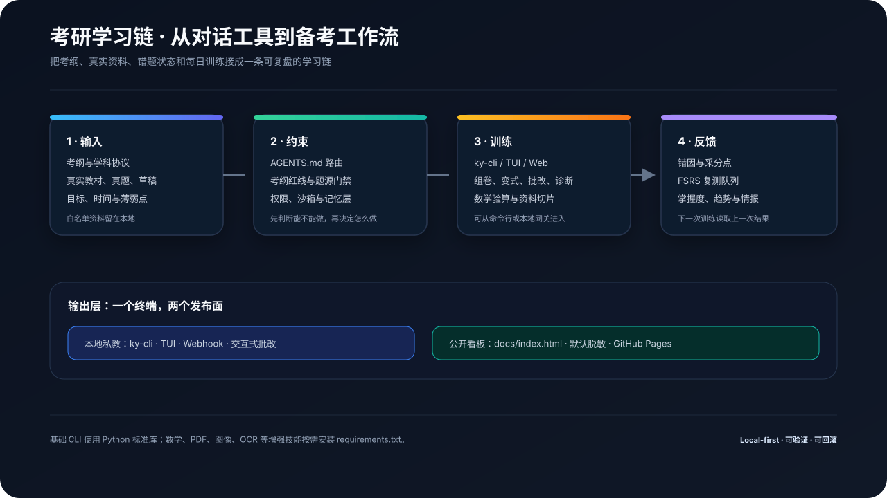

# 考研学习链 (Kaoyan AI Study Chain) · 数字化备考工程

**基于 AI Agent 私人教师协议、外置状态机驱动与自动化自测看板的开源考研备考工程**


-10b981?style=flat-square&logo=checkmarx&logoColor=white)


-6366f1?style=flat-square&logo=speedtest&logoColor=white)


---

## 📖 这是什么？





**考研学习链 (Kaoyan AI Study Chain)** 是一套面向考研学子的**数字化、工程化 AI 私人教师备考系统**。

传统使用大语言模型（ChatGPT、Claude、DeepSeek 等）备考经常遇到四大痛点：

1. **幻觉与超纲**：AI 随性自编缺少权威采分标准的题目，或派发超出大纲范围的偏题怪题；
2. **缺乏记忆与连续性**：多轮对话后 AI 遗忘你之前的薄弱考点、错题记录与复习节奏；
3. **缺乏采分点闭环**：直接给出终极答案，缺乏行级步骤分、公式分与“错因五分类”归因；
4. **缺少移动端自测工具**：碎片时间（排队、通勤、睡前）难以高效进行公式与核心考点默写。

本项目将 **Agent 私教协议（AGENTS.md）**、**外置状态机记忆（External State）**、**白名单题源抽题门禁（Source Verification）** 与 **自动化轻量 Web 看板（Static Site Generator）** 深度整合，帮助考研人构建属于自己的高纪律、零幻觉、稳拿基本盘的数字化私教系统。

---

## 🚀 用户本地化部署与快速上手流程 (3 分钟开箱)

### 环境依赖

- **操作系统**：Windows 10/11、macOS 或 Linux
- **Python**：**Python 3.10+** (推荐 3.11 / 3.12)
- **Git**（版本管理与多端同步）

### 极速 4 步走：

```bash
# 1. 克隆项目仓库到本地
git clone https://github.com/your-name/kaoyan_chain.git
cd kaoyan_chain

# 2. 运行跨平台交互式初始化向导 (锁定考研倒计时、科目大纲与提分目标)
python tools/init_workspace.py

# 3. 配置大模型 API Key (支持 DeepSeek、GLM、Qwen、Kimi、OpenAI 或本地 Ollama)
python tools/ky_cli.py config
# 或 Windows 双击 ky.bat 后输入 config

# 4. 启动终端私教开始复习！
ky
# 或 python tools/ky_cli.py
```

> \[!TIP\]
> 考研学习链提供 **三大操作端** 供你自由选用：
>
> - 🖥️ **桌面可视化端**：输入 `ky gui`，享受 PySide6 构建的高颜值暗黑/明亮双主题看板、倒计时与可视化做题面板！
> - 📟 **终端全景中枢**：输入 `ky menu`，启动 TUI v2.5 极客控制台，键鼠双控、零多余依赖！
> - 💬 **流式对话私教**：输入 `ky`，即刻开启多轮推演与真题采分点打分！

---

## 🌟 核心功能全景亮点


### 1. 🖥️ 桌面可视化操作端 (PySide6 Desktop Client · `ky gui`)

- **高颜值双主题**：基于 Qt/PySide6 构建，内置精心调优的现代化暗黑 (`dark.qss`) 与明亮 (`light.qss`) 样式；
- **全战役状态大盘**：Header 实时联动初试倒计时、学员目标院校/专业、当前激活辅导风格；
- **10 大功能卡片直达**：今日任务、靶向组卷、同源变式、考纲Diff、切片入库、院校侦察、双校对标、简章监控、看板更新、公众号检索；
- **4 大深度交互分页**：💬 **私教对话**（多线程异步防卡死）、📋 **今日任务**（打卡进度条）、📕 **错题本**（高频归因透视）、🏛️ **研招情报**（高校监控雷达）。

### 2. 📱 微信公众号考研经验检索与爬虫 (`ky wechat` / `ky wx`)

- **多源智能检索**：搜狗微信搜索 (主源) ➔ Bing 微信定向搜索 (备用源) ➔ 本地经验库 (离线兜底)；
- **HTML ➔ Markdown 强力清洗管道**：剥离广告、样式与追踪脚本，提取公众号名、发布时间与正文内容；
- **本地沉淀与口碑档案联动**：通过 `--save` 自动落地至 `docs/experiences/`，并无缝追加进目标高校社媒口碑研报。

### 3. ⚡ Rust (PyO3) 原生性能加速与透明零依赖降级 (`ky_rust_ext`)

- **原生动态库赋能**：在 `rust_ext/` 下采用 PyO3 + Maturin 构建高性能模块，试题智能分块、高校简章指纹 SHA-256、上下文 Token 压缩等性能敏感路径提速数十倍；
- **极致 Local-First 兼容**：在未安装 Rust 编译环境或特定架构下，自动透明降级为纯 Python 基准实现，零破坏、零报错。

### 4. 📟 终端全景智能中枢 (TUI v2.5 极客控制台)

- **键鼠双控面板**：运行 `ky menu`，呈现考研总战役倒计时、今日四科推进进度条、目标院校雷达与 10 大核心功能直达入口；
- **纯终端极速体验**：纯键盘数字快捷键秒级穿透，资源占用极低。

### 5. 📊 6-Tab 移动端自测看板 (`docs/index.html`)

- **零服务器依赖**：自包含单文件 HTML，手机浏览器打开即用，支持 **PWA 添加到手机主屏幕**；
- **独创遮罩自测**：在 `🧠 必背` 页签开启高斯模糊遮罩，触碰卡片秒测数学核心公式、英语高频词与政治帽子词；
- **全科掌握度雷达**：动态提取复习增量与掌握度分值，实时展示考情与学情趋势。

### 6. 🏛️ KaoYan Intelligence 招考全景情报与证据链引擎

- **全国 55+ 主流院校名录**：收录教育部代码、官方站点拓扑树（官网 ➔ 研究生院 ➔ 招生网 ➔ 二级学院）；
- **S 级研招网直连与证据链** (`ky admission`)：输出带有信源级别、置信度与时间戳的权威招考指标，锁定考研年份；
- **双校深度横向对标** (`ky compare`)：一键 PK 两校办学层次、初试科目差异（408 vs 自命题）、复试线与一志愿保护度；
- **招生简章动态指纹雷达** (`ky watch`)：SHA256 毫秒级比对目标院校主页，每年 8\~10 月第一时间捕获新简章；
- **社媒实名去噪研报** (`ky scout`)：聚合知乎、B站、小红书实名讨论，智能剔除营销卖课，出具就读体验研报。

### 7. ⚔️ 靶向组卷、同源变式与三级记忆闭环

- **靶向拼卷自测** (`ky compose` / `ky exam`)：针对薄弱章节与历史错题反向靶向拼卷，自动抹去答案供独立推演；
- **同源变式检索** (`ky variant`)：四科白名单同类真题变式精准检索，严加防伪水印与防幻觉溯源；
- **整卷多题诊断** (`ky diagnose`)：整卷级多题批改，输出章节失分排行与薄弱处方；
- **三级分层记忆体系** (`ky memory`)：Session / Project / Decisions 三级分离，防范 Token 爆炸与上下文污染。

---

## 💬 常用私教交互与指令速查

系统提供 34 个工业级 CLI 子命令与对话交互口令，完整参数说明请参阅 [📘 学员实操手册](操作手册.md)：


| 交互场景      | 推荐口令 / 子命令                         | 行为说明                                   |
| --------- | ---------------------------------- | -------------------------------------- |
| **桌面操作**  | `ky gui` / `ky-gui`                | 启动 PySide6 桌面可视化图形操作端 (支持暗黑/明亮双主题)     |
| **公众号检索** | `ky wechat 408经验 --save` / `ky wx` | 多源检索微信公众号考研文章与上岸经验贴，沉淀至本地并联动研报         |
| **晨起看盘**  | `ky status` / `ky today`           | 查看初试倒计时、今日四科任务攻坚清单与进度                  |
| **学科报到**  | `数学报到` / `英语报到` / `ky`             | 私教调取昨日错题，从白名单题库抽取题目派发                  |
| **提交作业**  | `交作业` / `/submit`                  | 逐行给出采分点 `[+2分]`/`[-1分]`，追查错因五分类并归档错题   |
| **微步提示**  | `/hint`                            | 唤醒苏格拉底三级脚手架（破题定性 ➔ 首步搭桥 ➔ 避坑），拒绝剧透     |
| **错题重测**  | `ky review` / `ky exam`            | 调取艾宾浩斯到期错题，隐去原答案进行盲盒自测                 |
| **智能减负**  | `ky relieve` / `ky fatigue`        | 检查疲劳警报；一键将时间预算下调 25%，切换为鼓励型风格          |
| **院校对标**  | `ky compare 华科 武大 计算机`             | 横向深度对标两校招考指标、408/自命题、复试线与一志愿保护         |
| **考纲比对**  | `ky fetch diff --school=华科`        | 解析新旧大纲 AST，标注考点增删与考查要求跃迁，测算动荡率         |
| **切片入库**  | `ky ingest 2024真题.md`              | 试卷智能切片与标准化题卡入库 (支持 Rust 毫秒级加速)         |
| **刷新看板**  | `ky build`                         | 重新编译并刷新本地与移动端自测看板（默认本地构建）              |
| **系统体检**  | `ky doctor`                        | 7 维度全系统健康诊断（Python/依赖/状态/API/端口/Git隐私） |


---

## 🔒 隐私优先与主流 AI Agent 接入

### 1. Local-First 本地优先隐私承诺

- 本项目严守 **Local-First** 隐私原则，做题草稿、个人笔记、错题详情及放在 `参考资料/` 中的个人版权资料**已全部由 `.gitignore` 保护，绝不上云**；
- 支持在纯离线环境下运行做题、考纲Diff、双校对标与状态机管理。

### 2. 主流 AI Agent 无缝接入

本项目采用标准开放的 Agentic Markdown 架构，原生适配市面主流 AI 智能体：

- **Google Antigravity**：原生适配，打开工作区输入 `数学报到` 自动完成协议加载与状态写回；
- **Cursor**：内置 [`.cursorrules`](.cursorrules)，`Ctrl + I` 发送口令即可自动批改；
- **Trae (字节跳动)**：在 Chat 中开启 Agent 模式，输入 `@workspace 专业课报到` 自动联动；
- **Cherry Studio**：将根目录 [`AGENTS.md`](AGENTS.md) 设为系统提示词，四科目录挂载为知识库；
- **微信 / QQ / 钉钉 / 飞书**：运行 `ky serve` 或 `ky clawbot`，随时随地在手机群聊中提问讲题。

---

## 🧪 自动化质量工程与开源协议

本项目包含覆盖全链路功能、权限沙箱、研招情报、Rust加速与真实 CLI 进程级 smoke test 的自动化回归套件：

```bash
# 运行全套自动化质量回归测试 (25 组测试，共 252 项测试点)
python tools/test_ky_suite.py

# 专项测试新增功能 (WeChat 检索、Rust 双模一致性、PySide6 桌面端)
python tools/test_new_features.py
```

- **测试保障**：全量 25 组测试集，**252 项测试点 100% 通过**；
- **CI 流水线**：内置 GitHub Actions 多平台 (Linux/Windows) 与多 Python 版本自动化测试保障；
- **开发者文档**：如需参与贡献或了解完整项目架构树，请参阅 [🛠️ 开发者与贡献指南 (CONTRIBUTING.md)](CONTRIBUTING.md)。

---

## 🤝 交流与联系 (Contact &amp; Community)

- 🐧 **QQ 号**：`296528868`
- 📮 **电子邮箱**：`moyetian@foxmail.com`
- 📘 **详细实操通关指南**：请阅读 [操作手册.md](操作手册.md)

> 愿每一位披星戴月的考研人都能稳住节奏、拒绝内耗，一战成硕，顺利上岸！🌟

---

## 📄 开源许可证

本项目基于 [MIT License](LICENSE) 开源。
