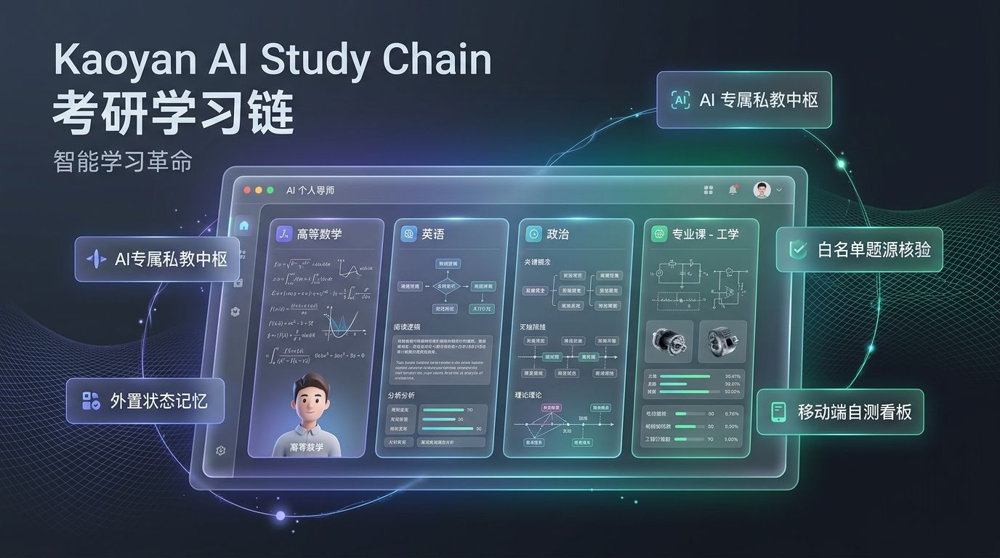
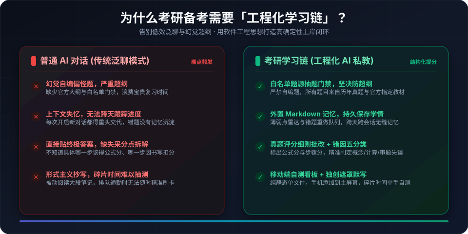
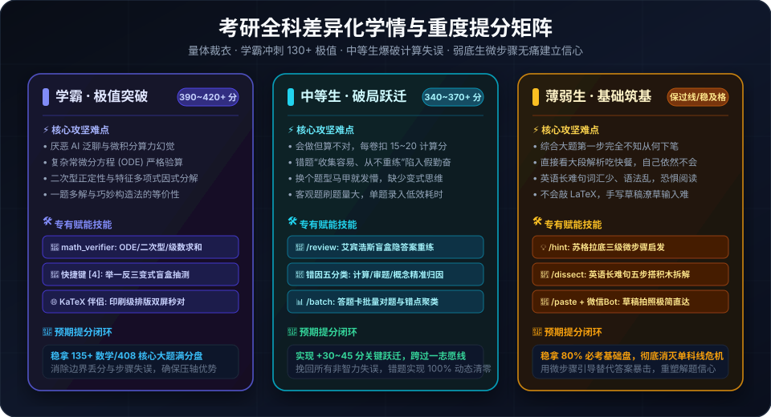
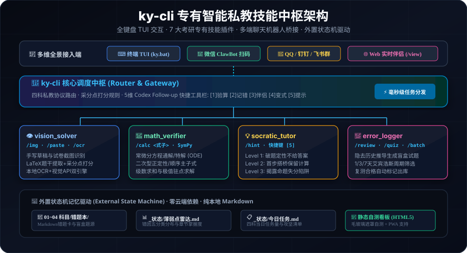
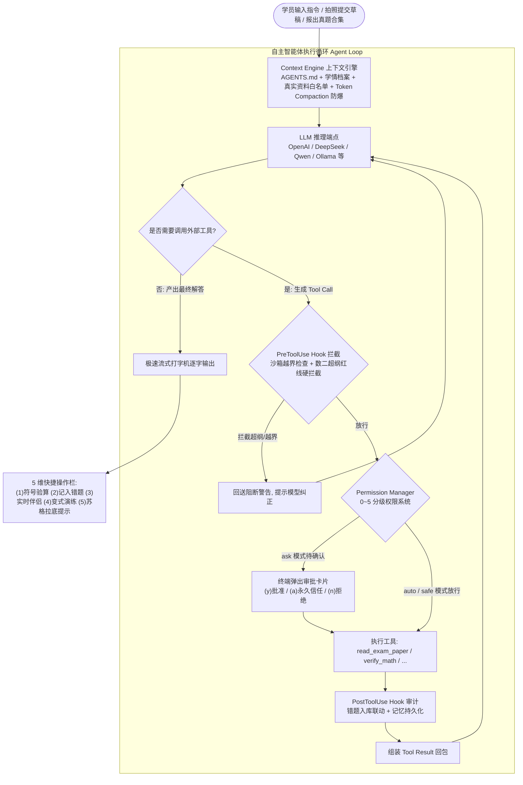
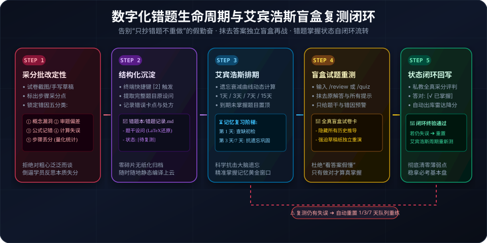
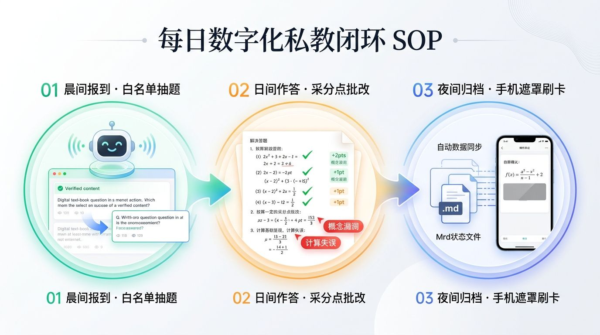

# 考研学习链 (Kaoyan AI Study Chain) · 数字化备考工程

<p align="center">
  <strong>基于 AI Agent 私人教师协议、外置状态机驱动与自动化自测看板的开源考研备考工程</strong>
</p>

<p align="center">
  <a href="https://moyetian.github.io/kaoyan_chain/"></a>
  <a href="#-用户本地化部署与快速上手流程-3-分钟开箱"></a>
</p>

<p align="center">
  
  
  
  
  
  
  
  
  
  
  
</p>

<p align="center">
  <a href="#-这是什么">📖 这是什么</a> •
  <a href="#-三类考研学生画像与差异化提分闭环">🎓 学情矩阵</a> •
  <a href="#-专有考研智能终端-ky-cli-全功能自主私教">💻 私教终端 ky-cli</a> •
  <a href="#-全套-cli-子命令矩阵全景说明">⌨️ 子命令矩阵</a> •
  <a href="#-考研全科自测看板-dashboard-核心全景">📊 移动看板</a> •
  <a href="#-靶向组卷同类变式与整卷多题诊断闭环">⚔️ 教学闭环</a> •
  <a href="#-plan-模式原子快照与三级分层记忆体系">🧠 记忆与回滚</a> •
  <a href="#-数字化错题生命周期与艾宾浩斯盲盒复测">🔄 错题闭环</a> •
  <a href="#-用户本地化部署与快速上手流程-3-分钟开箱">🚀 快速开始</a>
</p>

<p align="center">
  
</p>

---

## 📖 这是什么？

<p align="center">
  
</p>

**考研学习链 (Kaoyan AI Study Chain)** 是一套面向考研学子的**数字化、工程化 AI 私人教师备考系统**。

传统使用大语言模型（ChatGPT、Claude、Gemini、DeepSeek 等）备考经常遇到四大痛点：
1. **幻觉与超纲**：AI 随性自编缺少标准答案的题目，或者派发超出大纲范围的偏题怪题；
2. **缺乏记忆与连续性**：多轮对话后 AI 遗忘你之前的薄弱考点、错题记录与复习节奏；
3. **缺乏采分点闭环**：直接给出终极答案，缺乏步骤分、公式分与“错因五分类”追查；
4. **缺少移动端自测工具**：碎片时间（排队、通勤、睡前）难以高效进行公式与核心考点默写。

本项目借鉴现代软件工程的成熟架构，将 **Agent 私教协议（AGENTS.md）**、**外置状态机记忆（External State）**、**白名单题源抽题门禁（Source Verification）** 与 **自动化轻量 Web 看板（Static Site Generator）** 相结合，帮助考研人构建属于自己的高纪律、零幻觉、稳拿基本盘的数字化私教系统。

---

## 🎓 三类考研学生画像与差异化提分闭环

针对不同备考基础与目标梯队的考研学子，系统不仅在提示词中调整语气尺度，更针对性提供硬核能力闭环：

<p align="center">
  
</p>

* **学霸突破盘 (冲 390~420+)**：攻坚常微分方程通解/特解 (ODE)、二次型正定性判断、级数求和与拉格朗日极值，利用 `math_verifier` 符号计算底座杜绝大模型算力幻觉，配合变式盲盒抽测冲刺核心大题满分盘；
* **中等生破局盘 (突破 340~370 瓶颈)**：瞄准“会做但算不对”与“错题只抄不练”顽疾，依托 `/review` 艾宾浩斯盲盒隐答案重练与错因五分类精准追查，挽回每套试卷 15~20 分非智力失误；
* **薄弱生筑基盘 (保过线/稳及格)**：面对难题无从下笔时，调动 `/hint` 苏格拉底三级微步骤脚手架（破题定性 ➔ 首步搭桥 ➔ 避坑指南），结合英语长难句搭积木与微信拍照即批，无痛建立解题自驱力。

---

## 🎭 四大私教辅导风格（按需切换）

每位考研学子的备考基础与性格特点各不相同，本项目在顶层协议 [`AGENTS.md`](AGENTS.md) 中原生内置了**四大可切换的私教辅导风格**，AI 私教将根据您的选择自动调整语气、批改尺度与讲解深度：

| 风格名称 | 核心特征 | 教学行为准则 | 适合人群 |
|---|---|---|---|
| 🛡️ **严格把关·保姆提分型**<br>*(Strict & Disciplined · 默认)* | 严苛阅卷人视角 | 严抓推导步骤，每步标注 `[+2分]` / `[-1分]`；计算失误或跳步零容忍；强制要求进行「错因五分类」追查并写入重做队列 | 自律性稍弱、易粗心马虎、计算失误频发、追求冲刺 120+ 高分 |
| ⚡ **高效应试·高频秒杀型**<br>*(High-Yield Hacker)* | 80/20 法则为王 | 剔除一切偏难怪题与低性价比考点；强化代入法、排除法、特征值秒杀法、政治帽子词口诀与英语主干速抓技巧；成块套用答题模板 | 在职备考、启动较晚、时间紧迫、急需短期内稳抓 80% 核心盘过线 |
| 🌱 **温和启发·减负鼓励型**<br>*(Encouraging Mentor)* | 降低挫败，微步提示 | 将综合大题拆解为 2-3 个微小提示；多用日常生活生动比喻解释抽象定理；即便答错也先肯定思考亮点，再温和指出盲区 | 跨考新手、容易焦虑内耗、面对难题容易畏难卡壳的同学 |
| 🧠 **深度原理·学霸溯源型**<br>*(Deep Conceptual Master)* | 追根溯源，融会贯通 | 引导学员从“命题人命制陷阱”的角度审视题干；追溯定理的几何意义与物理背景；启发学员推导底层定理并自制知识图谱 | 基础扎实、冲刺名校专业第一、渴望探究底层数学/工程本质的学霸 |

> 💡 **如何切换风格**：在终端输入 `/plan` 重新配置，或随时在 [`AGENTS.md`](AGENTS.md) 的「当前激活辅导风格」一行中填入对应的风格名称即可生效！

---

## 💻 专有考研智能终端：`ky-cli` (全功能自主私教)

如果您不想打开笨重的大型 IDE，本项目自带了一个专为考研学子研发的**全功能轻量级专用终端私教工具（`ky-cli`）**。

它绝不是普通的聊天脚本，而是真正搭载了 **Claude Code / Codex 级别**执行内核的工业级自主智能体：

- **纯 Python 标准库编写**：零 `pip install` 依赖，只要有 Python 即可秒开；
- **工业级 Agent Loop 内核驱动**：自主规划、多步推理、真题抽题、符号验算、文件操作与分级权限；
- **全模型 API 原生接入**：直接配置 DeepSeek、智谱 GLM、通义千问、月之暗面 Kimi、OpenAI 或本地 Ollama；
- **多端聊天机器人桥接 (IM Bridge)**：支持连接**微信 (ClawBot/企微)**、**QQ (NapCat/OneBot)**、**钉钉**、**飞书**。

<p align="center">
  
</p>

### 1. ⚡ 核心自主智能体执行循环 (Agent Loop)

为了彻底解决“无法直接读取本地真题 PDF 抽题”、“无法修改和建立本地错题文件”的硬伤，`ky-cli` 内置了严谨的多轮智能体执行循环：



#### 📖 彻底解决“真题 PDF 抽题难”痛点
当您在终端中输入：
> *“你从这本书里面抽题给我 `D:\考研资料\01-数学\参考资料\考研数学二纯真题版.pdf`”*

私教**绝不会回答“无法读取本地文件”**！它将立即自主调用专有的 `read_exam_paper` 工具，精确定位该 PDF 中指定年份（如 2018 年）、题号（如 第15题）或核心考点（如 中值定理）的试卷原文，并将题干完整提取派发给您，同时严格按照评分标准分步批改！

---

### 2. 🧰 15+ 标准 Tools 工具矩阵与内置技能中心

私教终端完整挂载了通用系统工具与考研专属技能底座：

| 工具分类 | 工具名称 | 权限等级 | 核心功能与亮点 |
|---|---|---|---|
| **真题专抽** | `read_exam_paper` | Level 0 (只读) | **专门翻阅大体积历年真题合集 PDF**，按年份、题号、考点精准提取原版试卷题干 |
| **高精验算** | `verify_math` | Level 0 (只读) | 调起 SymPy 严格验算常微分方程(ODE)、二次型正定性、级数求和、极值驻点与微积分，杜绝算力幻觉 |
| **不剧透启发** | `socratic_hint` | Level 0 (只读) | 苏格拉底三级微步骤脚手架（破题定性 ➔ 首步搭桥 ➔ 避坑指南），拒绝直接贴终极答案 |
| **盲盒重测** | `review_mistakes`| Level 0 (只读) | 自动提取到期艾宾浩斯错题，生成抹去历史推导与标准答案的盲盒试卷 |
| **文件读取** | `read_file` | Level 0 (只读) | 本地文本与试卷提取，智能感知 `.pdf` 并自动抽取正文文本 |
| **文件检索** | `search_files` / `grep` | Level 0 (只读) | 递归文件名通配搜索与正文关键词行号精准定位 |
| **目录探测** | `list_directory` | Level 0 (只读) | 探测本地工作区与参考资料库结构 |
| **版本控制** | `git_status` / `diff` | Level 0 (只读) | 审查备考复习进度与学情文档变动差异 |
| **建立状态** | `write_file` | Level 1 (安全编辑) | 建立新的复习任务卡片或学情档案 |
| **精确修改** | `edit_file` | Level 1 (安全编辑) | 局部替换更新考点掌握度状态 |
| **错题归档** | `log_mistake` | Level 1 (安全编辑) | 自动将做错题目规范提取沉淀入科目错题本 Markdown 文件 |
| **记忆管理** | `manage_memory` | Level 1 (安全编辑) | 智能体自主读写 Global / Project / Decisions / Session 四层记忆 |
| **工作区执行** | `run_command` | Level 3 (Shell执行) | 在工作区内安全执行构建与脚本测试 |
| **网络检索** | `web_search` | Level 4 (网络) | 免 Key 检索 2025/2026 最新官方大纲变动通知与院校自命题政策 |
| **正文提取** | `fetch_url` | Level 4 (网络) | 抓取网页并深度清洗 CSS/JS 噪点，提取纯净正文 |

---

### 3. 🧠 三级分层记忆体系 (Hierarchical Memory System)

传统 AI 聊天对话一关即忘，而备考需要长达数月乃至一年的知识沉淀。系统构建了**四层外置持久化记忆库**：

```text
.memory/
├── user.md       <-- [Global] 全局学员画像 (亦映射至 ~/.ky/memory/user.md)
├── project.md    <-- [Project] 当前考研战役大盘 (目标院校/专业/科目考纲/提分目标)
├── decisions.md  <-- [Decisions] 关键复习决策与避坑指南 (如数二绝不碰三重积分)
└── session.md    <-- [Session] 当前会话即时工作区 (正在攻坚的题号/卡壳点)
```

1. **Global Memory**：记录学员的基础起点（如四级已过）、学习作息规律与偏好的私教风格，多科目全局通用；
2. **Project Memory**：锁定当前考研大盘战役配置、锁定官方考纲与手头真实资料白名单；
3. **Decisions Memory**：长期复习过程中总结的关键做题决策（如*“数学二不考曲面积分，遇到直接跳过”、“中值定理优先构造辅助函数”*）；
4. **Session Memory**：当前会话中正在处理的临时任务与推导结论；
5. **智能体自主维护**：模型在发现学员的新习惯或关键结论时，能够主动调用 `manage_memory(action='append', scope='decisions', ...)` 自主沉淀记忆！

---

### 4. 🪝 生命周期强制拦截钩子系统 (Lifecycle Hooks System)

> **核心哲学**：
> - **Skill** 是“让模型知道怎么做”（提示词/指导层）；
> - **Hook** 是“系统强制必须做某件事”（运行时/硬拦截层）。

系统在智能体生命周期的 6 大关键节点注入了强制拦截逻辑：

| 生命周期事件 | 触发时机 | 默认内置系统强制行为 (Built-in Actions) |
|---|---|---|
| `SessionStart` | 会话开启时 | 自动校验三级记忆完整性、检查今日四科任务进度 |
| `PreToolUse` | 工具执行前 | **🚨 考纲红线强制拦截**：当前科目为数学二时，若参数或调用涉及“三重积分”、“曲面积分”、“无穷级数”等超纲考点，Hook 直接硬阻断并报警超纲，坚决阻断学员浪费精力做偏难怪题！同时执行沙箱越界拦截。 |
| `PostToolUse` | 工具执行后 | **联动自检**：当调用 `log_mistake` 归档错题后，Hook 自动将错题标题与错因类型追加到 Session 记忆并排期艾宾浩斯复测。 |
| `BeforeCompact`| 上下文压缩前 | **记忆防丢提炼**：当长对话触发 Context Compaction 时，Hook 自动扫描提炼学员的做题决策（如“我决定只做真题”），自动持久化写入 `.memory/decisions.md`，防止记忆随历史截断而遗失！ |
| `AfterCompact` | 上下文压缩后 | 校验压缩后 Token 空间合规性。 |
| `SessionEnd` | 会话退出时 | 自动同步当日复习增量与学习时长至学情档案。 |

---

### 5. 🔌 Model Context Protocol (MCP) 客户端生态

引入 Anthropic 官方推荐的现代工具互联标准协议 **Model Context Protocol (MCP)**：

- **纯 Python 标准库实现**：零外部 pip 依赖，通过子进程管道与外部服务进行标准 JSON-RPC 2.0 stdio 通信；
- **即插即用外部生态**：在 `ky_config.json` 或 `.mcp.json` 中声明外部 MCP Server（如 SQLite 题库、GitHub MCP、文件系统 MCP）；
- **动态工具发现与透明挂载**：启动时自动与外部 MCP Server 握手，通过 `tools/list` 探测工具并自动注册进 `ToolRegistry`，私教在解题过程中可直接无缝调用外部生态！

---

### 6. 🛡️ 0~5 级权限分级系统与沙箱安全防御网

- **运行模式命令行可调**：
  - `ky` (默认 `--permission=ask`)：修改文件或执行命令时在终端弹出 Codex 风格审批卡片：`[y] 批准本次 / [a] 本会话永久信任 / [n] 拒绝`；
  - `ky --permission=plan`：**计划模式 (Plan Mode)**：写操作前出具完整的变更计划卡片，并**自动创建原子快照备份**，支持秒级一键回滚 (`ky rollback`)；
  - `ky --permission=auto`：**全自动沙箱模式**（Level 0~3 免打扰秒级放行，极速刷题体验）；
  - `ky --permission=safe`：**严格只读安全模式**（禁止一切文件修改与脚本运行）。
- **沙箱防御网 (硬拦截)**：
  - 严格限制在工作区或合法资料库路径，坚决阻断系统敏感目录穿越（`C:\Windows`, `~/.ssh` 等）；
  - 工具层硬拦截高危黑名单指令（`rm -rf`, `del /f /s /q c:`, `format` 等）。

---

## ⌨️ 全套 CLI 子命令矩阵全景说明

考研专用终端私教工具（`ky` / `python tools/ky_cli.py`）提供丰富的命令行子命令，无需进入交互式环境即可直接调度核心功能：

| 子命令 | 完整命令语法 | 核心功能与参数说明 | 典型使用场景 |
|---|---|---|---|
| **战役态势** | `ky status` | 打印初试倒计时、今日打卡天数、作息节律（距周日休整窗口天数）与四科提分矩阵 | 晨起第一眼掌握全局战役态势 |
| **今日任务** | `ky today [--json]` | 列出今日四科时间预算与针对薄弱项的精准清单；加 `--json` 导出机读数据 | 确认当日复习清单、或供自动化脚本读取 |
| **快速打卡** | `ky done <任务关键词>` | 快速将包含关键词的任务标记为完成并同步回写至各科 `今日任务.md` | 学完某一模块后单行命令秒打卡 |
| **错题复测** | `ky review [科目]` | 调取艾宾浩斯记忆周期遗忘曲线待复测错题（可选 `math`/`eng`/`pol`/`pro`） | 每日晚间进行错题抗遗忘抽检 |
| **靶向组卷** | `ky exam [科目] [--count=N] [--save]` | 从错题库与薄弱考点自动反向抽取拼装**全真盲盒试卷**，隐去原答案，文末附带加密采分点 | 阶段性闭卷自测、周末模拟考 |
| **自动判卷** | `ky exam-submit <试卷路径> <作答文本>` | 自动批改自测卷作答，输出采分点分值、正答率与错因五分类归因 | 独立做完自测试卷后一键打分入库 |
| **真题变式** | `ky variant <考点关键词>` | 检索白名单同考点真题；本地未放置实体书时**强制烙印【私教自拟变式】水印**防幻觉 | 攻坚某一卡壳知识点的同类变式强化 |
| **考纲图谱** | `ky map [科目] [--json]` | 全量解析官方考纲知识点树，按 A(熟练)/B(巩固)/C(生疏)/D(盲区) 输出大盘 | 阶段性排查知识盲区与考点掌握率 |
| **整卷诊断** | `ky diagnose <答题卡文本或文件>` | 整卷级多题诊断引擎，聚类失分模块，输出**章节失分排行榜与下周复习处方** | 模考或成套真题做完后综合复盘 |
| **疲劳监控** | `ky fatigue` | 检查近两日任务完成率，连续 2 天低于 60% 自动触发防疲劳警报与心理疏导 | 预防考研中后期内耗与严重崩盘 |
| **智能减负** | `ky relieve` | **一键启动减负模式**：复习时间预算下调 25%，并平滑切换为温和启发辅导风格 | 状态低谷期自动减压，休整再战 |
| **风格切换** | `ky style [1/2/3/4]` | 查看当前辅导风格，或数字一键切换（保姆提分/高效秒杀/温和启发/学霸溯源） | 根据当前复习阶段自由调整私教尺度 |
| **健康体检** | `ky doctor` | 6 维度全链路系统体检（Python/专有依赖/四科协议与状态机/API/网关端口/Git隐私） | 安装配置后自检、或排查运行故障 |
| **记忆诊断** | `ky memory [status\|prune]` | 诊断三级分层记忆容量与 Token；执行 `prune` 滚动修剪并归档至 `decisions.md` | 长期复习防止上下文膨胀超限 |
| **快照回滚** | `ky rollback` | 快速回滚 Plan 模式写入前创建的最近一次文件快照，秒级撤销误修改 | 私教或工具误改学情文件时一键复原 |
| **任务广播** | `ky notify [自定义内容]` | 一键将今日任务清单或晨报广播推送到已配置的微信、QQ、钉钉、飞书备考群 | 起床自动推送晨报提醒复习 |
| **看板编译** | `ky build` | 重新解析最新学情与考纲数据，生成单文件移动端看板 `docs/index.html` | 每日学完一键刷新手机看板数据 |
| **考纲切换** | `ky subject` | 交互式选择考研科目（数一/二/三/396、英一/二、408等）并重新挂载考纲 | 报考院校专业变更或科目微调时使用 |
| **模型配置** | `ky config` | 交互式配置大模型 API Key、Base URL、Model Name、Temperature 及 Webhook | 首次启动或切换 AI 提供商 |
| **网关服务** | `ky serve [port]` | 启动双向对话 Webhook 网关与实时 Web 伴侣（默认端口 `8088`） | 连接微信/QQ/钉钉/飞书实现群内讲题 |
| **微信连接** | `ky clawbot` | 启动微信个人号 WeChat ClawBot 扫码连接器，手机微信扫码直连私教 | 免公网穿透，手机微信 1对1 讲题 |
| **双向网关** | `ky bridge` | 查看各大平台（微信/QQ/钉钉/飞书）双向讲题网关详细配置指南 | 初次配置群聊双向讲题时查阅 |

---

### ⌨️ REPL 交互式终端快捷指令速查表

在终端直接运行 `ky`（或 `python tools/ky_cli.py`）进入自主私教交互主界面后，可随时输入以下快捷指令：

| 快捷指令 / 快捷键 | 功能效果 | 核心使用场景 |
|---|---|---|
| `[1]` / `/today` | 查看今日四科时间预算与任务清单 | 确认每日复习进度与重点 |
| `[2]` / `/save` | 提取当前题目的题干设问与错因，写入本地 `错题本/` | 发现错题时一键归档入库 |
| `[3]` / `/batch` | 客观题答题卡批量对题，输入选项序列秒级核对并聚类错题 | 刷选择题/填空题专项、真题客观题 |
| `[4]` / `/review` | 🎯 **艾宾浩斯错题盲盒重测**，自动抹去原答案，独立重做合格后出库 | 每日错题抗遗忘巩固与薄弱点清零 |
| `[5]` / `/hint` | 💡 **苏格拉底微步骤启发**，三级阶梯引导不剧透全解（破题➔首步➔避坑） | 做题卡壳、第一步不知道怎么下笔时 |
| `[6]` / `/view` | 🌐 **打开实时可视化网页伴侣**，享受印刷级 KaTeX 排版与双端同步 | 解复杂数学题、看积分与矩阵排版 |
| `[7]` / `/style` | 查看或动态切换 4 种私教辅导风格 | 根据心境即时调整私教语气与严苛度 |
| `/math` | 瞬间切换至**数学私教**，自动重载数学大纲与错题档案 | 刷数学核心题型与步骤打分 |
| `/eng` | 切换至**英语私教**，加载真题阅读定位法与长难句库 | 拆解长难句、研读真题阅读 |
| `/pol` | 切换至**政治私教**，挂载核心速记与帽子词自测库 | 刷高频选择题与答题模板 |
| `/pro` | 切换至**专业课私教**，挂载官方考纲与核心算法知识图谱 | 大题背诵与高频算法设计练习 |
| `/exam` | 终端内直接基于错题与薄弱点反向靶向组卷 | 快速开启一套限时全真小测验 |
| `/variant` | 检索白名单同类真题变式题 | 针对某一错题进行举一反三巩固 |
| `/status` | 打印今日考研进度、各科目标分与研考倒计时 | 掌握全局战役态势与作息节律 |
| `/plan` | 重新启动 7 大维度个人专属定制化备考方案向导 | 阶段转换或学情变动时随时调整 |
| `/notify` | 一键将今日任务卡片广播推送到微信、QQ、钉钉、飞书群 | 晨间起床自动打卡提醒 |
| `/build` | 终端内直接重新编译本地与移动端自测看板 | 随时生成最新 HTML 看板 |
| `/config` | 分类多选菜单：配置大模型 API、MCP 服务与四大平台机器人 Webhook | 切换模型或修改配置 |
| `/img <路径>` | 传入草稿纸照片或题目截图进行视觉识别与批改 | 手写解答照片自动 OCR 评分 |

---

## 📊 考研全科自测看板 (Dashboard) 核心全景

> 💡 **在线直达**：点击体验 👉 **[考研全科移动端自测看板 (Live Demo)](https://moyetian.github.io/kaoyan_chain/)**
> 
> *(本地使用：双击工作区中的 [`docs/index.html`](docs/index.html) 即可单文件直接运行，纯原生 HTML5/CSS3/JS 构建，零第三方依赖)*

<p align="center">
  
</p>

### 1. 五大核心交互页签图解

| 页签 | 功能定位 | 核心特性与交互设计 | 核心使用场景 |
|---|---|---|---|
| 📋 **今日**<br>*(Today)* | 每日攻坚任务卡 | • 四科当日复习分钟预算进度条<br>• 针对学员个性化薄弱项的精准攻坚清单<br>• 点击即时打勾打卡，初试倒计时毫秒感知 | 晨起确认当日任务，晚间核对执行闭环 |
| 🧠 **必背**<br>*(Flashcards)* | 核心速记与 3D 翻转卡 | • 数学高频定理推导、积分表、泰勒展开公式卡<br>• 英语高频词汇与作文功能句型速查<br>• 政治核心帽子词与历史时间线<br>• 专业课高频大题答题模板与算法三段式规范 | ★ **碎片时间主力**：排队、通勤、自习室休息、睡前默写 |
| 🎯 **薄弱**<br>*(Radar & Queue)* | 掌握度雷达与错题队列 | • 章节掌握度阶梯雷达图，直观暴露丢分洼地<br>• **艾宾浩斯与 FSRS 记忆周期循环复习**，未掌握错题强制置顶<br>• 标星攻坚难点定向突破 | 每周/每月全科复盘时定向爆破 |
| 📊 **数据**<br>*(Analytics)* | 全科学情诊断与态势 | • **错因五分类分布占比**（概念漏洞/审题偏差/公式记错/计算失误/书写丢分）<br>• **7 日任务完成率趋势 SVG 曲线**，直观反映近期学习平稳度与自律节律<br>• 计算失误量化指标与步骤丢分追踪，深浅色护眼主题一键无缝切换 | 阶段性评估各科复习重心，动态调整时间预算 |
| 🗺️ **图谱**<br>*(Knowledge Map)* | 官方考纲全景树图 | • **全量解析教育部官方考纲知识点树结构**，一级二级模块清晰分层<br>• 智能映射错题到细分考点，标记 **A(熟练) / B(巩固) / C(生疏) / D(盲区)**<br>• 点击细分考点即可一键唤醒终端针对性变式演练 | 阶段性清点大纲死角，确保初试无盲区覆盖 |

---

### 2. 独创「👁️ 遮罩自测模式」—— 考研碎片时间默写神器

传统的“看书背公式”往往容易陷入**“眼睛看懂了，手写写不出来”**的伪学习陷阱。

本看板独创了专为考研学子设计的**【👁️ 毛玻璃遮罩自测模式】**：
1. **一键开启遮罩**：在看板顶部点击“👁️ 开启遮罩自测”按钮；
2. **公式与答案虚化隐藏**：自测表格中的核心公式列、中文词义列、政治帽子词与核心推导结论会被高斯模糊虚化遮挡；
3. **单手触碰即刻揭晓**：
   - 无论在公交地铁还是自习室，单手点击任意被遮挡的卡片单元格，该项答案瞬间高亮揭晓；
   - 再次点击即可重新遮挡，支持连续自测默写；
4. **完全离线可用与符号降级解析**：
   - 所有知识点与公式卡片由本地 `build.py` 静态编译内嵌，零云端加载；
   - 内置 **KaTeX 离线稳健数学符号降级引擎 (`fallbackMathUnicode`)**，即使在完全无网无 CDN 的环境下，复杂的极限、积分与分数公式也能以清晰易读的 Unicode 数学排版完整呈现！

---

### 3. 🛡️ 隐私脱敏与快照模式 (`KY_SNAPSHOT_OPT_IN`)

看板支持双重数据安全模式：
- **默认本地完整模式**：编译生成的 `docs/index.html` 与 `docs/state_snapshot.json` 保留您的完整真实学情；
- **公开托管脱敏模式**：若需推送到公开的 GitHub Pages，只需在环境变量中设置 `KY_SNAPSHOT_OPT_IN=1`，编译引擎将自动对敏感的错题原文与个人日记进行脱敏，仅保留结构化统计指标，确保开源安全！

---

### 3. 🌐 印刷级 KaTeX 实时可视化网页伴侣 (`docs/live.html`)

针对考研数学中复杂的微积分、矩阵推导与采分点批改，系统配备了专用的**实时可视化伴侣窗口**：

- **终端与 Web 端两端实时同步**：在终端运行 `ky /view`（或直接双击 `docs/live.html`），浏览器立刻打开同步视图；
- **印刷级排版**：全面支持 KaTeX 渲染定积分、行列式、多元微分与分步计算式；
- **AI 动态思考呼吸动效与毫秒计时器**：解题过程中动态显示 `⏱️ 正在审阅题干关键采分点... (1.8s)`，推导完毕平滑淡出，交互体验极佳。

---

### 4. 📲 手机端 PWA 丝滑体验（免安装 App）

看板原生采用流体响应式设计，适配各类 iOS 与 Android 移动设备屏幕：
- **添加到主屏幕**：在手机 Safari 或 Chrome 浏览器中打开看板网址，点击分享按钮并选择 **“添加到主屏幕”**；
- **全屏原生 App 体验**：自动隐藏浏览器地址栏与导航条，拥有与原生 App 完全一致的沉浸式刷卡背诵体验。

---

## 🎯 个人专属 7 大维度定制化备考方案向导

初次使用（或在终端输入 `/plan`）时，系统将启动**个人专属 7 大维度个性化学情设计向导**：

```
╭────────────────────────────────────────────────────────────────────────╮
│  🎓 考研全科 AI 私人教师 · 个人专属定制化必考方案设计向导             │
│  (7 大核心维度：时间 · 考纲 · 资料白名单 · 学情摸底 · 每日投入 · 作息)  │
╰────────────────────────────────────────────────────────────────────────╯
```

1. **⏱️ 研考时间与战役节奏**：输入初试年份（如 2026），系统精准计算倒计时并锁定当前备考阶段（基础/强化/冲刺/模考）；
2. **📜 官方考纲智能锁定**：智能适配数学科目（数一/数二/数三/396）、英语科目（英一/英二）、政治以及专业课考纲，自动注入各科目考点红线；
3. **📊 学情摸底与薄弱防线诊断**：记录四科当前摸底分与核心痛点（如数学中值定理、英语长难句拆解慢、政治多选漏选、专业课核心算法规范）；
4. **📚 手头已有资料真实扫描与白名单核验（杜绝 AI 凭空捏造）**：
   - 自动扫描本地各科 `参考资料/` 实际文件，杜绝伪造未拥有的教材或虚构书名；
   - 本地未放文件时严格标记为以官方大纲为准出题；
5. **⏳ 每日可用复习时间与各科预算**：精准分配每日总精力（如全职 8.5h、在职 4.5h）到各科目的黄金切分；
6. **🌿 科学作息与防内耗调节机制**：锁定每周固定放松窗口与每月全真模考复盘日；
7. **🎯 私教辅导风格与提分目标矩阵**：设定目标成绩，自动激活匹配的辅导风格。

完成后，系统调动**深度规划引擎**，自动为学员生成专属全科备考方案书 [`00_考研全科总战役规划.md`](00_考研全科总战役规划.md) 以及首日（Day 1）四科针对性攻坚清单！

---

## 🔄 数字化错题生命周期与艾宾浩斯盲盒复测

考研复习最忌讳“错题抄了一大本，考场碰到依然错”。系统建立了**全自动化的错题生命周期闭环**：

<p align="center">
  
</p>

1. **采分判定与错因五分类**：手写解答或选项批改后，严格定性为【概念漏洞】/【审题偏差】/【公式记错】/【计算失误】/【书写丢分】；
2. **一键结构化沉淀**：按快捷键 `[2]` 自动提取原题干设问，归档至各科目 `错题本/`；
3. **艾宾浩斯周期排期**：自动监控 1天 / 3天 / 7天 / 15天 记忆衰减周期；
4. **全真盲盒试题重测**：输入 `/review` 或 `/quiz`，系统**自动隐去原历史推导与标准答案**，强迫学员在草稿纸上独立推演；
5. **闭环状态回写出库**：复测合格自动标记为 `[√ 已掌握]`，从待测队列出库，并在掌握度雷达与移动看板中动态体现提分战果！

---

## ⚔️ 靶向组卷、同类变式与整卷多题诊断闭环

为了让考研复习从“零碎刷题”走向“结构化闭环攻坚”，系统在 Sprint 2 中打造了完整的教学诊断工具链：

### 1. 🎯 反向靶向组卷与加密采分点 (`ky exam`)
- **自动逆向拼卷**：系统根据学员各科错题本（`错题本/`）与大纲薄弱考点，动态抽取 3~10 道最具攻坚价值的试题，组装为全真自测卷；
- **全真盲盒机制**：试卷题目自动**隐去历史作答与错误记录**，仅保留题干与规范作答区，强迫学员在空白稿纸上独立推演；
- **加密采分点防偷看**：试卷末尾自动嵌入 HTML 注释加密元数据（`EXAM_ANSWER_KEYS`），包含每道题的步骤分点与评分细则，学员作答前完全不可见；
- **闭环自动判卷**：作答完毕执行 `ky exam-submit <试卷> <解答文本>`，系统自动解密采分点逐步核验，输出得分率并自动将新错题归因入库！

### 2. 🔍 同类真题变式检索与防虚构书目水印 (`ky variant`)
- **白名单同考点溯源**：输入 `ky variant "极限"`，系统立即从学员本地挂载的真题库与历史错题中检索相同考点的经典变式；
- **红线防伪水印机制**：若本地未放入实体书 PDF，系统**绝对禁止凭空捏造未核验的书目**（如严禁自编题冒充《李林880》或《张宇1000》），并强制在题目前方烙印 **`【私教自拟变式】` 显著水印**，彻底根除大模型题源幻觉！

### 3. 📊 整卷级多题诊断引擎与复习处方 (`ky diagnose`)
- **答题卡批量聚合诊断**：一次性输入模考或整套真题的选择题答题序列（如 `1-5: A B C D A; 6-10: ...`）；
- **章节失分排行榜**：系统不仅判断对错，更自动将错题映射到考纲章节，生成直观的“头号丢分杀手排行榜”；
- **针对性复习处方**：自动根据失分严重度输出下周突破优先级清单，并建议时间分配。

### 4. 🌿 智能防疲劳预警与一键减负模式 (`ky fatigue` & `ky relieve`)
- **考研疲劳度感知**：备考最怕中后期节奏断裂。系统后台自动跟踪近 7 日每日任务完成率，若**连续 2 天完成率低于 60%**，系统主动触发防疲劳警报，输出心理疏导卡片；
- **一键科学减负**：学员只需执行 `ky relieve`，系统全自动将四科每日时间预算平滑下调 25%，并自动将辅导风格切换为「温和启发·减负鼓励型」，防止过度焦虑，保护备考长效战斗力！

---

## 🧠 Plan 模式原子快照与三级分层记忆体系

### 1. 🛡️ Plan 模式与原子快照一键回滚 (`ky --permission=plan` & `ky rollback`)
- **写前原子快照**：在计划模式下，私教或 Agent 在执行任何文件写入、任务更新或状态改写前，系统会自动在本地 `.checkpoint/` 目录为受影响文件创建微秒级原子快照；
- **变更预览审批**：终端向学员清晰展示即将发生的文件变更 Diff，学员审批通过方可执行；
- **秒级无损回滚**：如果发现修改有误或想撤回本次会话的改动，只需在终端执行：
  ```bash
  ky rollback
  ```
  系统即可将所有被修改文件百分之百精确复原至快照备份状态，彻底消除后顾之忧！

### 2. 🧬 三级分层记忆体系与自动修剪归档 (`ky memory`)
为了杜绝长时间备考导致的 Token 爆炸与上下文污染，系统设计了工业级三级分层记忆架构：
- **Session 级记忆**：当前终端会话的工作记忆，记录近期交互与做题状态；
- **Project 级记忆**：整个考研战役的全局配置、初试目标分、院校专业考纲与时间预算；
- **Decisions 级决策库** (`.memory/decisions.md`)：沉淀学员长期学习过程中做出的关键决策与复盘心得；
- **智能滚动修剪 (Pruning)**：当单层记忆超过健康容量门限时，执行 `ky memory prune`，系统自动保留最新活跃记录，并将历史条目无损归档至长效决策库，兼具极速推理与永恒记忆！

---

## 📚 学习资料与考纲导入指引（真实防虚构）

要让 AI 私教做到“不超纲、零幻觉”，最关键的原则是**“以学员实际放置的白名单资料为唯一真理”**，坚决杜绝 AI 凭空记忆捏造题目：

### 1. 资料存放规范：直接放入对应学科的 `参考资料/` 目录
在运行初始化向导后，系统已为数学、英语、政治、专业课各科目建立了专属的私密资料目录（受 `.gitignore` 严格保护，大体积文件与做题隐私绝不上传云端）：

```text
01-数学/参考资料/         <-- 放入数学教材、真题集、习题册（PDF / Word / JPG 等）
02-英语/参考资料/         <-- 放入历年真题阅读、长难句解析、作文讲义
03-思想政治理论/参考资料/  <-- 放入政治考点清单、核心选择题库、冲刺卷
04-专业课/参考资料/       <-- 放入高校指定参考书、历年自命题/408真题及课后习题
```

### 2. 支持的资料格式与 AI 私教驱动方式

学员只需将自己平时用到的数字化学习资料直接拷贝到对应科目的 `参考资料/` 文件夹中，AI 私教将全自动识别与调用：

1. **📄 PDF / Word 电子资料（教材与真题集）**：
   - **支持格式**：`.pdf`、`.docx`、`.doc`、`.txt`、`.md`
   - **驱动机制**：系统内置 `pdf_extractor` 与文档解析引擎，私教会直接读取该目录下的实体文件。每日报到时，私教将从你放入的真题 PDF 或习题册中精准抽取真实题干派发，**严禁 AI 凭空捏造未核验的题目或虚构书名**！
2. **🖼️ 题目截图与扫描图片（JPG / PNG）**：
   - **支持格式**：`.jpg`、`.jpeg`、`.png`、`.webp`
   - **驱动机制**：将习题拍照或电子题库截图直接放入 `参考资料/`（或在做题时通过 `/img <图片路径>` 传入），多模态视觉私教结合 OCR 引擎直接审阅图片原题，圈出计算错误步骤并逐行采分批改。
3. **📜 官方考纲对齐与超纲拦截门禁**：
   - 各科目根目录下的 `考试大纲.md` 已由向导自动匹配教育部或报考院校官方考纲规范；
   - AI 私教在派题与答疑时，会自动对照考纲知识点树，超出大纲范围的超纲考点（例如数二出现概率论、级数或三重积分）会被硬性拦截并提示跳过，确保 100% 聚焦应试得分盘！

---

## 🔒 隐私与防泄露机制（Local-First 原则）

本项目采用严格的 **Local-First（本地优先）** 隐私保护架构：
- 仓库内仅公开架构规范、教学协议与 `*.template.md` 空白模板文件；
- **个人隐私保护**：`.gitignore` 规则自动忽略您实际填写的个人学情文件（如 `今日任务.md`、`学员档案.md`、`当前进度.md`、`学情档案.md`）以及您每日在 `每日笔记/`、`每日作业/`、`错题本/`、`参考资料/` 下产生的所有私人做题记录与大体积 PDF；
- 无论您如何提交代码，您的个人复习进度、做题草稿、错题明细与大体积资料都**牢牢保留在本地，绝不会上传到 GitHub**。

---

## 🤖 市面主流 AI Agent 工具接入指南

本项目采用标准开放的 Agentic Markdown 架构，原生适配市面上主流的各类 AI 智能体与客户端：

```
┌────────────────────────────────────────────────────────────────────────┐
│                        市面主流 AI Agent 接入生态矩阵                   │
├─────────────────┬─────────────────┬──────────────────┬─────────────────┤
│ Google          │ Cursor          │ Trae (字节跳动)   │ Cherry Studio   │
│ Antigravity     │ AI 代码/文本编辑器 │ 自适应 AI IDE    │ 桌面多模型聚合   │
├─────────────────┼─────────────────┼──────────────────┼─────────────────┤
│ WorkBuddy       │ VS Code + Roo   │ Claude Code      │ 网页端通用大模型 │
│ 桌面自动化工作流 │ 本地插件生态     │ 命令行 Agent     │ 浏览器零门槛使用 │
└─────────────────┴─────────────────┴──────────────────┴─────────────────┘
```

1. **Google Antigravity (原生支持)**：官方全功能深度适配，直接在 Antigravity 中打开本仓库目录，在对话框输入 `学数学` 或 `数学报到`，AI 自动完成任务读取、批改与状态写回；
2. **Cursor**：内置 [`.cursorrules`](.cursorrules) 全局协议，快捷键 `Ctrl + L`（Chat）或 `Ctrl + I`（Composer）发送 `[科目]报到` 或 `交作业`；
3. **Trae (字节跳动自适应 AI IDE)**：打开工作区，在 Chat 侧边栏中开启 Agent 模式，输入 `@workspace 数学报到` 自动联动全库文件；
4. **Cherry Studio (桌面多模型客户端)**：将根目录 [`AGENTS.md`](AGENTS.md) 设为系统提示词，将四科目录添加为「知识库」即可；
5. **VS Code (Roo Code / Cline)**：内置 [`.clinerules`](.clinerules)，插件会自动加载并注入作为顶层系统约束；
6. **网页端通用大模型**：在 ChatGPT 创建 Custom GPT 或在 Claude 创建 Project，将 [`AGENTS.md`](AGENTS.md) 设置为 Instructions 即可零门槛使用。

---

## 📱 微信 / 钉钉 / 飞书 / QQ 机器人双向连接矩阵

本项目内置支持将终端私教通过 Webhook / Socket 与常用即时通讯聊天软件打通：

| 平台 | 连接方式 | 核心优势 | 快速命令 |
|---|---|---|---|
| 📱 **微信个人号** | **WeChat ClawBot 扫码直连** | **无需公网 IP**，手机微信扫码授权即可将个人号变身 24h 私教 | `ky clawbot` 或 `ky wechat` |
| 📌 **钉钉群** | **Outgoing 机器人回调** + 异步回传 | 内置 `sessionWebhook` 异步通道，群内 @ 机器人即刻讲题 | `ky bridge` |
| 🐦 **飞书群** | **企业自建应用** + 事件订阅 | 内置握手校验，群内艾特自动分步赋分 | `ky bridge` |
| 🐧 **QQ 群** | **NapCat / OneBot 11** 本地模式 | **无需任何公网穿透**，本地局域网秒级双向收发与题解推送 | `ky bridge` |

> 📖 **完整保姆级图文配置教程**：请参阅 [`docs/BOT_INTEGRATION_GUIDE.md`](docs/BOT_INTEGRATION_GUIDE.md)

---

## 🚀 用户本地化部署与快速上手流程 (3 分钟开箱)

### 环境依赖
- **操作系统**：Windows、macOS 或 Linux
- **Git**（版本管理）
- **Python 3.8+**（无需安装任何 pip 第三方库，全部使用 Python 标准库）

---

### 第一步：获取项目模板

在终端或命令行运行：
```bash
# 克隆本仓库到本地
git clone https://github.com/moyetian/kaoyan_chain.git my-kaoyan-chain
cd my-kaoyan-chain
```
*(也可以直接在 GitHub 点击绿色 **Code -> Download ZIP** 下载压缩包解压使用)*

---

### 第二步：一键初始化本地工作区与定制备考方案

项目内置了跨平台的交互式初始化引导工具：

```bash
# 运行初始化向导 (Windows / macOS / Linux 通用)
python tools/init_workspace.py
```

> [!TIP]
> 脚本将全自动引导您：
> 1. 一键将四科 `_状态/` 目录中的 `*.template.md` 实例化为本地受保护的 `*.md` 工作文件；
> 2. 为各科目建立私密的 `参考资料/` 目录与 `考试大纲.md` 考纲清单；
> 3. 运行 **7 大维度个性化方案向导**，锁定您的初试倒计时、考纲、真实资料、摸底分与薄弱防线；
> 4. 自动编译生成您的第一版专属移动端自测看板 `docs/index.html`。

---

### 第三步：日常私教学习闭环

<p align="center">
  
</p>

在您选用的 Agent 或终端终端私教中输入口令开始复习：
1. **晨间报到**：发送 `数学报到` 或 `英语报到`，AI 根据前一日错题与今日规划派题；
2. **日间作答**：草稿纸解答后拍照或敲字提交，输入 `交作业`；
3. **智能批改**：AI 按真题评分细则逐步给分，判定错因并自动写入错题重做队列；
4. **盲盒重测**：输入 `/review` 隐去原解答进行艾宾浩斯盲盒复测。

---

### 第四步：移动端自测看板查看与多端同步

#### 1. 本地直接预览
双击工作区中的 [`docs/index.html`](docs/index.html)，即可直接在任何现代浏览器中打开自测看板！

#### 2. 同局域网手机浏览 (无需云端)
在项目根目录下启动轻量级本地服务：
```bash
python -m http.server 8080 --directory docs
```
查看电脑的局域网 IP（如 `192.168.1.5`），在手机浏览器访问 `http://192.168.1.5:8080` 即可在手机上刷卡背诵！

#### 3. 部署到免费的 GitHub Pages (随时随地在线访问)
1. 在 GitHub 创建您的个人专属私有或公开仓库；
2. 绑定远程仓库并推送：
   ```bash
   git remote set-url origin https://github.com/<你的用户名>/<你的仓库名>.git
   git push -u origin main
   ```
3. 打开 GitHub 仓库页面 -> **Settings** -> **Pages** -> **Build and deployment** 下将 **Source** 切换为 **GitHub Actions**；
4. 仓库内置的 `.github/workflows/deploy-pages.yml` 将自动发布；在手机浏览器打开部署网址，点击 **添加到主屏幕**，即可像原生 App 一样随时自测！

---

## 💬 常用私教交互口令速查

| 口令 | 作用 | 触发依赖 |
|---|---|---|
| `数学报到` / `学数学` | 启动今日数学模块，AI 调取档案并派发精选练习 | `01-数学/AGENTS.md`、`今日任务.md` |
| `英语报到` / `学英语` | 启动英语模块，开始长难句拆解或真题阅读定位 | `02-英语/AGENTS.md`、`今日任务.md` |
| `政治报到` / `学政治` | 启动政治模块，刷高频单选/多选并抽测核心帽子词 | `03-思想政治理论/AGENTS.md` |
| `专业课报到` / `学专业课` | 启动专业课模块，按指定白名单资料抽取大题训练 | `04-专业课/AGENTS.md`、`学情档案.md` |
| `交作业` | 提交解答草稿，AI 进行采分点批改并归纳错因入库 | 各科 `错题本/` 与 `当前进度.md` |
| `查漏` | 调取四科薄弱点雷达与待重做错题队列 | 各科 `薄弱点雷达.md` |
| `更新看板` | 重新生成最新移动端看板并推送云端 | `python tools/update_dashboard.py` |

---

## 🧪 156 项全自动化质量工程测试 (17 大测试组)

本项目包含工业级的自动化回归测试套件，全面覆盖从底层配置、网关通讯、学科防伪水印、Agent 工业级内核到 Sprint 2 / Sprint 3 教学闭环的 **17 个大型测试组、156 项严苛用例 (100% 通过)**：

```bash
# 运行全套自动化测试
python tools/test_ky_suite.py
```

```text
============================================================
 🧪 考研学习链 (ky-cli) 全链路自动化回归测试矩阵
============================================================
 [测试组 1]  配置文件加载与字段默认值校验 .................... [PASS]
 [测试组 2]  四科私教提示词与学情状态自动组装 (防书目幻觉) ... [PASS]
 [测试组 3]  四大聊天平台 Webhook 报文格式与加签校验 ......... [PASS]
 [测试组 4]  每日任务卡片与晨报摘要提取 ...................... [PASS]
 [测试组 5]  Webhook 双向网关、飞书握手与 OpenAI 兼容端点 ... [PASS]
 [测试组 6]  移动端单文件看板编译生成与体积控制 .............. [PASS]
 [测试组 7]  Git 隐私隔离与防泄密安全门禁实测 ................ [PASS]
 [测试组 8]  考研专有技能：数学高精符号验算 (SymPy) .......... [PASS]
 [测试组 9]  考研专有技能：真题 PDF 指定页与题号抽取 ......... [PASS]
 [测试组 10] 考研专有技能：视觉草稿图处理与苏格拉底脚手架 ... [PASS]
 [测试组 11] 官方考纲注入与 7 维度方案持久化 ................. [PASS]
 [测试组 12] 工业级 Agent Loop、多轮推理与工具调用 .......... [PASS]
 [测试组 13] 沙箱防御网：敏感目录路径穿越与高危指令硬拦截 ... [PASS]
 [测试组 14] 权限分级审批引擎与 MCP 客户端通信 ............... [PASS]
 [测试组 15] 上下文压缩配对保护 (防孤儿Tool) 与 CLI 命令回归 . [PASS]
 [测试组 16] Sprint 2 教学闭环：靶向组卷/防伪变式/考纲图谱/整卷诊断/防疲劳减负 .. [PASS]
 [测试组 17] Sprint 3 体验生态：每日复盘/分层记忆修剪/Plan快照回滚/5Tab看板/FSRS .. [PASS]
============================================================
 测试结果统计: 通过 156 项, 失败 0 项
 🎉 全部测试项 100% 通过！系统各模块运转稳健！
============================================================
```

---

## 📂 仓库目录规范全景树

```text
kaoyan_chain/
├── .github/workflows/deploy-pages.yml   # GitHub Actions 自动化部署流水线
├── .gitignore                           # Local-First 隐私防泄露安全规则
├── .cursorrules                         # Cursor 编辑器智能加载协议
├── .clinerules                          # Roo Code / Cline 编辑器加载协议
├── LICENSE                              # MIT 开源许可证
├── README.md                            # 项目总说明与详细部署指南（本文档）
├── SETUP.md                             # 进阶配置与看板自定义手册
├── AGENTS.md                            # 全科总教练 Agent 路由中枢与风格设定
├── GEMINI.md                            # Gemini / Antigravity 入口配置
├── 更新看板.bat                         # Windows 一键编译看板并提交推送脚本
│
├── 01-数学/                             # 数学专属私教体系（数一/二/三/396通用）
│   ├── AGENTS.md                        # 防超纲、解题步骤规范、防计算失误协议
│   ├── 考试大纲.md                      # 核心考纲与知识点清单模板
│   ├── 参考资料/                        # 本地专属教材与真题目录 (已由 .gitignore 忽略)
│   ├── 00_数学备考总规划模板.md         # 阶段节奏与题量规划模板
│   ├── 01_每日作业提示词模板.md         # 派题与分步批改 Prompt
│   ├── _状态/*.template.md              # 任务、档案、雷达、进度表头模板
│   ├── 错题本/                          # 错题记录模板与索引
│   └── 每日笔记/                        # 笔记沉淀模板
│
├── 02-英语/                             # 英语专属私教体系（英一/英二通用）
│   ├── AGENTS.md                        # 搭积木拆长难句、三步定位解题法
│   ├── 考试大纲.md                      # 考纲词汇与核心模块清单
│   ├── 参考资料/                        # 本地专属真题与语料库目录 (忽略)
│   ├── 00_英语备考总规划模板.md         # 题型分值与阶段突破计划
│   ├── 01_每日使用提示词.md             # 拆句与选项排查 Prompt
│   ├── 作文语料库/通用作文语料.md       # 高频功能句与图表作文语料
│   ├── _状态/*.template.md              # 英语学情状态模板
│   └── 错题与长难句本/                  # 长难句切分与错题索引模板
│
├── 03-思想政治理论/                     # 思想政治理论体系（70分减负提效）
│   ├── AGENTS.md                        # 核心考点秒杀、大题模型化协议
│   ├── 考试大纲.md                      # 政治新大纲核心考点清单
│   ├── 参考资料/                        # 本地专属习题集与模拟卷目录 (忽略)
│   ├── 00_政治备考总规划模板.md         # 三阶段作战安排
│   ├── 01_每日使用提示词.md             # 选择题抽测与帽子词自测 Prompt
│   ├── _状态/核心速记_帽子词与历史节点.md# 政治高频核心速记卡
│   ├── _状态/*.template.md              # 政治学情状态模板
│   └── 错题本/                          # 政治选择题错因归纳模板
│
├── 04-专业课/                           # 专业课通用体系（统考 / 高校自命题通用）
│   ├── AGENTS.md                        # 专业课专属私教协议模板
│   ├── 考试大纲.md                      # 报考院校官方考纲要点清单
│   ├── 参考资料/                        # 本地指定教材与历年真题目录 (忽略)
│   ├── 00_专业课备考总规划模板.md       # 阶段作战计划模板
│   ├── 01_考纲拆解与分值地图模板.md     # 考纲分值拆解模板
│   ├── 02_核心公式与考点速查模板.md     # 核心结论速记模板
│   ├── 03_题源核验与抽题协议模板.md     # 权威题源白名单门禁
│   ├── 学情档案.template.md             # 章节掌握度记忆中枢模板
│   ├── 每日作业/                        # 每日作业记录模板
│   └── 错题本/                          # 错题记录模板与索引
│
├── 05-考研看板/                         # 看板构建工程
│   ├── build.py                         # 双模自适应构建引擎（纯 Python 标准库）
│   ├── docs/index.html                  # 编译生成的单文件移动端看板
│   └── README.md                        # 看板二次开发指引
│
├── docs/index.html                      # GitHub Pages 发布源镜像
└── tools/                               # 跨平台运维与管理工具包
    ├── agent/                           # 工业级自主智能体内核 (Agent Loop, Hooks, Memory, MCP, Sandbox, Permissions)
    ├── skills/                          # 考研专有能力技能中枢 (SymPy验算, PDF抽题, 盲盒组卷, 变式检索, 考纲图谱, 整卷诊断)
    ├── doctor.py                        # 6 维度全链路系统体检工具 (Python/依赖/状态/API/端口/Git隐私)
    ├── init_workspace.py                # 跨平台工作区全能初始化向导
    ├── ky_cli.py                        # 专有终端私教 (REPL) 与多端 IM 网关 (WeChat/QQ/DingTalk/Feishu)
    ├── study_planner.py                 # 7维度个人定制化方案设计引擎与防疲劳预警
    ├── syllabus_manager.py              # 官方考纲智能匹配与切换管理器
    ├── test_ky_suite.py                 # 156项全自动化工程回归测试套件 (17大测试组)
    ├── update_dashboard.py              # 跨平台一键编译更新与推送脚本
    └── verify_health.py                 # 全科规范与关键文件健康度巡检脚本
```

---

## 🛠️ 常见问题解答 (FAQ)

### Q1: 运行脚本报编码错误或找不到 Python？
- **Python 找不到**：请确认已安装 Python 3.8 或更高版本，并在安装时勾选了 `Add python.exe to PATH`；
- **Windows 乱码**：本项目所有脚本已内置 UTF-8 控制台兼容层。若使用 PowerShell，可执行 `[Console]::OutputEncoding = [System.Text.Encoding]::UTF8` 确保正常显示。

### Q2: 为什么我推送到 GitHub 后，找不到我的做题记录和参考资料？
- **这是特意设计的隐私防泄露机制**！本项目严格遵循 Local-First 原则，`.gitignore` 会自动拦截所有个人学情笔记、错题、草稿以及放在 `参考资料/` 中的版权电子书与扫描件。您的个人备考隐私与版权资产永远受到严密保护。

### Q3: 考试科目或专业不同怎么改？
- 本系统具备智能考纲切换体系。在终端直接运行 `python tools/init_workspace.py` 或输入 `/plan`，即可通过向导一键切换数一/数二/数三/396、英一/英二、政治或自主命题专业课，看板构建引擎会自动提取新科目的考点与自测卡片！

---

## 🤝 交流与联系 (Contact & Community)

如果您在使用过程中遇到任何问题、需要部署指引，或者想要一起交流考研经验、组队学习打卡、提出宝贵的改进建议，欢迎随时联系我：

- 🐧 **QQ 号**：`296528868`
- 📮 **电子邮箱**：`moyetian@foxmail.com`

> 愿每一位披星戴月的考研人都能稳住节奏、拒绝内耗，一战成硕，顺利上岸！🌟

---

## 📄 开源许可证

本项目基于 [MIT License](LICENSE) 开源。欢迎所有考研同学 Star、Fork、根据个人科目灵活定制，祝大家一战成硕！
