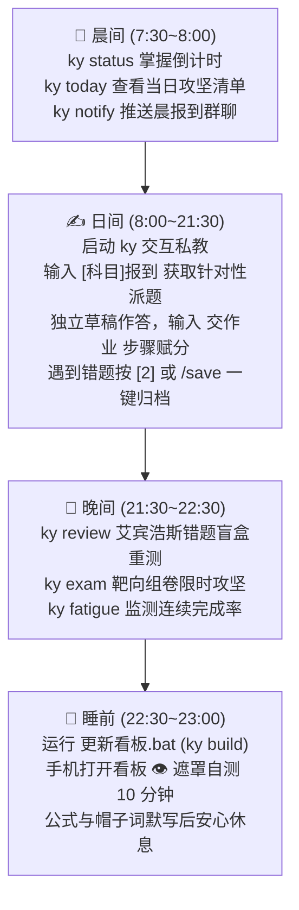

# 考研学习链 (Kaoyan AI Study Chain) · 部署与日常操作全流程手册

> **【系统最高目标】** 本文档为考研学子提供保姆级操作指南，涵盖环境安装、专属备考方案定制、终端私教日常交互、IM 聊天机器人讲题网关打通、移动端自测看板发布与考研日常标准操作程序 (Daily SOP)。

---

## 📑 目录索引

- [1. 极速环境准备与项目初始化](#1-极速环境准备与项目初始化)
- [2. 每日标准操作程序 (Daily SOP)](#2-每日标准操作程序-daily-sop)
- [3. 终端专用私教 (ky-cli) 实操全指南](#3-终端专用私教-ky-cli-实操全指南)
- [4. 靶向组卷、变式检索与诊断实战](#4-靶向组卷变式检索与诊断实战)
- [5. 聊天软件 (微信/QQ/钉钉/飞书) 双向讲题配置](#5-聊天软件-微信qq钉钉飞书-双向讲题配置)
- [6. 移动端看板部署 (GitHub / Cloudflare Pages)](#6-移动端看板部署-github--cloudflare-pages)
- [7. 自动化测试与系统体检](#7-自动化测试与系统体检)
- [8. 常见问题排查与避坑指南 (Troubleshooting)](#8-常见问题排查与避坑指南-troubleshooting)

---

## 1. 极速环境准备与项目初始化

### 1.1 系统要求
- **操作系统**：Windows 10/11、macOS 或 Linux
- **Python 运行时**：Python 3.8+（推荐 Python 3.10+，纯标准库支持，**核心运行零依赖**）
- **Git**：用于版本管理与多设备同步

> [!TIP]
> 考研专有高级技能（如数学高精符号验算、真题 PDF 抽取、草稿图像识别）为可选依赖。如需启用：
> ```bash
> pip install -r requirements.txt
> ```

---

### 1.2 三分钟开箱初始化

在项目工作区根目录下，打开终端运行工作区全自动初始化向导：

```bash
# 启动全自动向导 (Windows / macOS / Linux 通用)
python tools/init_workspace.py
```

向导将自动引导：
1. **状态文件实例化**：安全拷贝四科 `*.template.md` 模板为本地 `*.md` 工作文件（已有进度绝不覆盖）；
2. **私密资料库建立**：为数学、英语、政治、专业课自动创建被 `.gitignore` 保护的 `参考资料/` 目录；学员可直接将自己的教材、真题集、讲义习题（支持 PDF、Word、图片 JPG/PNG 等格式）放入对应文件夹，供私教精准抽取原题与讲题；
3. **7 大维度个性化方案设计**：锁定初试倒计时、科目考纲、真实教材白名单、摸底痛点、每日时间预算、作息与辅导风格；
4. **编译首版看板**：自动生成 `docs/index.html`。

---

## 2. 每日标准操作程序 (Daily SOP)

考研成功重在每天稳定、闭环、不内耗地推进。推荐如下标准一日复习流：



1. **晨间（确认与广播）**：
   - 运行 `ky status` 确认当前倒计时与作息节律；
   - 运行 `ky today` 查阅今日四科攻坚任务；
   - 运行 `ky notify` 一键将任务广播推送到微信、钉钉或 QQ 备考群，开启自律打卡；
2. **日间（攻坚与采分）**：
   - 运行 `ky`（默认 `--permission=ask`）进入交互式私教；
   - 输入 `数学报到` 或 `英语报到`，AI 私教自动调取档案，基于考纲与错题针对性派题；
   - 在纸上推导作答，完成后输入 `交作业`（支持文字或 `/img <草稿路径>` 照片）；
   - 私教按照真题评分标准逐行标注 `[+2分]` / `[-1分]`，指出错因五分类并提供处方；
   - 敲击快捷键 `[2]` 一键将错题归入本地 `错题本/`；
3. **晚间（复测与诊断）**：
   - 运行 `ky review` 查看今日艾宾浩斯抗遗忘待复测队列；
   - 运行 `ky exam [科目] --count=3` 随机抽取 3 道盲盒错题限时独立重测；
   - 运行 `ky fatigue` 查看近期任务完成率，确保不陷入过度疲劳；
4. **睡前（同步与遮罩自测）**：
   - 双击根目录下 `更新看板.bat`（或运行 `ky build`）重新编译看板；
   - 手机浏览器打开自测看板（或从手机主屏幕图标打开），点击“👁️ 开启遮罩自测”，单手轻触卡片默写公式、高频词汇与政治帽子词 10 分钟。

---

## 3. 终端专用私教 (ky-cli) 实操全指南

本项目配备了专有终端私教工具 `ky`（Windows 批处理 `ky.bat` / Linux `ky` / `python tools/ky_cli.py`）。

### 3.1 首次模型与参数配置 (`ky config`)

在终端输入：
```bash
ky config
```
弹出分类交互式配置菜单：
- **1. 大模型提供商 (API Provider)**：支持 DeepSeek、智谱 GLM、通义千问、Kimi、OpenAI、本地 Ollama 等；
- **2. 模型接入点与密钥**：填入 Base URL（如 `https://api.deepseek.com/v1`）与 API Key；
- **3. 推理模型选择**：如 `deepseek-chat` 或 `deepseek-reasoner`；
- **4. 严谨度温度 (Temperature)**：默认 `0.3`（理科计算推荐 0.1~0.3，避免大模型随意发散）；
- **5. 聊天机器人 Webhook**：配置微信、QQ OneBot、钉钉、飞书机器人地址。

---

### 3.2 运行模式与权限控制

| 启动命令 | 模式名称 | 运行机制与核心场景 |
|---|---|---|
| `ky` | 默认询问模式 (`--permission=ask`) | 工具修改文件或执行命令前，在终端弹出 Codex 风格卡片：`[y] 批准 / [a] 永久信任 / [n] 拒绝` |
| `ky --permission=plan` | **计划模式 (Plan Mode)** | 写操作前出具变更计划，**自动在 `.checkpoint/` 创建原子快照**；如遇误改可输入 `ky rollback` 秒级撤销！ |
| `ky --permission=auto` | 极速全自动沙箱 (`--permission=auto`) | 免交互审批（0~3级工具秒级放行），专为沉浸式连续刷题设计 |
| `ky --permission=safe` | 严格只读模式 (`--permission=safe`) | 禁止一切文件写入与命令执行，仅供阅读笔记、大纲与定理答疑 |

---

### 3.3 核心 CLI 子命令矩阵速查

```bash
# 查看总战役态势、倒计时、连续打卡天数与作息节律
ky status

# 查看今日四科任务清单 (加 --json 输出机读数据)
ky today
ky today --json

# 快速完成任务打卡并回写状态
ky done "概念精讲"

# 查看各科艾宾浩斯待复测错题
ky review math
ky review eng

# 定向侦察目标高校招生简章、专业目录、自命题大纲与知乎/B站口碑
ky scout 华中科技大学 计算机 --save
ky scout 浙江大学 软件工程 --apply

# 查看或切换私教辅导风格 (1:严格把关 2:高效秒杀 3:温和启发 4:学霸溯源)
ky style
ky style 2

# 疲劳度检测与一键减负
ky fatigue
ky relieve

# 三级分层记忆健康度诊断与超量滚动修剪
ky memory status
ky memory prune

# 秒级回滚 Plan 模式修改的文件快照
ky rollback

# 一键系统健康体检
ky doctor

# 编译并刷新看板
ky build

# 一键广播晨报到 IM 群聊
ky notify
```

---

## 4. 靶向组卷、变式检索与诊断实战

### 4.1 靶向自测组卷 (`ky exam`)
基于你的历史错题本和薄弱考点，动态生成全真盲盒小测卷：
```bash
# 针对数学随机抽取 3 道盲盒试题并保存为文件
ky exam math --count=3 --save
```
- 试卷自动抹去你之前的所有错误记录与解题线索；
- 试卷末尾嵌入了加密的采分点元数据；
- 独立完成后，提交批改：
```bash
ky exam-submit "EXAM-MATH-20260904-1655.md" "你的作答文本或答案"
```
系统将逐步比对采分点，输出正答率、诊断报告并自动记录错因。

---

### 4.2 真题同类变式检索 (`ky variant`)
当某个考点卡壳时，立即检索同类变式进行举一反三：
```bash
# 检索关于“拉格朗日中值定理”的同考点变式
ky variant "拉格朗日"
```
- **防伪水印门禁**：若本地未放入实体真题书，系统绝对不会凭空捏造《李林880》等书名，而是明示 **`【私教自拟变式】` 水印**，确保题源透明真实。

---

### 4.3 官方考纲树状图谱与掌握度 (`ky map`)
```bash
# 调取数学二官方大纲 66 个细分考点全景树
ky map math
```
- 清晰标注每个细分考点为 **[A]熟练 / [B]巩固 / [C]生疏 / [D]盲区**；
- 自动关联该考点下学员的累计错题数，重点歼灭 [C] 和 [D] 考点。

---

### 4.4 模考整卷多题诊断 (`ky diagnose`)
完成整套模拟试卷客观题后，一次性输入答题序列：
```bash
ky diagnose "1-5: A B C D A; 6-10: C B A D C"
```
系统自动比对标准答案，输出：
1. 本套试卷总得分与正答率；
2. **章节失分排行榜**（如：高等数学多元积分学失分 10 分，占比 40%）；
3. 下周突破处方与学习时间重分配建议。

---

### 4.5 高校招考证据核验与简章监控 (`ky admission` & `ky watch` & `ky scout`)
在确定报考院校或备考择校时，一键扫清信息壁垒与虚假宣传：
```bash
# 1. 精准调取研招网 (S级) 与高校官网 (A级) 权威招考事实与证据链
ky admission 华中科技大学 085404 --save

# 2. 锁定特定年份招考数据 (默认当年，可指定 --year)
ky admission 浙江大学 计算机技术 --year=2027

# 3. 将高校纳入动态简章监控雷达 (比对 SHA256 指纹与最新标题)
ky watch 华中科技大学

# 4. 轮询所有监控高校，第一时间捕捉 2027 招生简章出炉
ky watch --check

# 5. 查看当前已监控高校清单
ky watch --list

# 6. 综合全景侦察：聚合知乎、B站、小红书实名口碑与避坑指南
ky scout 华中科技大学 计算机 --save
```
- **权威证据链**：严格遵循「Search = Discovery, Official Page = Evidence」，每项指标附带 S/A 级信源评级、发布时间与年份锁定预警；
- **多源冲突仲裁**：自动检测研招网统考名额与二级学院公示冲突，并出具专业研判建议；
- **民间舆情与避坑**：知乎就读体验、导师口碑、B站高分复习经验、小红书压分与调剂歧视警示。

---

## 5. 聊天软件 (微信/QQ/钉钉/飞书) 双向讲题配置

终端私教不仅能在电脑命令行运行，还能作为本地网关与常用即时通讯聊天软件打通，让你在手机微信或群聊里随时 @私教 讲题！

```bash
# 启动本地网关服务器 (默认端口 8088)
ky serve
```

### 5.1 微信个人号 (WeChat ClawBot 扫码直连 · 推荐)
- **核心亮点**：**无需公网 IP**，手机微信扫一扫即可将微信个人号变身 24h 考研私教！
- **操作步骤**：
  1. 在终端直接运行：
     ```bash
     ky clawbot
     ```
  2. 终端将输出一个微信登录二维码，打开手机微信【扫一扫】授权登录；
  3. 私教网关自动接管该微信账号，你在手机微信上给该账号发题目或草稿，私教即刻分步推导讲题！

---

### 5.2 钉钉群 (DingTalk Outgoing 机器人)
1. 打开钉钉电脑端 -> 进入你的考研备考群 -> 【群设置】-> 【智能群助手】；
2. 添加自定义机器人 -> 开启 **【机器人回调 (Outgoing)】** 开关；
3. 将 POST 回调地址填入：`http://<你的公网IP或穿透域名>/webhook`；
4. 在群里直接输入 `@机器人 学数学：请问罗尔定理的核心条件是什么？`，私教自动异步分步批改推回群聊。

---

### 5.3 飞书群 (Feishu 企业自建应用)
1. 登录 [飞书开放平台 (open.feishu.cn)](https://open.feishu.cn) 创建自建企业应用；
2. 添加【机器人】能力；
3. 在【事件与回调】页面中，请求网址填入：`http://<你的公网IP或穿透域名>/webhook`（网关已内置 `url_verification` 握手）；
4. 订阅 `im.message.receive_v1` 事件并发布应用；
5. 在群聊中添加该机器人，直接艾特即可讲题！

---

### 5.4 QQ 群 (NapCat / OneBot 11 本地模式)
1. 在本地启动 NapCat QQ 机器人框架；
2. 在 HTTP 事件上报中填入：`http://127.0.0.1:8088/webhook`；
3. **无需任何公网穿透**，本地毫秒级双向收发，群内随时刷题。

> 📖 **完整保姆级图文配置**：详见 [`docs/BOT_INTEGRATION_GUIDE.md`](docs/BOT_INTEGRATION_GUIDE.md)

---

## 6. 移动端看板部署 (GitHub / Cloudflare Pages)

自测看板 `docs/index.html` 采用单文件自包含原生架构，零外部框架依赖，秒开秒测。

### 方案 A：GitHub Pages 自动部署 (公开/免费)
本项目已在 `.github/workflows/deploy-pages.yml` 内置自动构建流水线：
1. 在 GitHub 建立仓库并推送：
   ```bash
   git remote set-url origin https://github.com/<你的用户名>/<你的仓库名>.git
   git push -u origin main
   ```
2. 在 GitHub 仓库页面 -> **Settings** -> **Pages** -> **Source** 选择 **GitHub Actions**；
3. 推送更新后，GitHub Actions 会自动运行构建并发布到 `https://<用户名>.github.io/<仓库名>/`；
4. **隐私脱敏提示**：如部署至公开仓库，请在本地运行：
   ```bash
   set KY_SNAPSHOT_OPT_IN=1 && python tools/update_dashboard.py --local
   ```
   编译引擎会自动对个人错题明细脱敏，保护备考隐私。

---

### 方案 B：Cloudflare Pages 部署 (私有仓库完全免费推荐)
若你的 GitHub 仓库为 **Private（私有）**，GitHub Pages 免费版无法开启 Pages，推荐使用完全免费的 Cloudflare Pages：

1. **关联 GitHub 仓库**：
   - 登录 [Cloudflare Dashboard](https://dash.cloudflare.com/) -> **Workers & Pages** -> **Create application** -> **Pages** -> **Connect to Git**；
   - 授权选中你的私有考研仓库；
2. **构建参数设置**：
   - **Framework preset**: `None`
   - **Build command**: `python 05-考研看板/build.py` (或直接留空)
   - **Build output directory**: `docs`
3. **完成部署**：
   - 点击 **Save and Deploy**，约 1 分钟后即生成专属域名（如 `https://<你的项目>.pages.dev`）；
   - 之后本地每次 `git push`，Cloudflare 都会自动同步重新部署。

#### 🔐 进阶：配置 Cloudflare Zero Trust 免费邮箱验证白名单（强烈推荐）
为防止知道 `*.pages.dev` 网址的人随意查看你的个人分数与错题记录，可通过 Cloudflare 免费加一道邮箱验证锁：
1. 在 Cloudflare 控制台左侧进入 **Zero Trust**（首次进入会提示创建一个 Team Name，任意填写即可）；
2. 依次点击 **Access** -> **Applications** -> **Add an application** -> 选择 **Self-hosted**；
3. 基础配置：
   - **Application name**：`考研看板`
   - **Session Duration**：`1 month`（一个月只需验证一次）
   - **Application domain**：填入你的 `<项目名>.pages.dev`
4. 配置访问策略 (**Add policy**)：
   - **Policy name**：`only-me`
   - **Action**：`Allow`
   - **Include 规则**：选择 **Emails** -> 填入你自己的常用邮箱地址；
5. 点击 **Save** 保存。
> 之后无论在手机还是电脑打开看板，系统会自动发送一个 6 位数一次性验证码到你的邮箱，验证通过后即可免密畅爽刷卡一个月！

---

### 6.1 手机添加到主屏幕 (PWA 原生 App 体验)
1. 手机 Safari (iOS) 或 Chrome/Edge (Android) 打开你的看板网址；
2. 点击浏览器底部或右上角 **分享**（或菜单）按钮；
3. 选择 **“添加到主屏幕” (Add to Home Screen)**；
4. 手机主屏即生成一个独立的“考研看板”App 图标，全屏沉浸式刷卡背诵，支持离线 KaTeX 公式渲染与触碰遮罩默写！

---

## 7. 自动化测试与系统体检

为了确保大模型提示词装配、状态机读写、沙箱权限与考研技能库在高频备考中绝不出错，系统内置了工业级测试与体检工具：

### 7.1 一键健康体检 (`ky doctor`)
```bash
ky doctor
```
全面排查 6 大维度：
- [√] Python 3.10+ 版本与执行路径
- [√] 考研专有依赖 (SymPy, pypdf, Pillow, rapidocr)
- [√] 四科协议、考纲与状态记忆文件完整性
- [√] 大模型 API Key 连通性
- [√] 看板编译引擎与 8088 端口可用性
- [√] Git 隐私安全隔离 (`ky_config.json` 与 `.memory/` 拦截校验)

---

### 7.2 156 项全自动化回归测试 (`python tools/test_ky_suite.py`)
```bash
python tools/test_ky_suite.py
```
涵盖 17 大测试组：
1. 配置文件与容错机制
2. 四科系统提示词组装 (防捏造李林/张宇书目红线)
3. 四大 IM 平台 Webhook 校验与加签计算
4. 每日晨报卡片提取
5. Webhook 双向网关与 OpenAI 兼容端点
6. 看板编译生成与体积控制
7. Git 隐私安全门禁实测
8. 数学高精符号验算 (SymPy)
9. 真题 PDF 题号与页码抽取 (pypdf)
10. 视觉草稿预处理与苏格拉底三级脚手架
11. 官方大纲注入与 7 维度备考方案持久化
12. 工业级 Agent Loop、多轮推理与工具调用
13. 沙箱防御网：敏感路径穿越与高危指令硬拦截
14. 权限分级审批引擎与 MCP 客户端
15. 上下文压缩配对保护 (防孤儿 Tool) 与 CLI 命令回归
16. Sprint 2 教学闭环 (靶向组卷/防伪变式/考纲图谱/整卷诊断/防疲劳减负)
17. Sprint 3 体验生态 (每日复盘/分层记忆修剪/Plan快照回滚/5Tab看板/FSRS)

---

## 8. 常见问题排查与避坑指南 (Troubleshooting)

### Q1: 运行 `ky` 提示 `尚未配置 API Key`？
- **解答**：在终端运行 `ky config`，按提示填入你的大模型 API 密钥（如 DeepSeek、GLM 或通义千问）即可立即唤醒 AI 私教。

### Q2: 为什么推送到 GitHub 后看不到我的个人做题记录和资料？
- **解答**：这是本系统的 **Local-First 隐私防泄露铁律**。`.gitignore` 自动拦截了你的 `今日任务.md`、`学员档案.md`、`错题本/` 下的具体题目以及 `参考资料/` 下的教材 PDF。你的备考数据与版权资产永远安全保存在本地。

### Q3: 切换了报考院校或考试科目怎么办？
- **解答**：在终端运行 `ky subject`，交互式重新选择科目（如从数学一切换为数学二，或从英语一切换为英语二），系统会自动加载对应的官方考纲并更新防超纲红线禁区。

### Q4: 连续复习几天感觉压力大、任务做不完怎么办？
- **解答**：在终端运行 `ky relieve` 一键启动减负模式！系统会自动将每日时间预算下调 25%，并无缝切换为「温和启发·减负鼓励型」私教风格，帮你卸下内耗包袱，稳步复苏状态！
