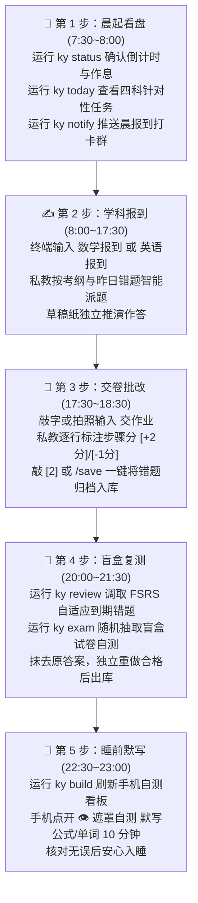

# 考研学习链 (Kaoyan AI Study Chain) · 学员实操与备考通关手册

> **【致考研学子】**
> 本手册是为你日常备考量身打造的实操指南。无论你是编程新手还是计算机科班，只需按照本手册的指引，即可在 3 分钟内配置好专属于你的 24 小时 AI 私人教师，开启高纪律、零幻觉、稳拿基本盘的备考之旅。

---

## 📑 快速目录索引

- [🌟 0. 快速了解：考研学习链能为你做什么](#0-快速了解考研学习链能为你做什么)
- [🚀 1. 新手 3 分钟极速开箱指引](#1-新手-3-分钟极速开箱指引)
- [🖥️ 2. 备考私教三大界面：桌面 GUI vs 终端 TUI vs REPL 对话](#2-备考私教三大界面桌面-gui-vs-终端-tui-vs-repl-对话)
  - [2.1 桌面可视化操作端 (`ky gui` · PySide6 构建)](#21-桌面可视化操作端-ky-gui--pyside6-构建)
  - [2.2 启动 TUI 全景智能中枢 (`ky menu`)](#22-启动-tui-全景智能中枢-ky-menu)
  - [2.3 终端交互式流式对话私教 (`ky`)](#23-终端交互式流式对话私教-ky)
- [⚡ 3. 考研人每日标准备考 5 步法 (Daily SOP)](#3-考研人每日标准备考-5-步法-daily-sop)
- [🏛️ 4. 研招情报与考纲透视全功能指令实战](#4-研招情报与考纲透视全功能指令实战)
  - [4.1 院校口碑与避坑侦察 (`ky scout`)](#41-院校口碑与避坑侦察-ky-scout)
  - [4.2 研招网与高校官方招考事实核验 (`ky admission`)](#42-研招网与高校官方招考事实核验-ky-admission)
  - [4.3 双校核心指标横向深度对标 (`ky compare`)](#43-双校核心指标横向深度对标-ky-compare)
  - [4.4 目标高校简章动态指纹监控雷达 (`ky watch`)](#44-目标高校简章动态指纹监控雷达-ky-watch)
  - [4.5 官方考纲 AST 变迁对比与动荡率分析 (`ky fetch`)](#45-官方考纲-ast-变迁对比与动荡率分析-ky-fetch)
  - [4.6 外部真题/模拟卷智能切片入库 (`ky ingest`)](#46-外部真题模拟卷智能切片入库-ky-ingest)
  - [4.7 靶向组卷与同源变式强化 (`ky compose` & `ky variant`)](#47-靶向组卷与同源变式强化-ky-compose--ky-variant)
  - [4.8 微信公众号考研经验贴多源检索与沉淀 (`ky wechat` / `ky wx`)](#48-微信公众号考研经验贴多源检索与沉淀-ky-wechat--ky-wx)
  - [4.9 Rust 原生算力加速与透明零依赖降级 (`ky_rust_ext`)](#49-rust-原生算力加速与透明零依赖降级-ky_rust_ext)
- [📱 5. 手机端自测看板与碎片时间默写技巧](#5-手机端自测看板与碎片时间默写技巧)
- [💬 6. 绑定常用聊天软件 (微信 / QQ / 钉钉 / 飞书)](#6-绑定常用聊天软件-微信--qq--钉钉--飞书)
- [🛠️ 7. 常见备考突发场景速查与处方](#7-常见备考突发场景速查与处方)
- [⌨️ 8. 全套 CLI 子命令矩阵全景速查 (39 项子命令)](#8-全套-cli-子命令矩阵全景速查-39-项子命令)
- [💬 9. 交互式私教 REPL 常用斜杠指令 (/slash commands)](#9-交互式私教-repl-常用斜杠指令-slash-commands)
- [🎭 10. 四大私教辅导风格与三类考生画像实战应用](#10-四大私教辅导风格与三类考生画像实战应用)
- [📁 11. 项目目录结构速览（我的资料该放哪）](#11-项目目录结构速览我的资料该放哪)
- [⚠️ 12. 使用注意事项与隐私边界](#12-使用注意事项与隐私边界)

---

## 0. 快速了解：考研学习链能为你做什么？

传统使用通用聊天软件备考，常常面临四大痛点：
1. **AI 总是自己瞎编题目**，或者出超出大纲范围的偏难怪题；
2. **多聊几句 AI 就忘了你之前的做题情况**和薄弱章节；
3. **解题直接给你贴最终答案**，缺少步骤采分点判定；
4. **排队通勤碎片时间不知道怎么复习**，看书容易“眼睛懂了手不会”。

**考研学习链为你构建了全套工程化解决方案**：
- 🛡️ **白名单题源门禁**：AI 只从你放入的本地教材/真题中抽题，绝不凭空捏造题目；
- 📜 **官方考纲红线拦截**：数学二绝不出现三重积分或级数，严格锁定应试得分盘；
- 🧠 **三级外置长效记忆**：记录你的每个薄弱考点与错题生命周期，数月备战记忆不丢；
- 🎯 **真题阅卷人步骤打分**：解答题每一个推导明确标注 `[+2分]` / `[-1分]`，追查错因五分类；
- 📱 **独创手机毛玻璃遮罩自测**：排队、睡前触碰卡片秒测公式与单词，离线完全可用；
- 🏛️ **KaoYan Intelligence 研招情报**：研招网官方招考核验、简章变动监控、考纲 AST 变迁分析与社媒实名口碑去噪。
- ⚡ **Rust 原生算力加持**：试卷题目切片、哈希指纹去重与 Token 压缩提速数十倍，开箱自适应降级。

---

## 1. 新手 3 分钟极速开箱指引

### 1.1 基础环境准备
- **操作系统**：Windows 10/11、macOS、或 Linux 均可；
- **Python 环境**：电脑中已安装 Python 3.10 或更高版本（推荐 Python 3.11 / 3.12）。基础 CLI 使用标准库，GUI、数学验证、PDF 提取按需安装 `requirements.txt`；
- **Git**：用于版本管理与多端同步。

### 1.2 步骤一：克隆或下载项目

> 📦 **不想折腾 Python / 命令行？** 直接到
> [Releases 页面](https://github.com/moyetian/kaoyan_chain/releases) 下载
> **开箱即用程序包**（Windows 安装版或解压即用的免装目录），
> 启动后跟随引导填配置即可 —— 可跳过本节的 Git / Python 步骤，详见
> [README.md](README.md) 的「📦 开箱即用」章节。

在终端或 PowerShell 运行：
```bash
git clone https://github.com/moyetian/kaoyan_chain.git
cd kaoyan_chain
```
*(如果没有安装 Git，也可以直接在 GitHub 点击绿色的 **Code -> Download ZIP** 下载解压)*

### 1.3 步骤二：运行全自动初始化向导
```bash
python tools/init_workspace.py
```
> [!TIP]
> 向导会友好地引导你完成 7 项个性化设置：
> 1. 输入目标初试年份（自动计算初试倒计时与战役阶段）；
> 2. 选择你的考试科目（数学一/二/三/396、英语一/二、政治、专业课）；
> 3. 填入初始摸底分与提分目标；
> 4. 自动为你建立各科目受保护的 `参考资料/` 目录；
> 5. 设定每日复习可用时间（如 8.5 小时）与作息窗口；
> 6. 选择你喜欢的 AI 私教辅导风格（默认推荐：严格把关·保姆提分型）；
> 7. 自动生成专属备考方案书 `00_考研全科总战役规划.md` 与第一版移动端看板！

### 1.4 步骤三：配置大模型密钥 (API Key)
在终端运行：
```bash
ky config
# 或者
python tools/ky_cli.py config
```
按提示依次选择提供商（支持 DeepSeek、智谱 GLM、阿里通义千问、Kimi、OpenAI 或本地 Ollama），填入你的 API Key 即可。
> 💡 **小贴士**：推荐使用 DeepSeek，性价比极高，理科数学与专业课推理能力非常优秀！

---

## 2. 备考私教三大界面：桌面 GUI vs 终端 TUI vs REPL 对话

考研学习链提供三种交互端，覆盖从极客终端到现代化桌面的全场景体验：

```text
┌────────────────────────────────────────────────────────────────────────────────────────┐
│                               备考私教三大交互界面对比                                 │
├──────────────────────────┬─────────────────────────────┬───────────────────────────────┤
│ 🖥️ 桌面可视化端 (GUI)     │ 📟 TUI 终端全景智能中枢     │ 💬 REPL 交互式对话私教        │
├──────────────────────────┼─────────────────────────────┼───────────────────────────────┤
│ 启动方式：ky gui 或      │ 启动方式：ky menu 或        │ 启动方式：直接输入 ky 或      │
│          python tools/   │          python tools/      │          python tools/        │
│          ky_gui.py       │          tui_navigator.py   │          ky_cli.py            │
│ 适用场景：全天主力备考、 │ 适用场景：晨起查态势、一键  │ 适用场景：深度推导、逐行改错、│
│          多Tab并行、图表 │          功能直达、轻量无桌 │          苏格拉底答疑、多轮推 │
│          浏览、微信经验搜│          面依赖、按键直通   │          演练习               │
│ 界面特点：PySide6构建、  │ 界面特点：等宽圆角边框、倒  │ 界面特点：流式打字机高亮输出、│
│          5套主题预设可选 │          计时进度条、三阶功 │          拍照上传、步骤采分点 │
│          10卡片网格与4Tab│          能卡片、数字快捷键 │          行级赋分             │
└──────────────────────────┴─────────────────────────────┴───────────────────────────────┘
```

### 2.1 桌面可视化操作端 (`ky gui` · PySide6 构建)

启动方式极简：
- **Windows 用户**：直接双击根目录下的 **`启动GUI.bat`** 即可一键拉起；
- **命令行用户**：在终端输入 `ky gui` 或 `python tools/ky_gui.py`。

系统核心特性：
- **新手图形化引导向导 (Onboarding Wizard)**：
  首次启动或点击顶部「设置」按钮时弹出，提供五步沉浸式向导：
  1. *目标院校与专业*：内置教育部全国高校权威库与智能启发推断，输入校名实时推导办学层次、所在地与A/B区；
  2. *科目大纲联动*：选择统考/自命题科目，自动互锁不考数学模式或自命题代码；
  3. *战役节奏与目标*：设定初试倒计时、每日时间预算与各科期望分数；
  4. *学情诊断与辅导风格*：诊断各科薄弱点，无缝切换严格把关/高效秒杀/温和启发/深度原理 4 种风格；
  5. *AI 引擎与搜索引擎*：配置 DeepSeek / Qwen / 通义 / 本地 Ollama 密钥及 Bing / 搜狗搜索引擎，提供非阻塞连通性一键测试。
- **战役态势 Header**：顶部动态展示目标院校、报考专业、当前激活辅导风格，以及醒目的初试倒计时与浅色/深色主题一键切换；
- **10 大功能网格卡片**：
  1. `📋 今日任务`：快速展开今日四科任务量清单；
  2. `🎯 靶向组卷`：按考点与难度智能拼卷演练；
  3. `🔄 同源变式`：检索与薄弱考点同类的真题变式；
  4. `📈 考纲Diff`：对比新旧考纲 AST 变迁与动荡率；
  5. `📥 切片入库`：一键切片真题并提取采分点；
  6. `🔍 院校侦察`：聚合研招网与社媒实名口碑研报；
  7. `⚖️ 双校对标`：横向 PK 两校招考指标与保护度；
  8. `📡 简章监控`：目标高校研究生院简章变动指纹雷达；
  9. `📊 看板更新`：重新编译掌握度雷达看板；
  10. `📱 公众号检索`：微信公众号考研经验贴多源抓取。
- **4 大深度交互分页 (Tabs)**：
  - 💬 **私教对话**：多线程异步解耦，打字不卡死；内置快捷口令条（`英语报到`、`政治报到`、`专业课报到`、`交作业`、`查漏`、`更新看板`）；
  - 📋 **今日任务**：四科今日计划表格，勾选直接联动打卡并更新全科完成率百分比进度条；
  - 📕 **错题本**：各科 FSRS 自适应待复测错题列表，清晰罗列错因五分类分布；
  - 🏛️ **研招情报**：已监控高校简章雷达态势、最新抓取公告与复试分数线，支持 LLM Agentic 深度招考情报研究。
- **主题切换与视觉工效**：全面通过 WCAG AA 对比度合规标准，彻底杜绝 QSS 边距坍塌与文字重叠，支持一键无缝热切换浅色/深色模式。

### 2.2 启动 TUI 全景智能中枢 (`ky menu`)

输入 `ky menu`，立刻展现极客风的终端全景控制面板：

```text
╭──────────────────────────────────────────────────────────────────────────────────╮
│            🎯 考研学习链 (Kaoyan Study Chain) · 终端全景智能中枢 v2.5            │
├──────────────────────────────────────────────────────────────────────────────────┤
│ ⏳ 2026 初试倒计时: 103 天  │  备考进度: [███░░░░░░░░░] 23.1% (第31/134天)       │
│ 🏛️  目标院校: 示例院校A │  📚 专业方向: 085404 计算机技术                     │
│ 🛡️  辅导风格: 严格把关    │  📋 今日打卡: 0/12 完成 (今日任务进行中)            │
├──────────────────────────────────────────────────────────────────────────────────┤
│   • 📡 简章监控: 已纳入 1 所高校动态监控 (示例院校A)                          │
│   • 📑 考纲变动: 波动率 10.7% (已生成考纲异动逐级处方)                           │
│   • 💬 社媒口碑: 已沉淀 3 篇院校实名经验档案                                     │
╰──────────────────────────────────────────────────────────────────────────────────╯

╭── ⚡ 核心备考与实战攻坚 (Core Preparation) ───────────────────────────────────────╮
│ [1] 今日任务 (Daily Tasks)           📋 查看四科任务量、打卡推进与行动指引       │
│ [2] 靶向组卷 (Exam Composer)         🎯 按考点与难度梯度智能拼卷演练             │
│ [3] 同源变式 (Variant Retrieval)     🔄 针对薄弱考点或错题智能检索同源题         │
╰──────────────────────────────────────────────────────────────────────────────────╯

╭── 🏛️ 研招情报与考纲透视 (Admissions & Syllabus) ──────────────────────────────────╮
│ [4] 考纲Diff (Syllabus Diff)         📈 对比新旧考纲 AST 掌握度变迁与动荡率      │
│ [5] 切片入库 (Material Ingestion)    📥 真题/模拟卷 Markdown 结构化入库          │
│ [6] 院校侦察 (School Scout)          🔍 聚合研招网指标与三大社媒实名口碑研报     │
│ [7] 双校对标 (School Comparator)     ⚖️ 横向深度对标双校招生指标与保护机制       │
│ [8] 简章监控 (Admission Watcher)     📡 目标高校研究生院简章动态指纹预警         │
╰──────────────────────────────────────────────────────────────────────────────────╯

╭── 📊 全景态势与系统大盘 (Dashboard & System) ─────────────────────────────────────╮
│ [9] 看板更新 (Dashboard Build)       📊 重编译掌握度雷达并刷新本地 Web 看板      │
│ [10] 公众号检索 (WeChat Search)      📱 微信公众号考研经验、院校解读与文章沉淀   │
│ [0] 安全退出 (Exit System)           🚪 保存状态并平稳退出终端导航器             │
╰──────────────────────────────────────────────────────────────────────────────────╯
```

只需在提示符后输入对应数字（`1` 到 `10` 或 `0`），即可一键直达对应功能！

> **非交互直达（脚本/自动化）**：`python tools/tui_navigator.py --action 7 --school1=云南大学 --school2=上海工程技术大学 --major=应用统计`；
> 考纲对比需带文件：`--action 4 --old=01-数学/考试大纲.md --new=01-数学/考试大纲.md`；
> 切片入库需带文件：`--action 5 --file=04-专业课/真题.md --subject=pro`。
> 未带必需文件时，TUI 会明确提示取消（严守不编造红线），而 `ky diff / ky fetch diff` 提供演示模式用于了解功能。

### 2.3 终端交互式流式对话私教 (`ky`)
输入 `ky`，直接进入分步引导与题目精讲模式。支持敲入 `数学报到`、`交作业`、`/hint` 等口令，私教将严格按照阅卷人视角为你逐行给出步骤得分！


---

## 3. 考研人每日标准备考 5 步法 (Daily SOP)

考研不是一两天的突击，而是长达数百天严守节奏的持久战。系统为你固化了最高效的每日 5 步闭环：



### 详细操作示范：

#### 第 1 步：晨起确认任务
```bash
ky status   # 第一眼确认研考倒计时与今日预算
ky today    # 查看数学、英语、政治、专业课具体攻坚内容
```

#### 第 2 步：日间报到与做题
进入终端私教：
```bash
ky
```
在提示符后输入：
> `数学报到`

私教将调取你昨日的薄弱项，从你的白名单资料库中抽取 2~3 道代表性核心题目派发给你。你在草稿纸上独立计算写出完整步骤。

#### 第 3 步：提交作业与批改
在终端输入你的解答（或者拍照后输入图片路径，Windows 如 `/img D:\图片\数学草稿01.jpg`，
macOS / Linux 如 `/img ~/Pictures/math_01.jpg`）：
> `交作业`
> `第一步：因为 f(x) 在 [0, 1] 连续可导，构造辅助函数 F(x) = ...`

私教会以真题阅卷人的标准逐行给出采分点：
- `[+2分]` 辅助函数构造正确；
- `[+3分]` 罗尔定理三个核心条件验证完备；
- `[-1分]` 结论区间开闭未明确标出；
- **错因五分类**：【审题偏差】。
此时按下快捷键 `[2]`，系统自动将题干与错误原因归档进 `01-数学/错题本/`。

#### 第 4 步：晚间 FSRS 错题盲盒重测
```bash
ky review math                     # 查看今日到期需要复习的数学错题
ky exam math --count=3 --save      # 自动生成一套 3 道错题组成的盲盒测试卷
```
试卷中自动隐去历史做题答案，强迫你在草稿纸上独立重新推导。

#### 第 5 步：睡前手机遮罩背诵
在电脑上运行：
```bash
ky build
```
拿起手机打开看板，开启【👁️ 遮罩自测模式】，触碰卡片背诵 10 分钟数学定理、英语高频词与政治帽子词，巩固当日记忆。

> **断网也能背**：`ky build` 默认把公式渲染资源（KaTeX 及字体）内联为本地副本，
> 地铁、图书馆破网、自习室断网时公式**不会**退化成 `$\int_0^1 x^2dx$` 这样的源码串。
> 如需改回境外 CDN（例如为压缩仓库体积）：`ky build --cdn`。

---

## 4. 研招情报与考纲透视全功能指令实战

### 4.1 院校口碑与避坑侦察 (`ky scout`)
想调研目标高校的报录比、复试公平性或就读体验？
```bash
# 侦察示例院校A计算机专业
ky scout 示例院校A 计算机 --save
```
- 自动抓取招生人数、初试统考/自命题科目；
- 聚合知乎、B站、小红书三大平台的学长学姐实名经验；
- 自动进行**广告与卖课营销贴降噪**，生成结构化 Markdown 研报并存入 `04-专业课/`。

---

### 4.2 研招网与高校官方招考事实核验 (`ky admission`)
想核实官方初试科目是否改考？
```bash
# 调取官方初试科目与招生名额
ky admission 示例院校A 085404 --save

# 锁定 2027 考研年份核验
ky admission 浙江大学 软件工程 --year=2027
```
- **S 级权威证据**：直接对接研招网官方硕士专业目录通道；
- **A 级官方证据**：直连高校研究生院与二级学院官方通知；
- **防年份漂移**：锁定年份，严防把往年旧大纲误当作当年新政。

---

### 4.3 双校核心指标横向深度对标 (`ky compare`)
在两所目标学校之间纠结犹豫时：
```bash
ky compare 示例院校A 示例院校B 计算机 --save
```
系统一键生成全方位的横向 PK 报告：
- **办学层次与教育部代码**；
- **初试科目差异**（如：都是 408 统考，还是有自命题科目）；
- **历年复试分数线走势**；
- **一志愿保护机制排查**（是否保护一志愿、复试比例是否合理）；
- **学员学情差距诊断 (User State Gap)**：结合你在 `ky_config.json` 中的摸底分，测算你的复试安全缓冲垫！

---

### 4.4 目标高校简章动态指纹监控雷达 (`ky watch`)
每年 8~10 月是各高校招生简章和专业目录集中公布的高峰期：
```bash
# 1. 将目标学校加入监控雷达
ky watch 示例院校A
ky watch 电子科技大学

# 2. 检查所有已监控高校的页面是否有最新更新
ky watch --check

# 3. 查看当前监控清单
ky watch --list
```
系统会通过 SHA256 指纹毫秒级比对研究生院官网。一旦发现高校发布了新简章，每天早晨运行 `ky today` 时会**自动置顶弹出「🔥 研招突发情报速递」提示**！

---

### 4.5 官方考纲 AST 变迁对比与动荡率分析 (`ky fetch`)
新大纲公布时，如何一眼看清增删改考点？
```bash
# 对比数学新旧考纲并保存异动研报
ky fetch 01-数学/考试大纲.md 01-数学/参考资料/2027新版考纲.md --save
```
- 自动解析考纲知识点树（AST）；
- 标注考点增减：如 `[新增] 泰勒公式展开`、`[删除] 了解级别的奇偶性`；
- 标注考查要求变更：如 `[要求提升] 零点定理 (理解 ➔ 掌握)`；
- 量化计算**考纲动荡率 (Volatility Rate)**，出具逐级应对处方。

---

### 4.6 外部真题/模拟卷智能切片入库 (`ky ingest`)
手头有一份 Markdown 格式的模拟卷或历年真题，想放入本地题库？
```bash
ky ingest "参考资料/2024年408模拟精选卷.md" --subject=专业课 --save
```
- 算法自动分块切片单选、多选与综合大题；
- 智能抽取选择题选项（A/B/C/D）与综合大题各步骤采分点（如 `[+6分]` / `[+9分]`）；
- 自动生成标准化题卡，放入对应科目 `参考资料/`，供私教日常精准抽题！

---

### 4.7 靶向组卷与同源变式强化 (`ky compose` & `ky variant`)
```bash
# 1. 靶向组卷：抽取 3 道错题与薄弱考点，组装一套自测卷
ky compose math --count=3 --type=choice --save

# 2. 变式强化：检索关于“中值定理”的同考点变式题
ky variant "中值定理"
```
- 试卷自动抹去原答案，生成独立答题卡格式；
- 变式题严格标明题源出处；本地未放置对应真题书时，**强制标注【私教自拟变式】水印**，坚决杜绝大模型题源幻觉！

---

### 4.8 微信公众号考研经验贴多源检索与沉淀 (`ky wechat` / `ky wx`)
除了知乎和B站，微信公众号是学长学姐分享最新一战/二战详细上岸经验、导师情况、复试机试细节的高密度富矿。
```bash
# 1. 检索经验贴并自动沉淀至本地 docs/experiences/
ky wechat "408计算机考研经验" --max=5 --save

# 2. 检索指定高校的复试心得并联动追加到该校研报
ky wx "示例院校A计算机复试经验" --school=示例院校A --save

# 3. 仅快速抓取标题与链接 (不抓取长正文，秒级响应)
ky wechat "数学二李林880怎么刷" --no-fetch

# 4. 指定定向检索数据源 (可选: auto / sogou / bing / local)
ky wechat "示例院校B软件工程" --source=sogou --max=3
```
- **多源智能调度**：默认 `auto` 模式，优先检索搜狗微信，少于 3 条时自动降级至 Bing 微信定向索引，仍不足时检索本地已沉淀经验；
- **HTML ➔ Markdown 强力清洗管道**：剥离所有无用脚本、广告与追踪标签，自动提取文章标题、公众号名称、发表日期与正文排版；
- **本地归档与高校研报联动**：添加 `--save` 会自动在 `docs/experiences/` 下生成规范命名的 Markdown 经验档案；如果携带 `--school=<校名>`，会自动挂载追加至目标高校的口碑研报中！

---

### 4.9 Rust 原生算力加速与透明零依赖降级 (`ky_rust_ext`)
为了让考研人在处理动辄数十万字的整卷真题切片、大批量简章网页哈希计算、海量会话 Token 压缩时享受毫秒级极致响应，系统在 `rust_ext/` 引入了基于 **Rust (PyO3)** 的原生高性能扩展：
- **题目智能切片加速 (`chunker.rs`)**：极速正则匹配大题分段与题干，自动提炼采分点；
- **高校简章动态指纹比对 (`hasher.rs`)**：SHA-256 毫秒级原生哈希，高频网页监控不占 CPU；
- **上下文 Token 压缩 (`context_compactor.rs`)**：精确估算字符量，多轮对话杜绝大模型爆 Context；
- **招考数据正则提取 (`extractor.rs`)**：原生极速抽取高校通知、408/自命题科目与招生人数。

> [!TIP]
> **零依赖透明回退承诺**：
> 如果你的电脑未安装 Rust 工具链或处于不支持编译的环境，系统内置的透明回退机制会自动无缝切换至纯 Python 实现。所有功能、返回数据格式与批改采分标准 100% 精确一致，无需用户手动修改任何配置！

---

## 5. 手机端自测看板与碎片时间默写技巧

看板位于 `docs/index.html`，无需安装任何 App，直接在浏览器中打开即可！

### 5.1 局域网手机实时浏览
在电脑端终端运行：
```bash
python -m http.server 8080 --directory docs
```
在手机浏览器中输入电脑的 IP 地址（如 `http://192.168.1.100:8080`），即可实现手机端与电脑端同频复习！

### 5.2 添加到手机主屏幕 (PWA 原生体验)
1. 在手机 Safari (苹果) 或 Chrome/Edge (安卓) 中打开看板网页；
2. 点击底部的 **“分享”** 按钮（或右上角菜单）；
3. 选择 **“添加到主屏幕” (Add to Home Screen)**；
4. 手机桌面上会生成一个独立的“考研看板”App 图标，点击直接全屏打开，无地址栏干扰！

### 5.3 独创「👁️ 遮罩自测模式」实操
1. 进入看板顶部，点击 **“👁️ 开启遮罩自测”** 按钮；
2. 页面中的核心公式、英语单词释义、政治帽子词与答题关键步骤会**立刻被高斯模糊虚化遮挡**；
3. 用手指轻触任意被遮挡的卡片，该卡片答案瞬间高亮清晰展现；
4. 再次轻触即可重新遮挡，适合在食堂排队、地铁通勤或睡前连续自测默写！

### 5.4 主题预设选择器与「备考节律」自动换装
1. 点击看板右上角的 **「主题」按钮**，即可在 5 套预设（曜石黑 / 晨曦白 / 护眼绿 / 樱粉 / 高对比无障碍）之间循环切换，你的选择会自动记忆；
2. 不手动选择时，看板会按**距初试天数**自动套用「备考节律」主题：
   基础期（>180 天）深色 → 强化期（>90 天）护眼绿 → 冲刺期（>30 天）亮色 → 临考月（>7 天）樱粉 → 决战周（≤7 天）高对比；
3. 节律只是默认建议 —— 一旦你手动点过主题按钮，你的选择优先，节律不再覆盖；
4. 高对比主题为无障碍设计（黑底黄字），疲劳与焦虑较高的考前一周可读性最佳。

---

## 6. 绑定常用聊天软件 (微信 / QQ / 钉钉 / 飞书)

如果不想一直坐在电脑前，可以把终端私教连接到微信或 QQ，手机随时发题，AI 随时讲题！

### 6.1 微信个人号 (WeChat ClawBot · 需第三方连接器)
```bash
ky clawbot
```
连接器按其文档输出登录二维码，用手机微信扫码授权后，私教才可在微信中对话；本项目提供本地网关入口，不包含第三方连接器本身。

### 6.2 QQ / 钉钉 / 飞书配置
先在终端启动网关：
```bash
ky serve
```
- **QQ 群 (NapCat)**：在 NapCat 中将 HTTP 事件上报填入 `http://127.0.0.1:8088/webhook`；机器人和网关在同机时可免公网穿透；
- **钉钉群 / 飞书**：详细图文配置步骤参见 [`docs/BOT_INTEGRATION_GUIDE.md`](docs/BOT_INTEGRATION_GUIDE.md)。

---

## 7. 常见备考突发场景速查与处方

| 备考突发场景 | 推荐操作 / 解决指令 | 说明与处方 |
|---|---|---|
| **做题卡壳，第一步无从下笔** | 在交互私教中输入 `/hint` | 唤醒苏格拉底三级微步骤提示（破题定性 ➔ 首步搭桥 ➔ 避坑指南），拒绝直接剧透答案 |
| **复习压力过大，任务连续积压** | 终端运行 `ky relieve` | 一键启动减负模式：四科时间预算下调 25%，并自动切换为「温和启发·减负鼓励型」辅导风格 |
| **发现这道题非常有价值想记下来** | 按快捷键 `[2]` 或输入 `/save` | 私教自动提取原题干设问与你的错因，一键写入本地错题本 Markdown 文件 |
| **想更换报考院校或专业考试科目** | 终端运行 `ky subject` | 重新选择数一/数二/数三/396、英一/英二等科目，系统自动挂载新大纲与红线 |
| **不小心误修改了学情文件** | 终端运行 `ky rollback` | 系统自动从 `.checkpoint/` 恢复写前创建的原子快照，秒级无损撤回 |
| **备考一段时间想全面体检系统** | 终端运行 `ky doctor` | 检查 Python、四科协议、状态机、API 连通性与 Git 隐私安全 |
| **想把今日任务发到备考监督群** | 完成机器人配置后运行 `ky notify` | 格式化今日四科攻坚清单并推送到已绑定的平台 |
| **查看所有命令行子命令速查** | 终端运行 `ky --help` | 打印全部 39 项子命令与使用参数 |

---


---

## 8. 全套 CLI 子命令矩阵全景速查 (39 项子命令)

系统提供 39 个工业级子命令（表驱动分发，均支持 `ky <命令> --help` 查看独立用法），分为 5 大核心功能集群，可在终端随时调用：

### 8.1 学习任务与做题集群
| 子命令 | 语法示例 | 核心功能说明 |
|---|---|---|
| `status` | `ky status` | 查看考研总战役大盘态势、初试倒计时、打卡天数与作息节律 |
| `today` | `ky today [--json]` | 查看今日四科任务攻坚清单；加 `--json` 供第三方脚本集成 |
| `done` | `ky done <任务关键词>` | 快速将包含关键词的今日任务标记为完成并回写状态 |
| `review` | `ky review [math\|eng\|pol\|pro]` | 查看指定科目今日到期的 FSRS 自适应复测错题清单 |
| `calc` | `ky calc "diff(sin(x)*exp(x), x)"` | 基于 SymPy 高精度数学符号验算 (极限/导数/积分/ODE/矩阵，别名: `verify`) |
| `exam` | `ky exam [科目] [--count=N] [--save]` | 基于错题库与薄弱点反向靶向拼卷自测（抹去历史答案） |
| `exam-submit` | `ky exam-submit <试卷> <作答>` | 自动判卷并输出正答率、采分点与错因归因（五分类） |

### 8.2 知识图谱与试题工程集群
| 子命令 | 语法示例 | 核心功能说明 |
|---|---|---|
| `map` | `ky map [科目] [--json]` | 官方考试大纲知识点图谱与掌握度动态映射（A/B/C/D 评级） |
| `variant` | `ky variant <考点关键词> [--subject=math/eng/pol/pro]` | 四科白名单同类真题变式检索，严格防伪水印溯源（示例：`ky variant 假设检验 --subject=pro`优先命中 432 真题；数学概率类关键词会自动切换为统计推断模板） |
| `diagnose` | `ky diagnose <答题卡文本或文件>` | 整卷级多题诊断引擎，输出章节失分排行与薄弱处方 |
| `ingest` | `ky ingest <文件路径> [--subject=科目]` | 外部真题/试卷智能切片入库管道（题型识别/采分点提取） |
| `key` | `ky key list [试卷编号]` / `ky key set <试卷编号> <题号> <答案>` | 试卷答案密钥库管理与标准答案补录（`ky exam-submit` 整卷批改的答案来源） |
| `mount` | `ky mount [目录]` | 挂载 / 扫描本地资料目录，执行白名单题源门禁扫描（别名: `scan`） |

### 8.3 KaoYan Intelligence 研招情报集群
| 子命令 | 语法示例 | 核心功能说明 |
|---|---|---|
| `fetch` | `ky fetch [info\|diff\|watch]` | 考研招考情报与考纲变动抓取中枢（考纲Diff/监控雷达） |
| `diff` | `ky diff --old=大纲1 --new=大纲2` | 新旧考纲版本变化与动荡率对比研报 (等同于 `ky fetch diff`) |
| `admission` | `ky admission <高校> [专业] [--year=2027]` | 精准调取研招网与高校官方招考指标与 S/A 级权威证据链 |
| `watch` | `ky watch [高校] [--check\|--list]` | 高校研究生院最新简章与自命题动态指纹监控雷达 |
| `compare` | `ky compare <校1> <校2> [专业] [--save]` | 双校招考关键指标横向深度对标（408/自命题/复试线/保护） |
| `scout` | `ky scout <高校> [专业] [--save]` | 定向侦察目标高校招生简章、考试大纲、报录比与三大社媒口碑 |
| `wechat` | `ky wechat <关键词> [--max=N] [--save]` | 多源检索微信公众号考研文章与上岸经验贴，沉淀至本地并联动研报 (别名: `wx`) |

### 8.4 状态调节与减负规划集群
| 子命令 | 语法示例 | 核心功能说明 |
|---|---|---|
| `fatigue` | `ky fatigue` | 检查疲劳度与完成率监控警报（连续2天低于60%触发） |
| `relieve` | `ky relieve` | 一键启动智能减负模式（任务量下调25%，切换为鼓励型风格，具幂等保护） |
| `style` | `ky style [1/2/3/4]` | 查看或动态切换 4 种私教辅导风格 |
| `plan` | `ky plan` | 启动 7 维度个人专属定制化必考方案设计向导 |
| `subject` | `ky subject` | 选择考研科目（数一/二/三/396、英一/二）并自动加载大纲 |

### 8.5 系统运维、记忆与多端网关集群
| 子命令 | 语法示例 | 核心功能说明 |
|---|---|---|
| `gui` | `ky gui` 或 `ky-gui` | 启动考研学习链桌面可视化图形操作端 (PySide6 构建，内置 5 套主题预设) |
| `doctor` | `ky doctor` | 7 维度全系统健康诊断（Python/依赖/状态/API/端口/隐私/降级评估） |
| `memory` | `ky memory [status\|prune]` | 三级分层记忆健康度诊断与滚动修剪归档 |
| `rollback` | `ky rollback` | 快速回滚 Plan 模式写入前备份的最近一次文件快照 |
| `build` | `ky build` | 一键重新编译并刷新本地与移动端自测看板（默认离线构建，公式资源内联本地；`--cdn` 切回 CDN） |
| `config` | `ky config` | 交互式配置大模型 API Key、模型名称与机器人 Webhook |
| `notify` | `ky notify [自定义内容]` | 一键向微信、QQ、钉钉、飞书群广播今日考研晨报 |
| `serve` | `ky serve [端口] [--host=0.0.0.0]` | 启动 Webhook 网关与实时 KaTeX LaTeX Web 伴侣 |
| `clawbot` | `ky clawbot` | 启动微信个人号 ClawBot 连接器入口 |
| `bridge` | `ky bridge` | 查看各平台双向讲题网关图文接入指南 |
| `menu` | `ky menu` 或 `ky tui` | 启动终端全景智能中枢 TUI v2.5 极客控制台 |
| `view` | `ky view` | 在浏览器打开实时可视化伴侣（Web 伴侣 / Live，别名: `live`，需网关端口空闲） |

> **元命令**：`ky help [命令]`（查看帮助）、`ky version`（查看当前版本号）、
> `ky commands`（列出全部子命令）—— 这三条是通用入口，任何终端环境下均可直接调用。

---

## 9. 交互式私教 REPL 常用斜杠指令 (/slash commands)

进入 `ky` 交互式终端私教后，支持在任意对话中随时输入以下快捷指令：

| 斜杠口令 | 触发行为 | 依赖与说明 |
|---|---|---|
| `/math` | 切换至数学专属私教，调取数学薄弱点与大纲考点 | 自动加载 `01-数学/AGENTS.md` |
| `/eng` | 切换至英语专属私教，开始长难句拆解与真题精读 | 自动加载 `02-英语/AGENTS.md` |
| `/pol` | 切换至政治专属私教，开启帽子词秒杀与选择题抽测 | 自动加载 `03-思想政治理论/AGENTS.md` |
| `/pro` | 切换至专业课专属私教，从白名单教材/真题中抽题 | 自动加载 `04-专业课/AGENTS.md` |
| `/submit` | 提交解答草稿，触发行级采分点赋分与错因归因 | 等同于输入 `交作业` |
| `/hint` | 唤醒苏格拉底三级微步骤提示（破题定性 ➔ 搭桥 ➔ 避坑） | 绝不直接剧透终极答案 |
| `/save` | 一键将当前题干与错因记录到科目错题本 Markdown 文件 | 快捷键 `[2]` 也可直接触发 |
| `/review` | 调取当前科目今日到期的艾宾浩斯待复测错题 | 隐去原答案开启盲盒自测 |
| `/done` | 标记今日某个任务为已完成（如 `/done 导数中值定理`） | 自动更新状态文件与雷达 |
| `/status` | 打印当前总战役态势、倒计时与四科投入时间预算 | 实时大盘态势速览 |
| `/style` | 查看当前私教辅导风格或动态切换为 1/2/3/4 | 实时改变私教语气与批改尺度 |
| `/plan` | 重新启动个人方案定制向导，重设院校与目标分 | 覆盖更新 `ky_config.json` |
| `/doctor` | 在交互会话内即时运行全链路系统体检 | 快速排查 API 或依赖异常 |
| `/notify` | 向绑定的群机器人广播当前学习进展与晨报 | 需预先配置 webhook |
| `/gui` | 弹出启动 PySide6 桌面可视化控制端 | 可视化交互与做题面板 |
| `/wechat` | 发起微信公众号考研经验贴多源检索 (别名 `/wx`) | 快速查阅上岸经验与复试信息 |
| `/menu` | 退出交互 REPL 并打开 TUI 终端全景导航面板 | 启动极客图形控制台 |
| `/exit` | 安全保存工作记忆与状态，退出终端私教 | 快捷退出（或按 `Ctrl+C`） |

---

## 10. 四大私教辅导风格与三类考生画像实战应用

### 10.1 四大辅导风格精粹
1. 🛡️ **严格把关·保姆提分型 (Strict & Disciplined · 默认)**
   - **典型语气**：“步骤二中构造辅助函数未交代闭区间连续性，扣 1 分；此处开闭区间混淆属于审题偏差，已归入错题重做队列。”
   - **适合人群**：计算粗心、自律性弱、冲刺 110+ 高分者。
2. ⚡ **高效应试·高频秒杀型 (High-Yield Hacker)**
   - **典型语气**：“这道选择题直接取特殊值 x=0 秒杀，排除 A、D 项；考场只有 180 分钟，只抓这 80% 核心必考得分盘！”
   - **适合人群**：在职备考、启动较晚、追求最高性价比过线者。
3. 🌱 **温和启发·减负鼓励型 (Encouraging Mentor)**
   - **典型语气**：“你第一步对泰勒公式阶数的估计非常敏锐！别担心卡壳，回忆一下：展开到三阶之后，分母的极限是什么？”
   - **适合人群**：跨考新手、焦虑内耗、难题卡壳易挫败者。
4. 🧠 **深度原理·学霸溯源型 (Deep Conceptual Master)**
   - **典型语气**：“命题人在此处设置绝对值函数的陷阱，本质是考察导数几何意义中的左右导数不连续。试着自己画出几何切线证明它。”
   - **适合人群**：目标名校第一、渴望掌握底层数学逻辑的学霸。

### 10.2 三类考生画像提分处方
- **冲刺 390~420+ 学霸**：激活「严格把关型」或「学霸溯源型」，借助 `math_verifier` 符号计算验证，攻坚常微分方程、多元积分与算法大题；
- **突破 340~370 瓶颈生**：激活「严格把关型」，每日严守 `/review` 艾宾浩斯盲盒复测与错因五分类追查，消灭计算失误；
- **保过线/稳及格薄弱生**：激活「温和启发型」，遇到难题调动 `/hint` 三级脚手架，搭配手机端遮罩背诵，稳拿 80% 基础得分盘。

> 💡 **考研心语**：备考是一场战胜焦虑、稳扎稳打的修行。相信科学的力量，严守每日闭环，你所付出的每一滴汗水，终将在金秋十二月绽放！🌟

---

## 11. 项目目录结构速览（我的资料该放哪）

只需记住 4 个位置，其余目录保持原样即可：

```text
考研学习链/
├── AGENTS.md                  # 顶层私教协议（换 AI 工具时把它设为系统提示词即可）
├── 00_考研全科总战役规划.md    # 你的总战役规划（由 ky plan 生成，仅本地，不上云）
│
├── 01-数学/ 02-英语/ 03-思想政治理论/ 04-专业课/
│   ├── AGENTS.md              # 该科目的专属私教协议
│   ├── 考试大纲.md            # 考纲（公共课内置；专业课需 ky plan 生成）
│   ├── 参考资料/              # ⭐ 把你的真题与教材 PDF 放这里（白名单题源，绝不上云）
│   ├── _状态/                 # 学情雷达、今日任务（系统自动写，仅本地）
│   ├── 错题本/ 每日笔记/ 每日作业/   # 个人学习记录（系统自动写，仅本地）
│
├── 05-考研看板/               # 手机看板构建工程（ky build 会刷新它）
├── docs/                      # 看板产物：把 index.html 发到手机或 Pages 即可用
├── data/universities/         # 内置 57 所高校详细档案 + 1,841 所基础名录（公开数据，可随项目更新）
└── tools/                     # 全部程序源码（日常使用无需改动）
```

> **一句话记忆**：资料放 `参考资料/`；学情与错题由系统自动写入 `_状态/`、`错题本/`；
> 看板产物在 `docs/index.html`。这三类之外的目录，平时不用管。

---

## 12. 使用注意事项与隐私边界

1. **先初始化，再使用**：首次使用务必运行 `python tools/init_workspace.py` 生成 `ky_config.json`，否则倒计时与任务编排不可用。
2. **密钥只存本地**：`ky_config.json` / `ky_history.json` 已被 `.gitignore` 保护，切勿提交或分享；一旦泄露请立即在服务商处吊销更换。
3. **哪些数据绝不上云**：`_状态/`、`学情档案.md`、`错题本/`、`每日笔记/`、`每日作业/`、`参考资料/`、`.memory/`、`.checkpoint/` 均在忽略名单内，只要不用 `git add -f` 强推就不会外传。
4. **示例模板与真实数据**：仓库中的 `*.example.md` / `*.template.md` 是脱敏模板；同名的真实文件由本地生成，不会被提交。
5. **联网与离线**：`ky scout`、`ky admission`、`ky watch`、`ky wechat`、`ky fetch` 需要联网；做题、判分、看板生成可离线使用。
6. **考纲红线**：数学二不会出现三重积分、级数等超纲内容；若大纲科目与报考科目不符系统会告警，用 `ky subject` 重新选择。
7. **端点超时**：部分第三方中转存在约 60 秒响应超时，长讲解会被中途掐断（报 `Remote end closed connection`），请改用官方端点或更快的模型。
8. **资料版权**：请勿公开传播受版权保护的教材与真题。AI 只从你放入的白名单资料出题；白名单为空时按官方考纲命题，绝不虚构书目。
9. **误改可回滚**：`ky rollback` 可从 `.checkpoint/` 恢复 Plan 模式写入前的原子快照。
10. **定期体检**：`ky doctor` 一键检查 Python 环境、四科协议、状态机、API 连通性与 Git 隐私隔离。

---

## 13. 免责声明（使用前请阅读）

1. 本项目是**独立开源个人项目**，与教育部、招生单位、研招网无任何隶属或授权关系。
2. 私教的讲解、判分与备考建议由大语言模型生成，**仅供参考**，可能存在错误，
   **不构成**报考或填报建议，请结合教材与真题自行判断。
3. 分数线、报录比、招生名额与自命题科目可能变动，报考前请**以目标院校研究生院
   当年招生简章与专业目录为准**。
4. 放入 `参考资料/` 的教材与真题请自行确保来源合法，**仅在个人学习范围内使用**。

> ⚖️ 完整版免责声明见 [README.md](README.md)；安装排障见 [SETUP.md](SETUP.md)；
> 开发贡献见 [CONTRIBUTING.md](CONTRIBUTING.md)。
