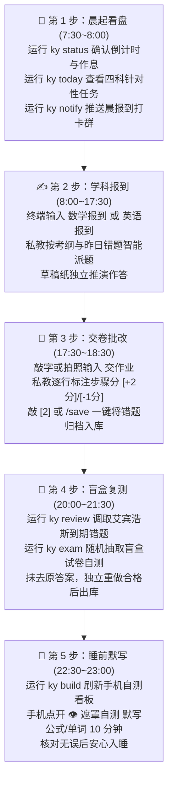

# 考研学习链 (Kaoyan AI Study Chain) · 学员实操与备考通关手册

> **【致考研学子】**
> 本手册是为你日常备考量身打造的实操指南。无论你是编程新手还是计算机科班，只需按照本手册的指引，即可在 3 分钟内配置好专属于你的 24 小时 AI 私人教师，开启高纪律、零幻觉、稳拿基本盘的备考之旅。

---

## 📑 快速目录索引

- [🌟 0. 快速了解：考研学习链能为你做什么](#0-快速了解考研学习链能为你做什么)
- [🚀 1. 新手 3 分钟极速开箱指引](#1-新手-3-分钟极速开箱指引)
- [🖥️ 2. 终端私教两大界面：TUI 交互面板 vs REPL 对话](#2-终端私教两大界面tui-交互面板-vs-repl-对话)
- [⚡ 3. 考研人每日标准备考 5 步法 (Daily SOP)](#3-考研人每日标准备考-5-步法-daily-sop)
- [🏛️ 4. 研招情报与考纲透视全功能指令实战](#4-研招情报与考纲透视全功能指令实战)
  - [4.1 院校口碑与避坑侦察 (`ky scout`)](#41-院校口碑与避坑侦察-ky-scout)
  - [4.2 研招网与高校官方招考事实核验 (`ky admission`)](#42-研招网与高校官方招考事实核验-ky-admission)
  - [4.3 双校核心指标横向深度对标 (`ky compare`)](#43-双校核心指标横向深度对标-ky-compare)
  - [4.4 目标高校简章动态指纹监控雷达 (`ky watch`)](#44-目标高校简章动态指纹监控雷达-ky-watch)
  - [4.5 官方考纲 AST 变迁对比与动荡率分析 (`ky fetch`)](#45-官方考纲-ast-变迁对比与动荡率分析-ky-fetch)
  - [4.6 外部真题/模拟卷智能切片入库 (`ky ingest`)](#46-外部真题模拟卷智能切片入库-ky-ingest)
  - [4.7 靶向组卷与同源变式强化 (`ky compose` & `ky variant`)](#47-靶向组卷与同源变式强化-ky-compose--ky-variant)
- [📱 5. 手机端自测看板与碎片时间默写技巧](#5-手机端自测看板与碎片时间默写技巧)
- [💬 6. 绑定常用聊天软件 (微信 / QQ / 钉钉 / 飞书)](#6-绑定常用聊天软件-微信--qq--钉钉--飞书)
- [🛠️ 7. 常见备考突发场景速查与处方](#7-常见备考突发场景速查与处方)

---

## 0. 快速了解：考研学习链能为你做什么？

传统使用通用聊天软件备考，常常面临四大痛点：
1. **AI 总是自己瞎编题目**，或者出超出大纲范围的偏难怪题；
2. **多聊几句 AI 就忘了你之前的做题情况**和薄弱章节；
3. **解题直接给你贴最终答案**，缺少步骤采分点判定；
4. **排队通勤碎片时间不知道怎么复习**，看书容易“眼睛懂了手不会”。

**考研学习链为你构建了全套工程化解决方案**：
- 🛡️ **白名单题源门禁**：AI 只从你放入的本地教材/真题中抽题，绝不凭空捏造题目；
- 📜 **官方考纲红线拦截**：数学二绝不出现三重积分或级数，严格锁定应试得分盘；
- 🧠 **三级外置长效记忆**：记录你的每个薄弱考点与错题生命周期，数月备战记忆不丢；
- 🎯 **真题阅卷人步骤打分**：解答题每一个推导明确标注 `[+2分]` / `[-1分]`，追查错因五分类；
- 📱 **独创手机毛玻璃遮罩自测**：排队、睡前触碰卡片秒测公式与单词，离线完全可用；
- 🏛️ **KaoYan Intelligence 研招情报**：研招网官方招考核验、简章变动监控、考纲 AST 变迁分析与社媒实名口碑去噪。

---

## 1. 新手 3 分钟极速开箱指引

### 1.1 基础环境准备
- **操作系统**：Windows 10/11、macOS、或 Linux 均可；
- **Python 环境**：电脑中已安装 Python 3.8 或以上（推荐 Python 3.10+，核心运行**完全零第三方依赖**）；
- **Git**：用于版本管理与多端同步。

### 1.2 步骤一：克隆或下载项目
在终端或 PowerShell 运行：
```bash
git clone https://github.com/moyetian/kaoyan_chain.git
cd kaoyan_chain
```
*(如果没有安装 Git，也可以直接在 GitHub 点击绿色的 **Code -> Download ZIP** 下载解压)*

### 1.3 步骤二：运行全自动初始化向导
```bash
python tools/init_workspace.py
```
> [!TIP]
> 向导会友好地引导你完成 7 项个性化设置：
> 1. 输入目标初试年份（自动计算初试倒计时与战役阶段）；
> 2. 选择你的考试科目（数学一/二/三/396、英语一/二、政治、专业课）；
> 3. 填入初始摸底分与提分目标；
> 4. 自动为你建立各科目受保护的 `参考资料/` 目录；
> 5. 设定每日复习可用时间（如 8.5 小时）与作息窗口；
> 6. 选择你喜欢的 AI 私教辅导风格（默认推荐：严格把关·保姆提分型）；
> 7. 自动生成专属备考方案书 `00_考研全科总战役规划.md` 与第一版移动端看板！

### 1.4 步骤三：配置大模型密钥 (API Key)
在终端运行：
```bash
ky config
# 或者
python tools/ky_cli.py config
```
按提示依次选择提供商（支持 DeepSeek、智谱 GLM、阿里通义千问、Kimi、OpenAI 或本地 Ollama），填入你的 API Key 即可。
> 💡 **小贴士**：推荐使用 DeepSeek，性价比极高，理科数学与专业课推理能力非常优秀！

---

## 2. 终端私教两大界面：TUI 交互面板 vs REPL 对话

考研学习链提供两种终端操作界面，你可以根据当前复习场景自由选用：

```text
┌────────────────────────────────────────────────────────────────────────┐
│                        终端私教两大交互界面对比                        │
├──────────────────────────────────┬─────────────────────────────────────┤
│ 🖥️ TUI 终端全景智能中枢 (v2.5)     │ 💬 REPL 交互式对话私教 (Interactive) │
├──────────────────────────────────┼─────────────────────────────────────┤
│ 启动方式：ky menu 或 python tools/ │ 启动方式：直接输入 ky 或 python      │
│          tui_navigator.py        │          tools/ky_cli.py            │
│ 适用场景：晨起查态势、一键功能导航、│ 适用场景：连续刷题、逐题分步批改、  │
│          做题组卷、监控简章等     │          苏格拉底启发、复杂定理答疑 │
│ 界面特点：等宽圆角边框、倒计时进度│ 界面特点：流式打字机输出、实时快捷  │
│          条、三阶功能卡片、快捷键│          操作栏、拍照上传、多轮推导 │
└──────────────────────────────────┴─────────────────────────────────────┘
```

### 2.1 启动 TUI 全景智能中枢 (`ky menu`)

输入 `ky menu`，立刻展现极客风的全景控制面板：

```text
╭──────────────────────────────────────────────────────────────────────────────────╮
│            🎯 考研学习链 (Kaoyan Study Chain) · 终端全景智能中枢 v2.5            │
├──────────────────────────────────────────────────────────────────────────────────┤
│ ⏳ 2026 初试倒计时: 104 天  │  备考进度: [███░░░░░░░░░] 22.4% (第30/134天)       │
│ 🏛️  目标院校: 华中科技大学 │  📚 专业方向: 085404 计算机技术                     │
│ 🛡️  辅导风格: 严格把关    │  📋 今日打卡: 0/12 完成 (今日任务进行中)            │
├──────────────────────────────────────────────────────────────────────────────────┤
│   • 📡 简章监控: 已纳入 1 所高校动态监控 (华中科技大学)                          │
│   • 📑 考纲变动: 波动率 10.7% (已生成考纲异动逐级处方)                           │
│   • 💬 社媒口碑: 已沉淀 3 篇院校实名经验档案                                     │
╰──────────────────────────────────────────────────────────────────────────────────╯

╭── ⚡ 核心备考与实战攻坚 (Core Preparation) ───────────────────────────────────────╮
│ [1] 今日任务 (Daily Tasks)           📋 查看四科任务量、打卡推进与行动指引       │
│ [2] 靶向组卷 (Exam Composer)         🎯 按考点与难度梯度智能拼卷演练             │
│ [3] 同源变式 (Variant Retrieval)     🔄 针对薄弱考点或错题智能检索同源题         │
╰──────────────────────────────────────────────────────────────────────────────────╯

╭── 🏛️ 研招情报与考纲透视 (Admissions & Syllabus) ──────────────────────────────────╮
│ [4] 考纲Diff (Syllabus Diff)         📈 对比新旧考纲 AST 掌握度变迁与动荡率      │
│ [5] 切片入库 (Material Ingestion)    📥 真题/模拟卷 Markdown 结构化入库          │
│ [6] 院校侦察 (School Scout)          🔍 聚合研招网指标与三大社媒实名口碑研报     │
│ [7] 双校对标 (School Comparator)     ⚖️ 横向深度对标双校招生指标与保护机制       │
│ [8] 简章监控 (Admission Watcher)     📡 目标高校研究生院简章动态指纹预警         │
╰──────────────────────────────────────────────────────────────────────────────────╯

╭── 📊 全景态势与系统大盘 (Dashboard & System) ─────────────────────────────────────╮
│ [9] 看板更新 (Dashboard Build)       📊 重编译掌握度雷达并刷新本地 Web 看板      │
│ [0] 安全退出 (Exit System)           🚪 保存状态并平稳退出终端导航器             │
╰──────────────────────────────────────────────────────────────────────────────────╯
```

只需在提示符后输入对应数字（`1` 到 `9` 或 `0`），即可一键直达对应功能！

---

## 3. 考研人每日标准备考 5 步法 (Daily SOP)

考研不是一两天的突击，而是长达数百天严守节奏的持久战。系统为你固化了最高效的每日 5 步闭环：



### 详细操作示范：

#### 第 1 步：晨起确认任务
```bash
ky status   # 第一眼确认研考倒计时与今日预算
ky today    # 查看数学、英语、政治、专业课具体攻坚内容
```

#### 第 2 步：日间报到与做题
进入终端私教：
```bash
ky
```
在提示符后输入：
> `数学报到`

私教将调取你昨日的薄弱项，从你的白名单资料库中抽取 2~3 道代表性核心题目派发给你。你在草稿纸上独立计算写出完整步骤。

#### 第 3 步：提交作业与批改
在终端输入你的解答（或者拍照后输入 `/img D:\draft\math_01.jpg`）：
> `交作业`
> `第一步：因为 f(x) 在 [0, 1] 连续可导，构造辅助函数 F(x) = ...`

私教会以真题阅卷人的标准逐行给出采分点：
- `[+2分]` 辅助函数构造正确；
- `[+3分]` 罗尔定理三个核心条件验证完备；
- `[-1分]` 结论区间开闭未明确标出；
- **错因五分类**：【审题偏差】。
此时按下快捷键 `[2]`，系统自动将题干与错误原因归档进 `01-数学/错题本/`。

#### 第 4 步：晚间艾宾浩斯错题盲盒重测
```bash
ky review math                     # 查看今日到期需要复习的数学错题
ky exam math --count=3 --save      # 自动生成一套 3 道错题组成的盲盒测试卷
```
试卷中自动隐去历史做题答案，强迫你在草稿纸上独立重新推导。

#### 第 5 步：睡前手机遮罩背诵
在电脑上运行：
```bash
ky build
```
拿起手机打开看板，开启【👁️ 遮罩自测模式】，触碰卡片背诵 10 分钟数学定理、英语高频词与政治帽子词，巩固当日记忆。

---

## 4. 研招情报与考纲透视全功能指令实战

### 4.1 院校口碑与避坑侦察 (`ky scout`)
想调研目标高校的报录比、复试公平性或就读体验？
```bash
# 侦察华中科技大学计算机专业
ky scout 华中科技大学 计算机 --save
```
- 自动抓取招生人数、初试统考/自命题科目；
- 聚合知乎、B站、小红书三大平台的学长学姐实名经验；
- 自动进行**广告与卖课营销贴降噪**，生成结构化 Markdown 研报并存入 `04-专业课/`。

---

### 4.2 研招网与高校官方招考事实核验 (`ky admission`)
想核实官方初试科目是否改考？
```bash
# 调取官方初试科目与招生名额
ky admission 华中科技大学 085404 --save

# 锁定 2027 考研年份核验
ky admission 浙江大学 软件工程 --year=2027
```
- **S 级权威证据**：直接对接研招网官方硕士专业目录通道；
- **A 级官方证据**：直连高校研究生院与二级学院官方通知；
- **防年份漂移**：锁定年份，严防把往年旧大纲误当作当年新政。

---

### 4.3 双校核心指标横向深度对标 (`ky compare`)
在两所目标学校之间纠结犹豫时：
```bash
ky compare 华中科技大学 武汉大学 计算机 --save
```
系统一键生成全方位的横向 PK 报告：
- **办学层次与教育部代码**；
- **初试科目差异**（如：都是 408 统考，还是有自命题科目）；
- **历年复试分数线走势**；
- **一志愿保护机制排查**（是否保护一志愿、复试比例是否合理）；
- **学员学情差距诊断 (User State Gap)**：结合你在 `ky_config.json` 中的摸底分，测算你的复试安全缓冲垫！

---

### 4.4 目标高校简章动态指纹监控雷达 (`ky watch`)
每年 8~10 月是各高校招生简章和专业目录集中公布的高峰期：
```bash
# 1. 将目标学校加入监控雷达
ky watch 华中科技大学
ky watch 电子科技大学

# 2. 检查所有已监控高校的页面是否有最新更新
ky watch --check

# 3. 查看当前监控清单
ky watch --list
```
系统会通过 SHA256 指纹毫秒级比对研究生院官网。一旦发现高校发布了新简章，每天早晨运行 `ky today` 时会**自动置顶弹出「🔥 研招突发情报速递」提示**！

---

### 4.5 官方考纲 AST 变迁对比与动荡率分析 (`ky fetch`)
新大纲公布时，如何一眼看清增删改考点？
```bash
# 对比数学新旧考纲并保存异动研报
ky fetch 01-数学/考试大纲.md 01-数学/参考资料/2027新版考纲.md --save
```
- 自动解析考纲知识点树（AST）；
- 标注考点增减：如 `[新增] 泰勒公式展开`、`[删除] 了解级别的奇偶性`；
- 标注考查要求变更：如 `[要求提升] 零点定理 (理解 ➔ 掌握)`；
- 量化计算**考纲动荡率 (Volatility Rate)**，出具逐级应对处方。

---

### 4.6 外部真题/模拟卷智能切片入库 (`ky ingest`)
手头有一份 Markdown 格式的模拟卷或历年真题，想放入本地题库？
```bash
ky ingest "参考资料/2024年408模拟精选卷.md" --subject=专业课 --save
```
- 算法自动分块切片单选、多选与综合大题；
- 智能抽取选择题选项（A/B/C/D）与综合大题各步骤采分点（如 `[+6分]` / `[+9分]`）；
- 自动生成标准化题卡，放入对应科目 `参考资料/`，供私教日常精准抽题！

---

### 4.7 靶向组卷与同源变式强化 (`ky compose` & `ky variant`)
```bash
# 1. 靶向组卷：抽取 3 道错题与薄弱考点，组装一套自测卷
ky compose math --count=3 --type=choice --save

# 2. 变式强化：检索关于“中值定理”的同考点变式题
ky variant "中值定理"
```
- 试卷自动抹去原答案，生成独立答题卡格式；
- 变式题严格标明题源出处；本地未放置对应真题书时，**强制标注【私教自拟变式】水印**，坚决杜绝大模型题源幻觉！

---

## 5. 手机端自测看板与碎片时间默写技巧

看板位于 `docs/index.html`，无需安装任何 App，直接在浏览器中打开即可！

### 5.1 局域网手机实时浏览
在电脑端终端运行：
```bash
python -m http.server 8080 --directory docs
```
在手机浏览器中输入电脑的 IP 地址（如 `http://192.168.1.100:8080`），即可实现手机端与电脑端同频复习！

### 5.2 添加到手机主屏幕 (PWA 原生体验)
1. 在手机 Safari (苹果) 或 Chrome/Edge (安卓) 中打开看板网页；
2. 点击底部的 **“分享”** 按钮（或右上角菜单）；
3. 选择 **“添加到主屏幕” (Add to Home Screen)**；
4. 手机桌面上会生成一个独立的“考研看板”App 图标，点击直接全屏打开，无地址栏干扰！

### 5.3 独创「👁️ 遮罩自测模式」实操
1. 进入看板顶部，点击 **“👁️ 开启遮罩自测”** 按钮；
2. 页面中的核心公式、英语单词释义、政治帽子词与答题关键步骤会**立刻被高斯模糊虚化遮挡**；
3. 用手指轻触任意被遮挡的卡片，该卡片答案瞬间高亮清晰展现；
4. 再次轻触即可重新遮挡，适合在食堂排队、地铁通勤或睡前连续自测默写！

---

## 6. 绑定常用聊天软件 (微信 / QQ / 钉钉 / 飞书)

如果不想一直坐在电脑前，可以把终端私教连接到微信或 QQ，手机随时发题，AI 随时讲题！

### 6.1 微信个人号 (WeChat ClawBot · 免公网推荐)
```bash
ky clawbot
```
终端会打印一个登录二维码，用手机微信扫码授权后，私教即可在微信中 24 小时为你 1 对 1 讲题！

### 6.2 QQ / 钉钉 / 飞书配置
先在终端启动网关：
```bash
ky serve
```
- **QQ 群 (NapCat)**：在 NapCat 中将 HTTP 事件上报填入 `http://127.0.0.1:8088/webhook` 即可本地免穿透连接；
- **钉钉群 / 飞书**：详细图文配置步骤参见 [`docs/BOT_INTEGRATION_GUIDE.md`](docs/BOT_INTEGRATION_GUIDE.md)。

---

## 7. 常见备考突发场景速查与处方

| 备考突发场景 | 推荐操作 / 解决指令 | 说明与处方 |
|---|---|---|
| **做题卡壳，第一步无从下笔** | 在交互私教中输入 `/hint` | 唤醒苏格拉底三级微步骤提示（破题定性 ➔ 首步搭桥 ➔ 避坑指南），拒绝直接剧透答案 |
| **复习压力过大，任务连续积压** | 终端运行 `ky relieve` | 一键启动减负模式：四科时间预算下调 25%，并自动切换为「温和启发·减负鼓励型」辅导风格 |
| **发现这道题非常有价值想记下来** | 按快捷键 `[2]` 或输入 `/save` | 私教自动提取原题干设问与你的错因，一键写入本地错题本 Markdown 文件 |
| **想更换报考院校或专业考试科目** | 终端运行 `ky subject` | 重新选择数一/数二/数三/396、英一/英二等科目，系统自动挂载新大纲与红线 |
| **不小心误修改了学情文件** | 终端运行 `ky rollback` | 系统自动从 `.checkpoint/` 恢复写前创建的原子快照，秒级无损撤回 |
| **备考一段时间想全面体检系统** | 终端运行 `ky doctor` | 检查 Python、四科协议、状态机、API 连通性与 Git 隐私安全 |
| **想把今日任务发到备考监督群** | 终端运行 `ky notify` | 一键格式化今日四科攻坚清单并推送到绑定的微信/QQ/钉钉群 |
| **查看所有命令行子命令速查** | 终端运行 `ky --help` | 打印全部 30+ 项子命令与使用参数 |

---

> 💡 **考研心语**：备考是一场战胜焦虑、稳扎稳打的修行。相信科学的力量，严守每日闭环，你所付出的每一滴汗水，终将在金秋十二月绽放！🌟
