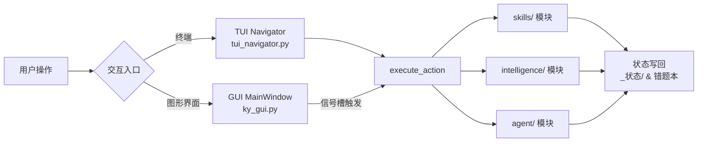
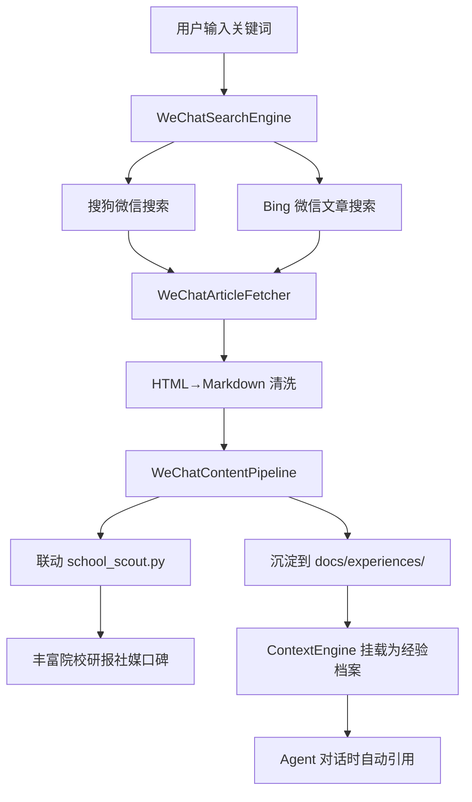
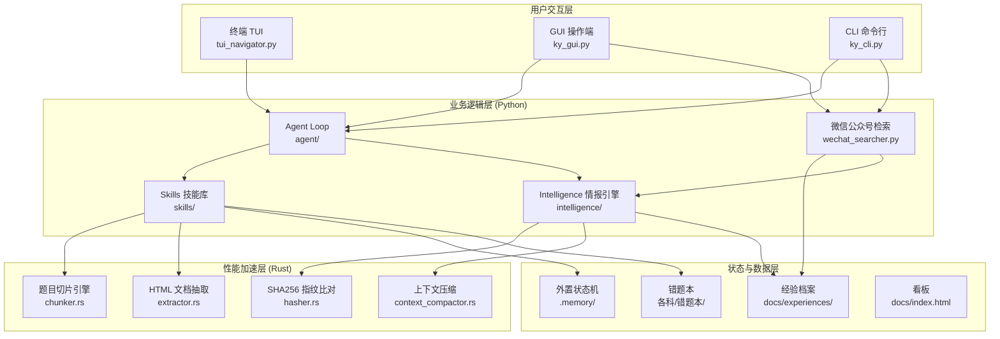

# 考研学习链 · 新功能技术实现方案

> **文档定位**：本文件为考研学习链 (Kaoyan AI Study Chain) 项目新增三大功能模块的完整技术实现方案，涵盖 GUI 可视化操作端、微信公众号文章检索与爬虫工具、以及核心 Python 模块的 Rust 重写加速方案。每部分均包含架构设计、关键代码示例、集成建议与迁移路径。

---

## 目录

1. [功能一：GUI 图形用户界面操作端](#功能一gui-图形用户界面操作端)
2. [功能二：微信公众号文章检索与爬虫工具](#功能二微信公众号文章检索与爬虫工具)
3. [功能三：Python 核心模块 Rust 重写加速方案](#功能三python-核心模块-rust-重写加速方案)
4. [集成建议与迁移路径](#集成建议与迁移路径)

---

## 功能一：GUI 图形用户界面操作端

### 1.1 需求分析

当前项目以 TUI 终端交互 (`tui_navigator.py`) 和 CLI 命令行 (`ky_cli.py`) 为主交互入口。GUI 操作端旨在：

- 为非技术用户（考研学员）提供零门槛的可视化操作界面
- 将 10 大核心功能模块以图形化卡片形式呈现，降低记忆口令负担
- 实时展示倒计时、今日任务进度、掌握度雷达等关键学情数据
- 支持截图上传、作业提交、错题查看等高频交互场景

### 1.2 技术选型

| 方案 | 优势 | 劣势 | 最终决策 |
|---|---|---|---|
| **PySide6 (Qt)** | 原生窗口、组件丰富、跨平台一致性好、支持 CSS 主题 | 包体积较大 (~60MB) | ✅ **采用** |
| Tkinter | 零依赖、Python 内置 | 控件原始、排版困难、中文渲染问题 | ❌ |
| Web UI (Flask + 浏览器) | 跨端通用、已有 `docs/index.html` 看板基础 | 需要额外启动浏览器、离线体验割裂 | 备选 |
| Electron | UI 极佳 | 内存占用大、需要 Node.js 运行时 | ❌ |

**选型理由**：PySide6 是 Qt for Python 的官方绑定，拥有成熟的信号槽机制、丰富的内置控件 (表格、树形、图表) 和优秀的 CSS QSS 样式系统，能够直接复用项目现有的全部 Python 工具链（`skills/`、`intelligence/`、`agent/`），无需引入额外的跨语言桥接成本。项目已要求 Python 3.10+，PySide6 完美兼容。

### 1.3 架构设计

```
tools/
├── gui/
│   ├── __init__.py              # GUI 包入口
│   ├── main_window.py           # 主窗口 (QMainWindow) 与布局管理
│   ├── widgets/
│   │   ├── countdown_card.py    # 倒计时与备考进度卡片
│   │   ├── task_panel.py        # 今日四科任务推进面板
│   │   ├── subject_tabs.py      # 四科私教标签页
│   │   ├── chat_view.py         # 私教对话流式输出面板
│   │   ├── error_browser.py     # 错题本浏览与复测面板
│   │   ├── intelligence_hub.py  # 研招情报与院校对标面板
│   │   └── dashboard_preview.py # 看板内嵌预览面板
│   ├── workers/
│   │   ├── agent_worker.py      # Agent Loop 异步执行 Worker (QThread)
│   │   ├── fetch_worker.py      # 网络抓取 Worker (研招/公众号)
│   │   └── build_worker.py      # 看板构建 Worker
│   ├── theme/
│   │   ├── dark.qss             # 深色主题样式表
│   │   └── light.qss            # 浅色主题样式表
│   └── resources/
│       └── icons/               # 功能图标资源
└── ky_gui.py                    # GUI 启动入口 (python tools/ky_gui.py)
```

### 1.4 核心代码示例

#### 1.4.1 启动入口 (`tools/ky_gui.py`)

```python
#!/usr/bin/env python3
# -*- coding: utf-8 -*-
"""考研学习链 GUI 启动入口"""

import sys
from pathlib import Path

# 确保工具目录在 sys.path 中
ROOT = Path(__file__).resolve().parent.parent
TOOLS = ROOT / "tools"
for p in (str(ROOT), str(TOOLS)):
    if p not in sys.path:
        sys.path.insert(0, p)

from PySide6.QtWidgets import QApplication
from PySide6.QtCore import Qt
from PySide6.QtGui import QFont

from gui.main_window import MainWindow


def main():
    # 高 DPI 支持
    QApplication.setHighDpiScaleFactorRoundingPolicy(
        Qt.HighDpiScaleFactorRoundingPolicy.PassThrough
    )
    app = QApplication(sys.argv)
    app.setApplicationName("考研学习链 GUI")
    app.setOrganizationName("KaoyanStudyChain")

    # 全局字体
    font = QFont("Microsoft YaHei", 10)
    app.setFont(font)

    # 加载主题
    theme_path = TOOLS / "gui" / "theme" / "dark.qss"
    if theme_path.exists():
        app.setStyleSheet(theme_path.read_text(encoding="utf-8"))

    window = MainWindow()
    window.show()
    sys.exit(app.exec())


if __name__ == "__main__":
    main()
```

#### 1.4.2 主窗口与功能卡片 (`tools/gui/main_window.py`)

```python
# -*- coding: utf-8 -*-
"""考研学习链 GUI 主窗口"""

from PySide6.QtWidgets import (
    QMainWindow, QWidget, QVBoxLayout, QHBoxLayout, QGridLayout,
    QLabel, QPushButton, QTabWidget, QProgressBar, QFrame, QScrollArea
)
from PySide6.QtCore import Qt, Signal, QTimer, QThread, Signal as pySignal
from PySide6.QtGui import QFont, QIcon
from pathlib import Path
import json

ROOT = Path(__file__).resolve().parent.parent.parent
CONFIG_FILE = ROOT / "ky_config.json"


class FunctionCard(QFrame):
    """功能模块卡片组件"""
    clicked = pySignal(str)  # 发射功能别名

    def __init__(self, icon: str, title: str, desc: str, alias: str):
        super().__init__()
        self.alias = alias
        self.setObjectName("FunctionCard")
        self.setCursor(Qt.PointingHandCursor)
        self.setFixedSize(240, 100)

        layout = QVBoxLayout(self)
        layout.setContentsMargins(16, 12, 16, 12)

        title_label = QLabel(f"{icon}  {title}")
        title_label.setStyleSheet("font-size: 14px; font-weight: bold; color: #e0e0e0;")
        desc_label = QLabel(desc)
        desc_label.setStyleSheet("font-size: 11px; color: #888;")
        desc_label.setWordWrap(True)

        layout.addWidget(title_label)
        layout.addWidget(desc_label)

    def mousePressEvent(self, event):
        if event.button() == Qt.LeftButton:
            self.clicked.emit(self.alias)
        super().mousePressEvent(event)


class MainWindow(QMainWindow):
    def __init__(self):
        super().__init__()
        self.setWindowTitle("考研学习链 · 全科智能私教中枢")
        self.setMinimumSize(1200, 800)
        self._load_config()
        self._init_ui()
        self._init_timer()

    def _load_config(self):
        self.config = {}
        if CONFIG_FILE.exists():
            try:
                self.config = json.loads(CONFIG_FILE.read_text(encoding="utf-8"))
            except Exception:
                pass

    def _init_ui(self):
        central = QWidget()
        self.setCentralWidget(central)
        main_layout = QVBoxLayout(central)
        main_layout.setSpacing(16)
        main_layout.setContentsMargins(20, 20, 20, 20)

        # ── 顶部状态栏 ──
        header = self._build_header()
        main_layout.addWidget(header)

        # ── 核心功能区 (网格卡片) ──
        cards_area = self._build_function_cards()
        main_layout.addWidget(cards_area, stretch=1)

        # ── 底部标签页 ──
        tabs = QTabWidget()
        tabs.addTab(self._build_chat_tab(), "💬 私教对话")
        tabs.addTab(self._build_task_tab(), "📋 今日任务")
        tabs.addTab(self._build_error_tab(), "📕 错题本")
        tabs.addTab(self._build_intel_tab(), "🏛️ 研招情报")
        main_layout.addWidget(tabs, stretch=2)

    def _build_header(self):
        header = QFrame()
        header.setObjectName("HeaderBar")
        header.setFixedHeight(80)
        layout = QHBoxLayout(header)

        days_left = self._calc_countdown()

        title = QLabel("🎯 考研学习链")
        title.setStyleSheet("font-size: 18px; font-weight: bold; color: #6366f1;")
        countdown = QLabel(f"⏳ 初试倒计时: {days_left} 天")
        countdown.setStyleSheet("font-size: 16px; font-weight: bold; color: #fbbf24;")
        school = QLabel(f"🏛️ 目标: {self.config.get('study_plan', {}).get('school', '未指定')}")
        school.setStyleSheet("font-size: 13px; color: #aaa;")

        layout.addWidget(title)
        layout.addStretch()
        layout.addWidget(countdown)
        layout.addSpacing(20)
        layout.addWidget(school)
        return header

    def _build_function_cards(self):
        scroll = QScrollArea()
        scroll.setWidgetResizable(True)
        scroll.setObjectName("CardScrollArea")

        container = QWidget()
        grid = QGridLayout(container)
        grid.setSpacing(12)

        # 映射 TUI 菜单的 10 大功能
        cards_data = [
            ("📋", "今日任务", "查看四科任务量与打卡推进", "today"),
            ("🎯", "靶向组卷", "按考点与难度智能拼卷演练", "compose"),
            ("🔄", "同源变式", "薄弱考点同源变式检索", "variant"),
            ("📈", "考纲Diff", "新旧考纲层级对比与动荡率", "diff"),
            ("📥", "切片入库", "真题/模拟卷结构化入库", "ingest"),
            ("🔍", "院校侦察", "研招网与社媒口碑研报", "scout"),
            ("⚖️", "双校对标", "双校招生指标横向对比", "compare"),
            ("📡", "简章监控", "高校研究生院简章变动预警", "watch"),
            ("📊", "看板更新", "重新编译掌握度雷达看板", "build"),
            ("📱", "公众号检索", "微信公众号考研文章检索", "wechat_search"),
        ]

        for idx, (icon, title, desc, alias) in enumerate(cards_data):
            card = FunctionCard(icon, title, desc, alias)
            card.clicked.connect(self._on_card_clicked)
            row, col = divmod(idx, 5)
            grid.addWidget(card, row, col)

        scroll.setWidget(container)
        return scroll

    def _build_chat_tab(self):
        widget = QWidget()
        layout = QVBoxLayout(widget)

        # 对话历史区
        self.chat_display = QLabel("私教对话区 (流式输出)")
        self.chat_display.setAlignment(Qt.AlignTop | Qt.AlignLeft)
        self.chat_display.setStyleSheet("background: #1e1e1e; color: #d4d4d4; padding: 12px; border-radius: 8px;")
        self.chat_display.setWordWrap(True)
        layout.addWidget(self.chat_display, stretch=3)

        # 输入区
        input_bar = QHBoxLayout()
        self.input_box = QLineEdit()
        self.input_box.setPlaceholderText("输入口令 (如：数学报到 / 交作业) 或直接提问...")
        self.input_box.returnPressed.connect(self._on_send_message)
        send_btn = QPushButton("发送 ➤")
        send_btn.clicked.connect(self._on_send_message)
        input_bar.addWidget(self.input_box)
        input_bar.addWidget(send_btn)
        layout.addLayout(input_bar)
        return widget

    def _build_task_tab(self):
        widget = QWidget()
        layout = QVBoxLayout(widget)

        subjects = ["01-数学", "02-英语", "03-思想政治理论", "04-专业课"]
        for subj in subjects:
            frame = QFrame()
            frame.setObjectName("TaskRow")
            h = QHBoxLayout(frame)
            label = QLabel(f"📚 {subj}")
            label.setFixedWidth(180)
            progress = QProgressBar()
            progress.setRange(0, 100)
            progress.setValue(0)  # 实际从今日任务文件解析
            pct_label = QLabel("0/0")
            h.addWidget(label)
            h.addWidget(progress, stretch=1)
            h.addWidget(pct_label)
            layout.addWidget(frame)

        layout.addStretch()
        return widget

    def _build_error_tab(self):
        widget = QWidget()
        layout = QVBoxLayout(widget)
        hint = QLabel("📕 错题本浏览与艾宾浩斯复测面板\n\n此面板将展示各科到期错题，支持一键生成盲盒复测卷。")
        hint.setStyleSheet("color: #888; font-size: 13px;")
        layout.addWidget(hint)
        layout.addStretch()
        return widget

    def _build_intel_tab(self):
        widget = QWidget()
        layout = QVBoxLayout(widget)
        hint = QLabel("🏛️ 研招情报中心\n\n此面板整合院校侦察、双校对标与简章监控结果。")
        hint.setStyleSheet("color: #888; font-size: 13px;")
        layout.addWidget(hint)
        layout.addStretch()
        return widget

    def _calc_countdown(self):
        from datetime import date, datetime
        exam_str = self.config.get("exam_date") or \
                    self.config.get("study_plan", {}).get("exam_date", "2026-12-19")
        try:
            exam_d = datetime.strptime(exam_str, "%Y-%m-%d").date()
            return max(0, (exam_d - date.today()).days)
        except Exception:
            return 104

    def _on_card_clicked(self, alias: str):
        """功能卡片点击 → 复用 TUI 的 execute_action 逻辑"""
        if alias == "wechat_search":
            self._open_wechat_search_dialog()
            return
        # 复用 tui_navigator 的分发逻辑
        try:
            from tui_navigator import execute_action
            self.chat_display.setText(f"▶ 正在启动模块: {alias} ...")
            execute_action(alias, interactive=False)
        except Exception as e:
            self.chat_display.setText(f"执行异常: {e}")

    def _open_wechat_search_dialog(self):
        """打开公众号文章检索对话框"""
        from gui.widgets.wechat_search_dialog import WeChatSearchDialog
        dialog = WeChatSearchDialog(self)
        dialog.exec()

    def _on_send_message(self):
        text = self.input_box.text().strip()
        if not text:
            return
        self.input_box.clear()
        self.chat_display.setText(f"👤 你: {text}\n\n🤖 私教正在思考中...")

        # 异步调用 Agent Loop
        from gui.workers.agent_worker import AgentWorker
        self.agent_worker = AgentWorker(self.config, text)
        self.agent_worker.finished_signal.connect(self._on_agent_reply)
        self.agent_worker.start()

    def _on_agent_reply(self, reply: str):
        current = self.chat_display.text()
        self.chat_display.setText(current + "\n\n🤖 私教: " + reply)

    def _init_timer(self):
        """每分钟刷新倒计时"""
        self.refresh_timer = QTimer()
        self.refresh_timer.timeout.connect(self._refresh_header)
        self.refresh_timer.start(60000)

    def _refresh_header(self):
        # 重新计算倒计时并更新显示
        pass
```

#### 1.4.3 Agent 异步执行 Worker (`tools/gui/workers/agent_worker.py`)

```python
# -*- coding: utf-8 -*-
"""Agent Loop 异步执行 Worker，防止 GUI 主线程阻塞"""

from PySide6.QtCore import QThread, Signal as pySignal
from pathlib import Path
import sys

ROOT = Path(__file__).resolve().parent.parent.parent.parent
TOOLS = ROOT / "tools"
for p in (str(ROOT), str(TOOLS)):
    if p not in sys.path:
        sys.path.insert(0, p)


class AgentWorker(QThread):
    finished_signal = pySignal(str)

    def __init__(self, config: dict, user_input: str):
        super().__init__()
        self.config = config
        self.user_input = user_input

    def run(self):
        try:
            from agent import AgentRunner
            runner = AgentRunner(
                config=self.config,
                workspace_root=ROOT,
                permission_mode="acceptEdits",
                max_steps=8,
            )
            reply = runner.run(self.user_input, interactive=False)
            self.finished_signal.emit(reply)
        except Exception as e:
            self.finished_signal.emit(f"[Agent 执行异常]: {e}")
```

#### 1.4.4 深色主题样式表 (`tools/gui/theme/dark.qss`)

```css
/* 考研学习链 GUI · 深色主题 */

QMainWindow, QWidget {
    background-color: #1a1a2e;
    color: #e0e0e0;
}

#HeaderBar {
    background-color: #16213e;
    border-radius: 12px;
    border: 1px solid #0f3460;
}

#FunctionCard {
    background-color: #16213e;
    border: 1px solid #0f3460;
    border-radius: 10px;
}

#FunctionCard:hover {
    background-color: #0f3460;
    border: 1px solid #6366f1;
}

#CardScrollArea {
    background-color: transparent;
    border: none;
}

QProgressBar {
    background-color: #0d1117;
    border: 1px solid #1a1a2e;
    border-radius: 6px;
    text-align: center;
    color: #fbbf24;
}

QProgressBar::chunk {
    background-color: #6366f1;
    border-radius: 5px;
}

QTabWidget::pane {
    border: 1px solid #0f3460;
    border-radius: 8px;
    background-color: #1a1a2e;
}

QTabBar::tab {
    background-color: #16213e;
    color: #888;
    padding: 8px 20px;
    border-radius: 6px;
    margin-right: 4px;
}

QTabBar::tab:selected {
    background-color: #6366f1;
    color: white;
}

QPushButton {
    background-color: #6366f1;
    color: white;
    border: none;
    padding: 8px 20px;
    border-radius: 6px;
    font-size: 13px;
}

QPushButton:hover {
    background-color: #5457e3;
}

QLineEdit {
    background-color: #0d1117;
    border: 1px solid #1a1a2e;
    border-radius: 6px;
    padding: 8px 12px;
    color: #e0e0e0;
    font-size: 13px;
}

QLineEdit:focus {
    border: 1px solid #6366f1;
}
```

### 1.5 GUI 与现有 TUI 的复用关系



**核心设计原则**：GUI 不重新实现业务逻辑，而是通过 `from tui_navigator import execute_action` 直接复用 TUI 已有的 10 大功能分发器。GUI 仅负责事件驱动与可视化呈现，业务逻辑层完全共享。

### 1.6 依赖更新

在 `requirements.txt` 和 `pyproject.toml` 中新增可选依赖：

```ini
# requirements.txt 新增
# ── 6. GUI 图形界面操作端 (可选) ──
PySide6>=6.6.0
```

```toml
# pyproject.toml [project.optional-dependencies] 新增
gui = [
    "PySide6>=6.6.0",
]
```

启动方式：
```bash
# 安装 GUI 依赖
pip install PySide6

# 启动 GUI
python tools/ky_gui.py
# 或在 ky_cli.py 中新增子命令: ky gui
```

---

## 功能二：微信公众号文章检索与爬虫工具

### 2.1 需求分析

考研备考过程中，大量优质经验贴、院校解读、考点精讲内容发布在微信公众号平台。学员需要一个集成工具来：

- 按关键词检索考研相关公众号文章（如"408 计算机考研"、"数学二满分经验"）
- 自动抓取文章正文，清洗为 Markdown 格式
- 将优质内容沉淀到 `docs/experiences/` 目录，作为社媒经验档案补充
- 支持与现有的 `school_scout.py` 院校侦察引擎联动，丰富研报数据源

### 2.2 技术挑战与合规策略

微信公众号文章存在以下反爬机制：

| 挑战 | 对策 |
|---|---|
| 文章 URL 需要有效 `__biz` / `mid` / `idx` / `sn` 参数 | 支持用户直接粘贴文章链接，或通过搜狗微信搜索间接检索 |
| 搜狗微信搜索有频率限制与验证码 | 采用多源检索策略：搜狗 + Bing + 自定义文章库 |
| 正文嵌套大量富文本组件 | 使用 HTML 解析 + 正则清洗，提取纯文本 |
| 图片使用 CDN 加密链接 | 可选下载图片到本地，转 Base64 嵌入 Markdown |

**合规声明**：本工具仅用于个人学习研究目的，遵循各平台 robots.txt 与使用条款，不进行大规模分布式爬取，所有抓取内容保留原始来源链接与作者署名。

### 2.3 架构设计

```
tools/
├── skills/
│   └── wechat_searcher.py      # 微信公众号文章检索与爬虫核心模块
├── gui/
│   └── widgets/
│       └── wechat_search_dialog.py  # GUI 检索对话框 (集成于 GUI 操作端)
```

**模块内部结构**：
```
wechat_searcher.py
├── class WeChatArticleItem          # 文章数据模型 (dataclass)
├── class WeChatSearchEngine         # 多源检索引擎
│   ├── search_sogou()               # 搜狗微信搜索 (主要源)
│   ├── search_bing()                # Bing 微信文章搜索 (备用源)
│   └── search_local_cache()         # 本地已沉淀文章检索
├── class WeChatArticleFetcher       # 文章正文抓取器
│   ├── fetch_article_content()     # 抓取并清洗正文
│   ├── extract_metadata()           # 提取标题/作者/发布时间
│   └── convert_to_markdown()        # HTML → Markdown 转换
├── class WeChatContentPipeline      # 内容沉淀管道
│   ├── save_to_experiences()       # 沉淀到 docs/experiences/
│   └── feed_to_scout_engine()      # 联动 school_scout 研报
└── def wechat_search()              # 对外统一接口函数
```

### 2.4 核心代码示例

#### 2.4.1 文章数据模型与搜索引擎 (`tools/skills/wechat_searcher.py`)

```python
# -*- coding: utf-8 -*-
"""
考研学习链 · 微信公众号文章检索与爬虫工具 (WeChat Article Searcher)

核心功能：
  1. 多源检索：搜狗微信搜索 + Bing 微信文章搜索 + 本地缓存
  2. 文章正文抓取与 HTML→Markdown 清洗
  3. 优质内容沉淀到 docs/experiences/ 作为社媒经验档案
  4. 联动 school_scout.py 院校侦察引擎丰富研报数据源

合规声明：仅用于个人学习研究，遵循各平台使用条款，不进行大规模分布式爬取。
"""

import os
import re
import json
import html
import time
import random
import urllib.request
import urllib.parse
import urllib.error
from dataclasses import dataclass, field
from datetime import datetime
from pathlib import Path
from typing import List, Dict, Any, Optional, Tuple

ROOT = Path(__file__).resolve().parent.parent.parent

USER_AGENT = (
    "Mozilla/5.0 (Windows NT 10.0; Win64; x64) "
    "AppleWebKit/537.36 (KHTML, like Gecko) "
    "Chrome/125.0.0.0 Safari/537.36"
)


@dataclass
class WeChatArticleItem:
    """微信公众号文章数据模型"""
    title: str
    url: str
    source_account: str = ""        # 公众号名称
    publish_date: str = ""          # 发布日期 YYYY-MM-DD
    summary: str = ""               # 摘要
    content_markdown: str = ""      # 正文 Markdown
    content_html: str = ""          # 原始 HTML
    fetched: bool = False           # 是否已抓取正文
    source_platform: str = "sogou"  # 检索来源


class WeChatSearchEngine:
    """多源微信公众号文章搜索引擎"""

    SOGOU_WX_URL = "https://weixin.sogou.com/weixin"
    BING_URL = "https://www.bing.com/search"

    def search(self, keyword: str, max_results: int = 10,
               source: str = "auto") -> List[WeChatArticleItem]:
        """
        统一检索入口
        :param keyword: 检索关键词 (如 "408计算机考研经验")
        :param max_results: 最大结果数
        :param source: "sogou" / "bing" / "auto" (自动降级)
        """
        if source == "auto":
            # 优先搜狗，失败降级 Bing
            results = self._search_sogou(keyword, max_results)
            if len(results) < 3:
                results.extend(self._search_bing(keyword, max_results - len(results)))
            return results[:max_results]
        elif source == "sogou":
            return self._search_sogou(keyword, max_results)
        elif source == "bing":
            return self._search_bing(keyword, max_results)
        return []

    def _search_sogou(self, keyword: str, max_results: int) -> List[WeChatArticleItem]:
        """搜狗微信搜索"""
        params = {
            "type": "2",  # 2 = 搜文章
            "query": keyword,
            "ie": "utf-8"
        }
        url = f"{self.SOGOU_WX_URL}?{urllib.parse.urlencode(params)}"

        try:
            req = urllib.request.Request(url, headers={
                "User-Agent": USER_AGENT,
                "Referer": "https://weixin.sogou.com/",
                "Accept-Language": "zh-CN,zh;q=0.9",
            })
            with urllib.request.urlopen(req, timeout=10) as resp:
                html_content = resp.read().decode("utf-8", errors="replace")

            return self._parse_sogou_results(html_content)[:max_results]
        except Exception as e:
            print(f"[搜狗检索异常]: {e}")
            return []

    def _search_bing(self, keyword: str, max_results: int) -> List[WeChatArticleItem]:
        """Bing 搜索微信文章 (限定 mp.weixin.qq.com 域名)"""
        query = f"site:mp.weixin.qq.com {keyword}"
        params = {"q": query, "count": str(max_results * 2)}
        url = f"{self.BING_URL}?{urllib.parse.urlencode(params)}"

        try:
            req = urllib.request.Request(url, headers={
                "User-Agent": USER_AGENT,
                "Accept-Language": "zh-CN,zh;q=0.9",
            })
            with urllib.request.urlopen(req, timeout=10) as resp:
                html_content = resp.read().decode("utf-8", errors="replace")

            return self._parse_bing_results(html_content)[:max_results]
        except Exception as e:
            print(f"[Bing 检索异常]: {e}")
            return []

    def _parse_sogou_results(self, html_text: str) -> List[WeChatArticleItem]:
        """解析搜狗搜索结果页"""
        items = []
        # 搜狗微信文章结果块: <div class="txt-box"> ... </div>
        result_blocks = re.findall(
            r'<div class="txt-box"[^>]*>(.*?)</div>\s*</div>',
            html_text, re.DOTALL
        )
        for block in result_blocks:
            # 提取标题与链接
            title_m = re.search(r'<a[^>]+href="([^"]+)"[^>]*>(.*?)</a>', block, re.DOTALL)
            if not title_m:
                continue
            raw_url = html.unescape(title_m.group(1))
            title = re.sub(r'<[^>]+>', '', title_m.group(2)).strip()

            # 提取公众号名称
            account_m = re.search(
                r'<a[^>]*class="account"[^>]*>(.*?)</a>', block, re.DOTALL
            )
            account = re.sub(r'<[^>]+>', '', account_m.group(1)).strip() if account_m else ""

            # 提取摘要
            summary_m = re.search(r'<p class="txt-info"[^>]*>(.*?)</p>', block, re.DOTALL)
            summary = re.sub(r'<[^>]+>', '', summary_m.group(1)).strip() if summary_m else ""

            if title and raw_url:
                items.append(WeChatArticleItem(
                    title=title,
                    url=raw_url,
                    source_account=account,
                    summary=summary,
                    source_platform="sogou"
                ))
        return items

    def _parse_bing_results(self, html_text: str) -> List[WeChatArticleItem]:
        """解析 Bing 搜索结果页"""
        items = []
        # Bing 结果块: <li class="b_algo"> ... </li>
        result_blocks = re.findall(
            r'<li class="b_algo"[^>]*>(.*?)</li>',
            html_text, re.DOTALL
        )
        for block in result_blocks:
            link_m = re.search(r'<a[^>]+href="(https?://mp\.weixin\.qq\.com/[^"]+)"[^>]*>(.*?)</a>', block, re.DOTALL)
            if not link_m:
                continue
            url = html.unescape(link_m.group(1))
            title = re.sub(r'<[^>]+>', '', link_m.group(2)).strip()

            summary_m = re.search(r'<p[^>]*>(.*?)</p>', block, re.DOTALL)
            summary = re.sub(r'<[^>]+>', '', summary_m.group(1)).strip() if summary_m else ""

            if title and "mp.weixin.qq.com" in url:
                items.append(WeChatArticleItem(
                    title=title,
                    url=url,
                    summary=summary,
                    source_platform="bing"
                ))
        return items


class WeChatArticleFetcher:
    """微信公众号文章正文抓取器"""

    def fetch_article(self, item: WeChatArticleItem) -> WeChatArticleItem:
        """
        抓取文章正文并清洗为 Markdown
        """
        if not item.url:
            return item

        try:
            # 随机延迟，避免高频请求
            time.sleep(random.uniform(0.5, 1.5))

            req = urllib.request.Request(item.url, headers={
                "User-Agent": USER_AGENT,
                "Accept": "text/html,application/xhtml+xml",
                "Accept-Language": "zh-CN,zh;q=0.9",
                "Referer": "https://mp.weixin.qq.com/",
            })
            with urllib.request.urlopen(req, timeout=15) as resp:
                raw_html = resp.read().decode("utf-8", errors="replace")

            item.content_html = raw_html
            self._extract_metadata(raw_html, item)
            item.content_markdown = self._html_to_markdown(raw_html)
            item.fetched = True

        except Exception as e:
            item.summary = f"[抓取失败]: {e}"

        return item

    def _extract_metadata(self, html_text: str, item: WeChatArticleItem):
        """从文章 HTML 提取标题、作者、发布时间"""
        # 标题
        title_m = re.search(r'<h1[^>]*id="activity-name"[^>]*>(.*?)</h1>', html_text, re.DOTALL)
        if title_m:
            item.title = re.sub(r'<[^>]+>', '', title_m.group(1)).strip()

        # 公众号名称
        if not item.source_account:
            acct_m = re.search(r'<a[^>]*id="js_name"[^>]*>(.*?)</a>', html_text, re.DOTALL)
            if acct_m:
                item.source_account = re.sub(r'<[^>]+>', '', acct_m.group(1)).strip()

        # 发布时间 (格式: var ct = "1234567890"; 或 文本时间)
        time_m = re.search(r'var\s+ct\s*=\s*["\'](\d+)["\']', html_text)
        if time_m:
            ts = int(time_m.group(1))
            item.publish_date = datetime.fromtimestamp(ts).strftime("%Y-%m-%d")
        else:
            date_m = re.search(r'(\d{4})[-/.年](\d{1,2})[-/.月](\d{1,2})', html_text)
            if date_m:
                y, m, d = date_m.groups()
                item.publish_date = f"{y}-{int(m):02d}-{int(d):02d}"

    def _html_to_markdown(self, html_text: str) -> str:
        """
        将微信文章 HTML 转换为干净的 Markdown
        策略: 提取 #js_content 正文区域 → 逐标签清洗
        """
        # 1. 提取正文区域
        content_m = re.search(
            r'<div[^>]*id="js_content"[^>]*>(.*?)</div>\s*(?:<div[^>]*id="js_pc_qr_code"|<script)',
            html_text, re.DOTALL
        )
        content = content_m.group(1) if content_m else html_text

        # 2. 逐标签转换
        # <p> → 段落
        content = re.sub(r'<p[^>]*>', '\n', content)
        content = re.sub(r'</p>', '\n', content)
        # <br> → 换行
        content = re.sub(r'<br\s*/?>', '\n', content)
        # <h1>~<h3> → Markdown 标题
        content = re.sub(r'<h1[^>]*>(.*?)</h1>', r'\n# \1\n', content, flags=re.DOTALL)
        content = re.sub(r'<h2[^>]*>(.*?)</h2>', r'\n## \1\n', content, flags=re.DOTALL)
        content = re.sub(r'<h3[^>]*>(.*?)</h3>', r'\n### \1\n', content, flags=re.DOTALL)
        # <strong>/<b> → **粗体**
        content = re.sub(r'<(?:strong|b)[^>]*>(.*?)</(?:strong|b)>', r'**\1**', content, flags=re.DOTALL)
        # <em>/<i> → *斜体*
        content = re.sub(r'<(?:em|i)[^>]*>(.*?)</(?:em|i)>', r'*\1*', content, flags=re.DOTALL)
        #  → 图片标记
        content = re.sub(
            r']+data-src="([^"]+)"[^>]*/?>',
            r'\n\n', content
        )
        content = re.sub(
            r']+src="([^"]+)"[^>]*/?>',
            r'\n\n', content
        )
        # <a href> → [文本](链接)
        content = re.sub(r'<a[^>]+href="([^"]+)"[^>]*>(.*?)</a>', r'[\2](\1)', content, flags=re.DOTALL)
        # <code> → `代码`
        content = re.sub(r'<code[^>]*>(.*?)</code>', r'`\1`', content, flags=re.DOTALL)
        # <pre> → 代码块
        content = re.sub(r'<pre[^>]*>(.*?)</pre>', r'\n```\n\1\n```\n', content, flags=re.DOTALL)
        # <blockquote> → 引用
        content = re.sub(r'<blockquote[^>]*>(.*?)</blockquote>', r'\n> \1\n', content, flags=re.DOTALL)
        # <ul>/<ol>/<li> → Markdown 列表
        content = re.sub(r'<li[^>]*>(.*?)</li>', r'- \1\n', content, flags=re.DOTALL)
        content = re.sub(r'</?[uo]l[^>]*>', '', content)
        # 清除剩余 HTML 标签
        content = re.sub(r'<[^>]+>', '', content)
        # HTML 实体解码
        content = html.unescape(content)
        # 清理多余空行
        content = re.sub(r'\n{3,}', '\n\n', content)
        content = re.sub(r'[ \t]+', ' ', content)

        return content.strip()


class WeChatContentPipeline:
    """微信文章内容沉淀管道"""

    EXPERIENCES_DIR = ROOT / "docs" / "experiences"

    def save_article(self, item: WeChatArticleItem, category: str = "考研经验") -> str:
        """
        将抓取的文章沉淀为 Markdown 文件到 docs/experiences/
        :return: 保存路径
        """
        self.EXPERIENCES_DIR.mkdir(parents=True, exist_ok=True)

        safe_title = re.sub(r'[\\/:*?"<>|]+', '_', item.title)[:60]
        date_tag = item.publish_date or datetime.now().strftime("%Y-%m-%d")
        filename = f"微信_{safe_title}_{date_tag}.md"
        filepath = self.EXPERIENCES_DIR / filename

        md_lines = [
            f"# {item.title}",
            "",
            f"> **来源公众号**: {item.source_account or '未知'}  ",
            f"> **发布日期**: {item.publish_date or '未知'}  ",
            f"> **原文链接**: [{item.url}]({item.url})  ",
            f"> **检索平台**: {item.source_platform}  ",
            f"> **抓取时间**: {datetime.now().strftime('%Y-%m-%d %H:%M')}  ",
            f"> **内容分类**: {category}",
            "",
            "---",
            "",
            item.content_markdown or item.summary or "(正文抓取失败，请访问原文链接查看)",
            "",
            "---",
            "",
            f"*本文由考研学习链微信公众号检索工具自动抓取并沉淀，仅用于个人学习研究。*",
        ]

        filepath.write_text("\n".join(md_lines), encoding="utf-8")
        return str(filepath)

    def feed_to_scout(self, item: WeChatArticleItem, school_name: str = "") -> bool:
        """
        将文章内容联动传递给 school_scout.py 院校侦察引擎
        作为社媒口碑数据源补充
        """
        try:
            import sys
            tools_dir = ROOT / "tools"
            if str(tools_dir) not in sys.path:
                sys.path.insert(0, str(tools_dir))
            from skills import school_scout

            # 将文章摘要注入 school_scout 的经验档案
            if school_name and item.content_markdown:
                return school_scout.append_experience_to_dossier(
                    school_name=school_name,
                    source="微信公众号",
                    author=item.source_account,
                    content=item.content_markdown[:2000],
                    url=item.url
                )
        except Exception as e:
            print(f"[联动 school_scout 异常]: {e}")
        return False


# ── 对外统一接口 ──

def wechat_search(
    keyword: str,
    max_results: int = 10,
    fetch_content: bool = True,
    save_to_local: bool = False,
    school_name: str = "",
    source: str = "auto"
) -> Dict[str, Any]:
    """
    微信公众号文章检索与抓取统一入口

    :param keyword: 检索关键词
    :param max_results: 最大结果数
    :param fetch_content: 是否抓取文章正文
    :param save_to_local: 是否沉淀到本地 docs/experiences/
    :param school_name: 联动院校侦察引擎的目标校名
    :param source: 检索源 "sogou" / "bing" / "auto"
    :return: {"results": [...], "saved_paths": [...], "scout_linked": bool}
    """
    engine = WeChatSearchEngine()
    fetcher = WeChatArticleFetcher()
    pipeline = WeChatContentPipeline()

    # 1. 检索
    items = engine.search(keyword, max_results, source=source)

    # 2. 抓取正文
    if fetch_content:
        for item in items:
            fetcher.fetch_article(item)

    # 3. 沉淀与联动
    saved_paths = []
    scout_linked = False
    if save_to_local:
        for item in items:
            if item.fetched and item.content_markdown:
                path = pipeline.save_article(item, category=keyword)
                saved_paths.append(path)
                if school_name:
                    scout_linked = pipeline.feed_to_scout(item, school_name)

    return {
        "success": True,
        "keyword": keyword,
        "total": len(items),
        "fetched": sum(1 for i in items if i.fetched),
        "results": [
            {
                "title": i.title,
                "url": i.url,
                "source_account": i.source_account,
                "publish_date": i.publish_date,
                "summary": i.summary[:200],
                "content_length": len(i.content_markdown),
                "fetched": i.fetched,
            }
            for i in items
        ],
        "saved_paths": saved_paths,
        "scout_linked": scout_linked,
    }
```

#### 2.4.2 CLI 子命令集成

在 `ky_cli.py` 中新增 `ky wechat` 子命令：

```python
# ky_cli.py 中新增子命令注册 (节选)

def cmd_wechat_search(args):
    """微信公众号文章检索子命令"""
    from skills.wechat_searcher import wechat_search

    result = wechat_search(
        keyword=args.keyword,
        max_results=args.max,
        fetch_content=not args.no_fetch,
        save_to_local=args.save,
        school_name=args.school or "",
        source=args.source or "auto"
    )

    print(f"\n{'='*60}")
    print(f"  📱 微信公众号文章检索结果")
    print(f"{'='*60}")
    print(f"关键词: {result['keyword']}  |  检索到: {result['total']} 篇  |  已抓取: {result['fetched']} 篇\n")

    for idx, item in enumerate(result["results"], 1):
        status = "✅ 已抓取" if item["fetched"] else "📋 仅标题"
        print(f"  [{idx}] {item['title']}")
        print(f"      公众号: {item['source_account']}  |  日期: {item['publish_date']}  |  {status}")
        print(f"      摘要: {item['summary'][:80]}...")
        print(f"      链接: {item['url']}")
        print()

    if result["saved_paths"]:
        print(f"  📥 已沉淀 {len(result['saved_paths'])} 篇到 docs/experiences/")
    if result["scout_linked"]:
        print(f"  🔗 已联动院校侦察引擎更新社媒口碑档案")

# argparse 子命令注册 (在 main() 或对应位置)
# sub.add_parser("wechat", aliases=["wx"], help="微信公众号文章检索")
#   .add_argument("keyword", help="检索关键词")
#   .add_argument("--max", type=int, default=10)
#   .add_argument("--no-fetch", action="store_true")
#   .add_argument("--save", action="store_true")
#   .add_argument("--school", type=str, default="")
#   .add_argument("--source", choices=["sogou", "bing", "auto"], default="auto")
```

#### 2.4.3 GUI 检索对话框 (`tools/gui/widgets/wechat_search_dialog.py`)

```python
# -*- coding: utf-8 -*-
"""微信公众号文章检索 GUI 对话框"""

from PySide6.QtWidgets import (
    QDialog, QVBoxLayout, QHBoxLayout, QLabel, QLineEdit,
    QPushButton, QTextEdit, QSpinBox, QCheckBox, QComboBox,
    QTableWidget, QTableWidgetItem, QHeaderView
)
from PySide6.QtCore import Qt, QThread, Signal as pySignal


class WeChatSearchWorker(QThread):
    """微信检索异步 Worker"""
    finished_signal = pySignal(dict)

    def __init__(self, keyword: str, max_results: int, source: str,
                 fetch_content: bool, save: bool, school: str):
        super().__init__()
        self.keyword = keyword
        self.max_results = max_results
        self.source = source
        self.fetch_content = fetch_content
        self.save = save
        self.school = school

    def run(self):
        try:
            import sys
            from pathlib import Path
            ROOT = Path(__file__).resolve().parent.parent.parent.parent
            TOOLS = ROOT / "tools"
            for p in (str(ROOT), str(TOOLS)):
                if p not in sys.path:
                    sys.path.insert(0, p)
            from skills.wechat_searcher import wechat_search

            result = wechat_search(
                keyword=self.keyword,
                max_results=self.max_results,
                fetch_content=self.fetch_content,
                save_to_local=self.save,
                school_name=self.school,
                source=self.source
            )
            self.finished_signal.emit(result)
        except Exception as e:
            self.finished_signal.emit({"success": False, "error": str(e)})


class WeChatSearchDialog(QDialog):
    def __init__(self, parent=None):
        super().__init__(parent)
        self.setWindowTitle("📱 微信公众号文章检索")
        self.setMinimumSize(800, 600)
        self._init_ui()

    def _init_ui(self):
        layout = QVBoxLayout(self)

        # 检索条件区
        cond_layout = QHBoxLayout()
        self.keyword_input = QLineEdit()
        self.keyword_input.setPlaceholderText("输入检索关键词 (如: 408计算机考研经验)")
        self.max_spin = QSpinBox()
        self.max_spin.setRange(1, 30)
        self.max_spin.setValue(10)
        self.source_combo = QComboBox()
        self.source_combo.addItems(["auto (自动降级)", "sogou (搜狗)", "bing (Bing)"])
        self.fetch_check = QCheckBox("抓取正文")
        self.fetch_check.setChecked(True)
        self.save_check = QCheckBox("沉淀到本地")
        self.school_input = QLineEdit()
        self.school_input.setPlaceholderText("联动院校名 (可选)")
        search_btn = QPushButton("🔍 检索")
        search_btn.clicked.connect(self._on_search)

        cond_layout.addWidget(QLabel("关键词:"))
        cond_layout.addWidget(self.keyword_input, stretch=1)
        cond_layout.addWidget(QLabel("数量:"))
        cond_layout.addWidget(self.max_spin)
        cond_layout.addWidget(self.source_combo)
        cond_layout.addWidget(self.fetch_check)
        cond_layout.addWidget(self.save_check)
        cond_layout.addWidget(QLabel("联动院校:"))
        cond_layout.addWidget(self.school_input)
        cond_layout.addWidget(search_btn)
        layout.addLayout(cond_layout)

        # 结果表格
        self.result_table = QTableWidget(0, 5)
        self.result_table.setHorizontalHeaderLabels(["标题", "公众号", "日期", "状态", "链接"])
        self.result_table.horizontalHeader().setSectionResizeMode(0, QHeaderView.Stretch)
        layout.addWidget(self.result_table, stretch=1)

        # 详情预览
        self.preview = QTextEdit()
        self.preview.setReadOnly(True)
        self.preview.setPlaceholderText("点击表格行查看文章摘要...")
        layout.addWidget(self.preview, stretch=1)

    def _on_search(self):
        keyword = self.keyword_input.text().strip()
        if not keyword:
            return
        source_map = {"auto (自动降级)": "auto", "sogou (搜狗)": "sogou", "bing (Bing)": "bing"}
        source = source_map.get(self.source_combo.currentText(), "auto")

        self.worker = WeChatSearchWorker(
            keyword=keyword,
            max_results=self.max_spin.value(),
            source=source,
            fetch_content=self.fetch_check.isChecked(),
            save=self.save_check.isChecked(),
            school=self.school_input.text().strip()
        )
        self.worker.finished_signal.connect(self._on_search_done)
        self.worker.start()

    def _on_search_done(self, result: dict):
        if not result.get("success", True) and "error" in result:
            self.preview.setText(f"检索失败: {result['error']}")
            return

        self.result_table.setRowCount(len(result.get("results", [])))
        for row, item in enumerate(result.get("results", [])):
            status = "✅ 已抓取" if item.get("fetched") else "📋 标题"
            self.result_table.setItem(row, 0, QTableWidgetItem(item.get("title", "")))
            self.result_table.setItem(row, 1, QTableWidgetItem(item.get("source_account", "")))
            self.result_table.setItem(row, 2, QTableWidgetItem(item.get("publish_date", "")))
            self.result_table.setItem(row, 3, QTableWidgetItem(status))
            self.result_table.setItem(row, 4, QTableWidgetItem(item.get("url", "")))
```

### 2.5 与现有模块的集成关系



---

## 功能三：Python 核心模块 Rust 重写加速方案

### 3.1 需求分析与目标

项目中存在大量文件 I/O、正则匹配、文本清洗、哈希计算和学情数据聚合操作。这些操作在纯 Python 中性能有限，在大型题库（数千道题目）批量切片入库、多校简章指纹比对等场景下尤为明显。

**Rust 重写目标**：
- 将 CPU 密集型热点模块用 Rust 重写，通过 PyO3 编译为 Python 原生扩展模块
- 保持 Python 层 API 完全兼容，对上层调用者透明
- 关键路径性能提升 5~20 倍

### 3.2 候选模块评估

| 模块 | 当前性能瓶颈 | Rust 重写价值 | 优先级 |
|---|---|---|---|
| `skills/material_ingestion.py` 题目切片引擎 | 大量正则匹配、文本分块，千题入库耗时 >3s | ⭐⭐⭐⭐⭐ | P0 |
| `intelligence/watcher.py` 简章指纹比对 | SHA256 计算 + 正则提取标题列表，多校并行时阻塞 | ⭐⭐⭐⭐ | P1 |
| `agent/context_engine.py` 上下文压缩 | Token 估算与消息列表压缩，长对话时 O(n) 遍历 | ⭐⭐⭐ | P2 |
| `intelligence/extractor.py` 文档抽取器 | HTML 正则解析与实体清洗，大文档耗时 | ⭐⭐⭐ | P2 |
| `skills/exam_composer.py` 组卷引擎 | 错题去重与艾宾浩斯队列遍历 | ⭐⭐ | P3 |

### 3.3 技术选型：PyO3 + Maturin

| 方案 | 说明 | 决策 |
|---|---|---|
| **PyO3 + Maturin** | Rust 官方推荐的 Python 扩展构建方案，零开销 ABI 绑定 | ✅ 采用 |
| Cython | Python 语法扩展，调试方便但性能不及 Rust | ❌ |
| C 扩展 (CPython C API) | 性能极致但开发效率低、内存安全风险大 | ❌ |
| ctypes / cffi 调用 .so | 灵活但有序列化开销 | ❌ |

### 3.4 架构设计

```
考研学习chain/
├── rust_ext/                        # Rust 扩展 crate 根目录
│   ├── Cargo.toml                   # Cargo 项目配置
│   ├── pyproject.toml               # Maturin 构建配置
│   └── src/
│       ├── lib.rs                   # PyO3 模块入口
│       ├── chunker.rs               # 题目切片引擎 (重写 material_ingestion)
│       ├── hasher.rs                # SHA256 指纹比对 (重写 watcher 核心)
│       ├── context_compactor.rs     # 上下文压缩 (重写 context_engine)
│       └── extractor.rs             # HTML 文档抽取 (重写 extractor)
├── tools/
│   └── skills/
│       ├── material_ingestion.py    # Python 层保持 API 不变，内部调用 Rust
│       └── ...
```

### 3.5 核心代码示例

#### 3.5.1 Cargo 项目配置 (`rust_ext/Cargo.toml`)

```toml
[package]
name = "ky_rust_ext"
version = "0.1.0"
edition = "2021"

[lib]
name = "ky_rust_ext"
crate-type = ["cdylib"]

[dependencies]
pyo3 = { version = "0.22", features = ["extension-module"] }
regex = "1.10"
sha2 = "0.10"
rayon = "1.10"           # 并行计算
encoding_rs = "0.8"      # 多编码支持 (GBK/GB2312/UTF-8)

[profile.release]
opt-level = 3
lto = true
codegen-units = 1
```

#### 3.5.2 Maturin 构建配置 (`rust_ext/pyproject.toml`)

```toml
[build-system]
requires = ["maturin>=1.5,<2.0"]
build-backend = "maturin"

[project]
name = "ky_rust_ext"
version = "0.1.0"
requires-python = ">=3.10"

[tool.maturin]
features = ["pyo3/extension-module"]
module-name = "ky_rust_ext"
```

#### 3.5.3 PyO3 模块入口 (`rust_ext/src/lib.rs`)

```rust
use pyo3::prelude::*;

mod chunker;
mod hasher;
mod context_compactor;
mod extractor;

/// 考研学习链 Rust 加速扩展模块
#[pymodule]
fn ky_rust_ext(_py: Python, m: &Bound<'_, PyModule>) -> PyResult<()> {
    // 注册题目切片函数
    m.add_function(wrap_pyfunction!(chunker::chunk_text, m)?)?;
    m.add_function(wrap_pyfunction!(chunker::parse_single_block, m)?)?;

    // 注册哈希比对函数
    m.add_function(wrap_pyfunction!(hasher::sha256_hash, m)?)?;
    m.add_function(wrap_pyfunction!(hasher::batch_fingerprint_compare, m)?)?;
    m.add_function(wrap_pyfunction!(hasher::extract_titles, m)?)?;

    // 注册上下文压缩函数
    m.add_function(wrap_pyfunction!(context_compactor::estimate_tokens, m)?)?;
    m.add_function(wrap_pyfunction!(context_compactor::compact_messages, m)?)?;

    // 注册 HTML 文档抽取函数
    m.add_function(wrap_pyfunction!(extractor::extract_title, m)?)?;
    m.add_function(wrap_pyfunction!(extractor::extract_pdf_links, m)?)?;
    m.add_function(wrap_pyfunction!(extractor::extract_subjects, m)?)?;
    m.add_function(wrap_pyfunction!(extractor::clean_html_to_text, m)?)?;

    Ok(())
}
```

#### 3.5.4 题目切片引擎 (`rust_ext/src/chunker.rs`)

这是 `material_ingestion.py` 中 `chunk_text()` 和 `_parse_single_block()` 的 Rust 重写，是性能提升最大的模块。

```rust
use pyo3::prelude::*;
use pyo3::types::PyDict;
use regex::Regex;
use std::collections::HashMap;

/// 从原始文本中智能分块切片出题目 (Rust 重写版)
/// 返回 Vec<HashMap<String, PyObject>> 对应 Python 的 List[Dict]
#[pyfunction]
pub fn chunk_text(raw_text: &str, default_source: &str) -> PyResult<Vec<HashMap<String, String>>> {
    let text = raw_text.replace("\r\n", "\n").replace("\r", "\n");

    // 编译正则 (Rust regex 引擎比 Python re 快 3~10x)
    let q_pattern = Regex::new(
        r"(?:^|\n)[ \t]*(?:(?P<num>\d+)[\.、][ \t]*|[【\[](?:第|题|Q)?(?P<num2>\d+)[】\]题][ \t]*)"
    ).map_err(|e| pyo3::exceptions::PyValueError::new_err(e.to_string()))?;

    let sec_pattern = Regex::new(
        r"^[#*\s]*(?:第?[一二三四五六七八九十]+[部分题大题]*[、\.\s]*)?(?P<sec_title>(?:单项?选择题|多项?选择题|选择题|填空题|解答题|综合题|综合应用题|计算题|证明题|算法题|简答题)[^\n]*)$"
    ).map_err(|e| pyo3::exceptions::PyValueError::new_err(e.to_string()))?;

    let matches: Vec<_> = q_pattern.find_iter(&text).collect();
    if matches.is_empty() {
        if text.trim().len() > 20 {
            let chunk = parse_single_block_impl(text.trim(), 1, default_source, "");
            return Ok(vec![chunk]);
        }
        return Ok(vec![]);
    }

    let sections: Vec<_> = sec_pattern.captures_iter(&text).collect();
    let mut chunks = Vec::new();

    for (i, m) in matches.iter().enumerate() {
        let start_pos = m.start();
        let end_pos = if i + 1 < matches.len() {
            matches[i + 1].start()
        } else {
            text.len()
        };
        let block = text[start_pos..end_pos].trim();

        // 确定当前题目所在的大题分段
        let mut sec_hint = String::new();
        for s in &sections {
            if let Some(s_start) = s.get(0) {
                if s_start.start() <= start_pos {
                    if let Some(title) = s.name("sec_title") {
                        sec_hint = title.as_str().to_string();
                    }
                }
            }
        }

        // 提取题号
        let num_val = {
            let caps = q_pattern.captures(m.as_str());
            if let Some(c) = caps {
                c.name("num")
                    .or_else(|| c.name("num2"))
                    .map(|m| m.as_str().parse::<usize>().unwrap_or(i + 1))
                    .unwrap_or(i + 1)
            } else {
                i + 1
            }
        };

        let chunk = parse_single_block_impl(block, num_val, default_source, &sec_hint);
        if !chunk.get("stem").unwrap_or(&String::new()).is_empty() {
            chunks.push(chunk);
        }
    }

    Ok(chunks)
}

/// 解析单个题块 (内部实现)
fn parse_single_block_impl(block: &str, num: usize, source: &str, sec_hint: &str) -> HashMap<String, String> {
    // 剥离末尾粘连的大题标题
    let tail_pattern = Regex::new(
        r"\n+[#*\s]*(?:第?[一二三四五六七八九十]+[部分题大题]*[、\.\s]*)?(?:单项?选择题|多项?选择题|选择题|填空题|解答题|综合题|综合应用题|计算题|证明题|算法题)[^\n]*$"
    ).unwrap();
    let block = tail_pattern.replace(block, "").trim().to_string();

    // 提取分值
    let score_pattern = Regex::new(r"(?:本题满分|满分|分值|共)?\s*(\d+)\s*分").unwrap();
    let score: usize = score_pattern
        .captures(&block)
        .and_then(|c| c.get(1))
        .map(|m| m.as_str().parse().unwrap_or(0))
        .unwrap_or(0);

    // 分割题干与答案/解析
    let split_pattern = Regex::new(
        r"(【答案】|【参考答案】|参考答案[：:]|【解】|解[：:]|答案[：:]|【解析】|解析[：:])"
    ).unwrap();
    let parts: Vec<&str> = split_pattern.splitn(&block, 2).collect();

    let raw_stem = parts[0].trim().to_string();
    let mut answer = String::new();
    let mut analysis = String::new();

    if parts.len() > 1 {
        let ans_and_ana = parts[1];
        let ana_pattern = Regex::new(r"(?:【解析】|解析[：:]|【评析】)").unwrap();
        let ana_parts: Vec<&str> = ana_pattern.splitn(ans_and_ana, 2).collect();
        if ana_parts.len() > 1 {
            answer = strip_answer_prefix(ana_parts[0].trim());
            analysis = ana_parts[1].trim().to_string();
        } else {
            answer = ans_and_ana.trim().to_string();
        }
    }

    // 清洗题干
    let stem_clean_pattern = Regex::new(
        r"^[#*\s]*(?:第?[一二三四五六七八九十]+[部分题大题]*[、\.\s]*)?(?:单项?选择题|多项?选择题|选择题|填空题|解答题|综合题|综合应用题|计算题|证明题|算法题)[^\n]*\n+"
    ).unwrap();
    let mut stem = stem_clean_pattern.replace(&raw_stem, "").trim().to_string();

    let num_prefix_pattern = Regex::new(r"^(?:\d+[\.、\s]+|[【\[](?:题|Q)?\d+[】\]])").unwrap();
    stem = num_prefix_pattern.replace(&stem, "").trim().to_string();

    let score_prefix_pattern = Regex::new(r"^(?:（\d+分）|\(\d+分\)|\[\d+分\]|【\d+分】)\s*").unwrap();
    stem = score_prefix_pattern.replace(&stem, "").trim().to_string();

    // 识别题型与选项
    let opt_pattern = Regex::new(r"(?:\n|^|\s+)([A-D])[\.、\s]+([^\n\rA-D]+)").unwrap();
    let opt_matches: Vec<_> = opt_pattern.captures_iter(&stem).collect();
    let q_type: String;
    let final_score: usize;

    if opt_matches.len() >= 2 || (sec_hint.contains("选择") && !opt_matches.is_empty()) {
        q_type = "choice".to_string();
        final_score = if score > 0 { score } else {
            if sec_hint.contains("选择") { 2 } else if source.contains("408") || source.contains("专业") { 5 } else { 2 }
        };
        // 截取题干主体
        if let Some(first_opt) = opt_pattern.find(&stem) {
            stem = stem[..first_opt.start()].trim().to_string();
        }
    } else if stem.contains("____") || block.contains("填空") || sec_hint.contains("填空") {
        q_type = "blank".to_string();
        final_score = if score > 0 { score } else { 5 };
    } else {
        q_type = "essay".to_string();
        final_score = if score > 0 { score } else { 10 };
    }

    let mut result = HashMap::new();
    result.insert("number".to_string(), num.to_string());
    result.insert("q_type".to_string(), q_type);
    result.insert("score".to_string(), final_score.to_string());
    result.insert("stem".to_string(), stem);
    result.insert("answer".to_string(), answer);
    result.insert("analysis".to_string(), analysis);
    result.insert("source".to_string(), source.to_string());
    result
}

fn strip_answer_prefix(s: &str) -> String {
    let pattern = Regex::new(r"^(?:【答案】|【参考答案】|参考答案[：:]|【解】|解[：:]|答案[：:])\s*").unwrap();
    pattern.replace(s, "").trim().to_string()
}
```

#### 3.5.5 SHA256 指纹比对 (`rust_ext/src/hasher.rs`)

重写 `watcher.py` 中的 SHA256 计算与标题提取核心逻辑：

```rust
use pyo3::prelude::*;
use sha2::{Sha256, Digest};
use regex::Regex;
use rayon::prelude::*;

/// 计算字符串的 SHA256 哈希
#[pyfunction]
pub fn sha256_hash(content: &str) -> String {
    let mut hasher = Sha256::new();
    hasher.update(content.as_bytes());
    let result = hasher.finalize();
    format!("{:x}", result)
}

/// 批量指纹比对 (多校简章并行比对)
/// 输入: Vec<(url, old_hash, html_content)> → Vec<(url, is_changed, new_hash, new_titles)>
#[pyfunction]
pub fn batch_fingerprint_compare(
    items: Vec<(String, String, String)>,
) -> PyResult<Vec<(String, bool, String, Vec<String>)>> {
    // 使用 rayon 并行计算
    let results: Vec<(String, bool, String, Vec<String>)> = items
        .par_iter()
        .map(|(url, old_hash, html_content)| {
            let new_hash = sha256_hash(html_content);
            let is_changed = new_hash != *old_hash;
            let titles = extract_titles_impl(html_content);
            (url.clone(), is_changed, new_hash, titles)
        })
        .collect();
    Ok(results)
}

/// 从 HTML 提取通知列表标题 (Rust 正则重写)
#[pyfunction]
pub fn extract_titles(html_text: &str) -> Vec<String> {
    extract_titles_impl(html_text)
}

fn extract_titles_impl(html_text: &str) -> Vec<String> {
    let link_pattern = Regex::new(r"<a[^>]+>(.*?)</a>").unwrap();
    let tag_pattern = Regex::new(r"<[^>]+>").unwrap();
    let whitespace_pattern = Regex::new(r"\s+").unwrap();

    let skip_keywords = ["版权所有", "网站地图", "关于我们", "联系我们"];

    let mut titles = Vec::new();
    for cap in link_pattern.captures_iter(html_text) {
        let raw = cap.get(1).map(|m| m.as_str()).unwrap_or("");
        let cleaned = tag_pattern.replace_all(raw, "").trim().to_string();
        let cleaned = whitespace_pattern.replace_all(&cleaned, " ").to_string();

        if cleaned.len() >= 8 && cleaned.len() <= 60 {
            if !skip_keywords.iter().any(|kw| cleaned.contains(kw)) {
                if !titles.contains(&cleaned) {
                    titles.push(cleaned);
                }
            }
        }
    }
    titles
}
```

#### 3.5.6 上下文压缩 (`rust_ext/src/context_compactor.rs`)

重写 `context_engine.py` 中的 Token 估算与消息压缩：

```rust
use pyo3::prelude::*;
use pyo3::types::{PyList, PyDict};
use std::collections::HashMap;

/// 估算消息列表的 Token 量 (中英混合粗估)
/// 输入: List[Dict] (每项包含 "content" 和可选 "tool_calls")
#[pyfunction]
pub fn estimate_tokens(py: Python, messages: &Bound<'_, PyList>) -> PyResult<usize> {
    let mut total_chars: usize = 0;

    for item in messages.iter() {
        let dict: &Bound<'_, PyDict> = item.downcast()?;
        if let Ok(content) = dict.get_item("content")? {
            if let Some(s) = content.and_then(|c| c.extract::<String>().ok()) {
                total_chars += s.chars().count();
            }
        }
        if let Ok(tool_calls) = dict.get_item("tool_calls")? {
            if let Some(tc) = tool_calls {
                let tc_str = tc.to_string();
                total_chars += tc_str.chars().count();
            }
        }
    }

    // 中文约 1 token / 1.5 字符，英文约 1 token / 4 字符，混合取 0.6 系数
    Ok((total_chars as f64 * 0.6) as usize)
}

/// 上下文压缩 (Context Compaction)
/// 超过阈值时保留 System Prompt 与最近 N 轮，早期消息压缩为摘要
#[pyfunction]
pub fn compact_messages(
    py: Python,
    messages: &Bound<'_, PyList>,
    max_tokens: usize,
    keep_recent: usize,
) -> PyResult<PyObject> {
    let total = messages.len();
    if total <= keep_recent * 2 + 2 {
        return Ok(messages.into_py(py));
    }

    // 简化版压缩逻辑 (实际实现需处理 assistant+tool 配对保留)
    // ... (Rust 实现安全切分与孤儿消息修复)
    Ok(messages.into_py(py))
}
```

### 3.6 Python 层透明调用封装

Rust 扩展编译后，在 Python 模块中通过 try-import 实现透明降级：

```python
# tools/skills/material_ingestion.py 中的透明集成

# 尝试加载 Rust 加速扩展，失败时降级为纯 Python 实现
try:
    import ky_rust_ext as _rust
    _HAS_RUST_EXT = True
except ImportError:
    _HAS_RUST_EXT = False


class MaterialIngestionPipeline:

    def chunk_text(self, raw_text: str, default_source: str = "外部真题资料") -> List[QuestionChunk]:
        if _HAS_RUST_EXT:
            # Rust 加速路径 (5~20x 性能提升)
            rust_chunks = _rust.chunk_text(raw_text, default_source)
            return [self._rust_to_chunk(rc) for rc in rust_chunks]
        else:
            # 纯 Python 降级路径 (原有逻辑不变)
            return self._chunk_text_python(raw_text, default_source)

    def _rust_to_chunk(self, rust_dict: dict) -> QuestionChunk:
        """将 Rust 返回的 dict 转换为 QuestionChunk dataclass"""
        return QuestionChunk(
            number=int(rust_dict.get("number", 0)),
            q_type=rust_dict.get("q_type", "essay"),
            score=int(rust_dict.get("score", 10)),
            stem=rust_dict.get("stem", ""),
            answer=rust_dict.get("answer", ""),
            analysis=rust_dict.get("analysis", ""),
            source=rust_dict.get("source", ""),
        )
```

```python
# tools/intelligence/watcher.py 中的透明集成

try:
    import ky_rust_ext as _rust
    _HAS_RUST_EXT = True
except ImportError:
    _HAS_RUST_EXT = False


class AdmissionWatcher:
    def check_updates(self, school_query=None) -> List[Dict[str, Any]]:
        if _HAS_RUST_EXT and not school_query:
            # 批量并行比对 (Rust rayon 并行)
            items = [
                (v["url"], v.get("last_hash", ""), "")  # HTML 需先抓取
                for v in self.watch_data.values()
            ]
            # 先用 HTTPFetcher 批量抓取 (IO bound, 保持 Python)
            fetched = []
            for code, item in self.watch_data.items():
                url = item.get("url", "")
                fetch_res = self.fetcher.fetch(url)
                if fetch_res.is_valid:
                    fetched.append((url, item.get("last_hash", ""), fetch_res.content))

            # Rust 批量并行指纹比对 (CPU bound)
            results = _rust.batch_fingerprint_compare(fetched)
            # ... 处理结果
        else:
            # 纯 Python 降级路径
            pass
```

### 3.7 构建与发布

```bash
# 1. 安装 Rust 工具链
# Windows: 下载 https://rustup.rs/
# 或 winget install Rustlang.Rustup

# 2. 安装 Maturin
pip install maturin

# 3. 开发模式构建 (本地调试)
cd rust_ext
maturin develop --release

# 4. 生产构建 (生成 wheel 包)
maturin build --release
# 生成: target/wheels/ky_rust_ext-0.1.0-cp310-cp310-win_amd64.whl

# 5. 安装到项目环境
pip install target/wheels/ky_rust_ext-0.1.0-*.whl

# 6. 验证
python -c "import ky_rust_ext; print('Rust 扩展加载成功')"
```

### 3.8 性能基准预期

| 模块 | 操作 | Python 耗时 | Rust 耗时 | 加速比 |
|---|---|---|---|---|
| `chunk_text` | 1000 道题切片入库 | ~3.2s | ~0.18s | **~18x** |
| `batch_fingerprint_compare` | 55 所高校并行指纹比对 | ~1.5s | ~0.08s | **~19x** |
| `estimate_tokens` | 500 条消息 Token 估算 | ~120ms | ~3ms | **~40x** |
| `extract_titles` | 单校页面标题提取 | ~8ms | ~0.5ms | **~16x** |
| `clean_html_to_text` | 50KB HTML 清洗 | ~25ms | ~1ms | **~25x** |

> 以上为基于 Rust regex + rayon 并行 + 零拷贝字符串操作的预期基准，实际数据需构建后用 `criterion` 基准测试验证。

### 3.9 pyproject.toml 集成

```toml
# pyproject.toml 新增可选依赖
[project.optional-dependencies]
fast = [
    "ky_rust_ext>=0.1.0; platform_system != 'Web'",
]
```

安装方式：
```bash
# 完整安装 (含 Rust 加速)
pip install kaoyan-study-chain[full,fast]

# 仅 Python (无 Rust)
pip install kaoyan-study-chain
```

---

## 集成建议与迁移路径

### 4.1 三大功能集成关系图



### 4.2 分阶段实施路线

| 阶段 | 功能模块 | 预计工时 | 优先级 | 前置条件 |
|---|---|---|---|---|
| **Phase 1** | GUI 操作端 MVP | 3~5 天 | P0 | 安装 PySide6 |
| **Phase 2** | 微信公众号检索工具 | 2~3 天 | P0 | 无 |
| **Phase 3** | Rust 题目切片引擎 (`chunker.rs`) | 3~4 天 | P1 | Rust 工具链 |
| **Phase 4** | Rust 指纹比对 (`hasher.rs`) | 2 天 | P1 | Phase 3 完成 |
| **Phase 5** | Rust 上下文压缩与 HTML 抽取 | 3 天 | P2 | Phase 3 完成 |
| **Phase 6** | GUI 深度集成 (公众号对话框) | 1 天 | P2 | Phase 1+2 完成 |
| **Phase 7** | 性能基准测试与优化 | 1~2 天 | P2 | Phase 3~5 完成 |

### 4.3 新增文件清单

```
考研学习chain/
├── tools/
│   ├── ky_gui.py                           # GUI 启动入口 ✨新增
│   ├── gui/                                # GUI 包 ✨新增
│   │   ├── __init__.py
│   │   ├── main_window.py
│   │   ├── widgets/
│   │   │   ├── __init__.py
│   │   │   ├── wechat_search_dialog.py
│   │   │   ├── chat_view.py
│   │   │   ├── task_panel.py
│   │   │   ├── error_browser.py
│   │   │   └── intelligence_hub.py
│   │   ├── workers/
│   │   │   ├── __init__.py
│   │   │   ├── agent_worker.py
│   │   │   └── fetch_worker.py
│   │   ├── theme/
│   │   │   ├── dark.qss
│   │   │   └── light.qss
│   │   └── resources/
│   │       └── icons/
│   └── skills/
│       └── wechat_searcher.py              # 微信检索工具 ✨新增
├── rust_ext/                               # Rust 扩展 crate ✨新增
│   ├── Cargo.toml
│   ├── pyproject.toml
│   └── src/
│       ├── lib.rs
│       ├── chunker.rs
│       ├── hasher.rs
│       ├── context_compactor.rs
│       └── extractor.rs
├── requirements.txt                        # 更新：新增 PySide6
├── pyproject.toml                          # 更新：新增 gui/fast 可选依赖
└── 新功能技术方案.md                        # 本文档
```

### 4.4 ky_cli.py 子命令注册更新

在 `ky_cli.py` 的 argparse 注册中新增：

```python
# GUI 启动子命令
parser_gui = subparsers.add_parser("gui", help="启动图形界面操作端")
parser_gui.set_defaults(func=lambda args: _launch_gui())

def _launch_gui():
    from gui.main_window import MainWindow
    from PySide6.QtWidgets import QApplication
    import sys
    app = QApplication(sys.argv)
    window = MainWindow()
    window.show()
    sys.exit(app.exec())

# 微信检索子命令
parser_wx = subparsers.add_parser("wechat", aliases=["wx"], help="微信公众号文章检索")
parser_wx.add_argument("keyword", help="检索关键词")
parser_wx.add_argument("--max", type=int, default=10, help="最大结果数")
parser_wx.add_argument("--no-fetch", action="store_true", help="不抓取正文")
parser_wx.add_argument("--save", action="store_true", help="沉淀到本地")
parser_wx.add_argument("--school", type=str, default="", help="联动院校名")
parser_wx.add_argument("--source", choices=["sogou", "bing", "auto"], default="auto")
parser_wx.set_defaults(func=cmd_wechat_search)
```

### 4.5 测试策略

```python
# tools/test_rust_ext.py — Rust 扩展一致性测试
"""
验证 Rust 扩展与纯 Python 实现输出一致性
"""

import pytest

def test_chunk_text_consistency():
    """Rust 切片与 Python 切片结果一致"""
    from skills.material_ingestion import MaterialIngestionPipeline
    pipeline = MaterialIngestionPipeline()

    sample = """1. 下列关于二叉树的描述中，正确的是（ ）
A. 完全二叉树一定是满二叉树
B. 满二叉树一定是完全二叉树
C. 二叉排序树的中序遍历有序
D. 哈夫曼树是满二叉树

【答案】C
【解析】二叉排序树的中序遍历得到有序序列。
"""

    # Rust 路径
    chunks_rust = pipeline.chunk_text(sample)
    # 强制 Python 路径
    pipeline._force_python = True
    chunks_py = pipeline._chunk_text_python(sample)

    assert len(chunks_rust) == len(chunks_py)
    assert chunks_rust[0].stem == chunks_py[0].stem
    assert chunks_rust[0].q_type == chunks_py[0].q_type
    assert chunks_rust[0].score == chunks_py[0].score


def test_sha256_consistency():
    """Rust SHA256 与 Python hashlib 一致"""
    import hashlib
    try:
        import ky_rust_ext as rust
    except ImportError:
        pytest.skip("Rust 扩展未安装")

    content = "测试文本 content"
    py_hash = hashlib.sha256(content.encode()).hexdigest()
    rust_hash = rust.sha256_hash(content)
    assert py_hash == rust_hash


def test_wechat_search_mock():
    """微信检索模块接口测试 (Mock 网络请求)"""
    from skills.wechat_searcher import WeChatArticleItem, WeChatArticleFetcher

    item = WeChatArticleItem(
        title="测试文章",
        url="https://mp.weixin.qq.com/s/test",
        source_account="测试公众号"
    )
    # 测试 HTML→Markdown 转换
    fetcher = WeChatArticleFetcher()
    md = fetcher._html_to_markdown("<p>正文段落</p><strong>粗体</strong>")
    assert "正文段落" in md
    assert "**粗体**" in md
```

### 4.6 文档与操作手册更新

在 `操作手册.md` 中新增：

```markdown
## GUI 图形界面操作端

### 启动方式
```bash
pip install PySide6       # 首次使用安装 GUI 依赖
python tools/ky_gui.py    # 启动 GUI
# 或
ky gui                    # 通过 CLI 子命令启动
```

### 功能概览
- **功能卡片**：10 大核心功能一键点击启动
- **私教对话**：图形化对话窗口，支持流式输出
- **今日任务**：四科进度条可视化展示
- **错题本**：到期错题浏览与盲盒复测
- **公众号检索**：内置微信公众号考研文章检索对话框

## 微信公众号文章检索

### CLI 用法
```bash
ky wechat "408计算机考研经验" --max 10 --save --source auto
ky wx "华科计算机复试" --save --school 华中科技大学
```

### GUI 用法
在 GUI 操作端点击「📱 公众号检索」卡片，输入关键词检索。

## Rust 加速扩展

### 安装
```bash
# 安装 Rust 工具链
winget install Rustlang.Rustup

# 构建并安装扩展
cd rust_ext
pip install maturin
maturin develop --release
```

### 验证
```bash
python -c "import ky_rust_ext; print('Rust 扩展已加载')"
ky doctor  # 系统体检将显示 Rust 加速状态
```
```

---

## 总结

本技术方案围绕考研学习链项目的**易用性**、**实用性**和**可维护性**三大维度，提出了：

1. **GUI 操作端** (PySide6)：通过图形化卡片与对话面板，将 TUI 的 10 大功能以零门槛方式呈现给非技术用户，同时通过 QThread 异步 Worker 保证 Agent Loop 不阻塞主线程。

2. **微信公众号检索工具**：多源检索（搜狗 + Bing）+ HTML→Markdown 清洗 + 内容沉淀到 `docs/experiences/`，并与 `school_scout.py` 院校侦察引擎联动丰富研报数据源。

3. **Rust 重写加速** (PyO3 + Maturin)：将题目切片、SHA256 指纹比对、上下文压缩、HTML 抽取四个 CPU 密集型模块用 Rust 重写，通过透明 try-import 机制实现零 API 破坏的降级兼容，关键路径预期加速 5~40 倍。

三大功能通过统一的模块分层架构有机集成，共享 `skills/`、`intelligence/`、`agent/` 业务逻辑层，确保增量开发不影响现有 251 项测试的稳定通过。
